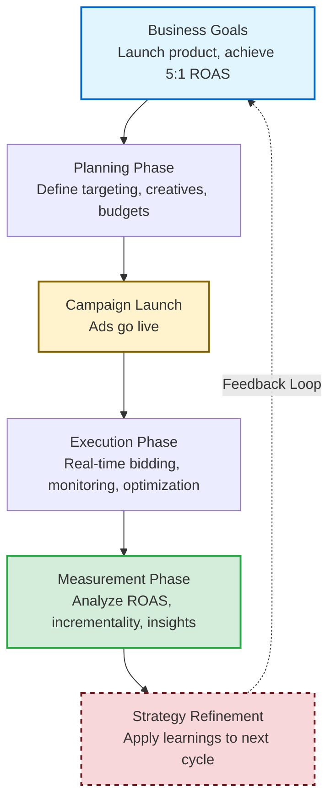
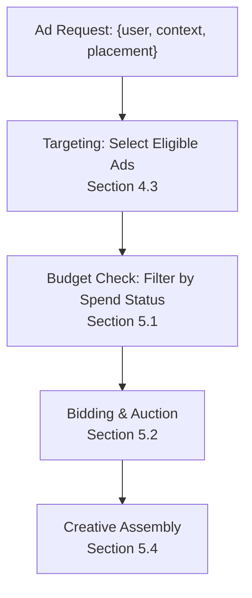

# Chapter 1: The Retail Media Network (RMN) Ecosystem

Retail media networks represent a fundamental architectural shift in digital advertising. Unlike traditional third-party ad networks (Chapter 0), which relied on cookie-based targeting and probabilistic attribution, RMNs exploit **vertical integration**: the retailer owns the e-commerce site, tracks shopper behavior through first-party data, and measures advertising effectiveness with deterministic closed-loop attribution. This integration changes everything—retrieval strategies, ranking objectives, measurement infrastructure, and privacy controls—while introducing new engineering challenges at the intersection of e-commerce, ML systems, and real-time serving.

This chapter establishes the RMN problem domain before we build the systems in subsequent chapters. We follow the advertiser's journey: understanding what RMNs are and their core terminology, then walking through campaign planning, execution and optimization, and measurement. Understanding this landscape is essential: engineering choices cascade from business requirements, and we must architect systems that balance monetization, user experience, and privacy under brutal latency constraints (10–50ms at 10K–50K QPS).

---
- [Chapter 1: The Retail Media Network (RMN) Ecosystem](#chapter-1-the-retail-media-network-rmn-ecosystem)
  - [1. Introduction to RMN](#1-introduction-to-rmn)
    - [1.1 What is a Retail Media Network?](#11-what-is-a-retail-media-network)
    - [1.2 The Three Constituencies](#12-the-three-constituencies)
    - [1.3 How RMNs Differ from Traditional Ad Networks](#13-how-rmns-differ-from-traditional-ad-networks)
  - [2. Core RMN Ontology](#2-core-rmn-ontology)
    - [2.1 Entity Hierarchy](#21-entity-hierarchy)
    - [2.2 Glossary of Core Terms](#22-glossary-of-core-terms)
  - [3. The Advertiser Lifecycle](#3-the-advertiser-lifecycle)
  - [4. Ads Planning: Campaign Setup](#4-ads-planning-campaign-setup)
    - [4.1 Campaign Management: Structuring the Campaign](#41-campaign-management-structuring-the-campaign)
    - [4.2 Creative Management: Ad Formats and Assets](#42-creative-management-ad-formats-and-assets)
    - [4.3 Targeting \& Audience Strategy](#43-targeting--audience-strategy)
      - [4.3.1 Keyword Targeting (Search Ads)](#431-keyword-targeting-search-ads)
      - [4.3.2 Audience Targeting (Display, Browse)](#432-audience-targeting-display-browse)
      - [4.3.3. Contextual Targeting](#433-contextual-targeting)
      - [4.3.4 Combining Targeting Conditions](#434-combining-targeting-conditions)
  - [5. Running Ads and Optimization](#5-running-ads-and-optimization)
    - [5.1 Budget Management](#51-budget-management)
    - [5.2 Bidding and Auctions](#52-bidding-and-auctions)
    - [5.3 Campaign Optimization Strategies](#53-campaign-optimization-strategies)
  - [6. Measurement and Attribution](#6-measurement-and-attribution)
    - [6.1 Core Metrics](#61-core-metrics)
    - [6.2 Attribution Models](#62-attribution-models)
    - [6.3 Platform Reporting Capabilities](#63-platform-reporting-capabilities)
    - [6.4 Incrementality Measurement](#64-incrementality-measurement)
    - [6.5 Closing the Loop: Insights to Action](#65-closing-the-loop-insights-to-action)
  - [Summary and Next Steps](#summary-and-next-steps)
  - [References and Further Reading](#references-and-further-reading)

---

## 1. Introduction to RMN

### 1.1 What is a Retail Media Network?

A **retail media network (RMN)** is an advertising platform operated by a retailer, enabling brands (often the retailer's suppliers or endemic advertisers) to place ads on the retailer's owned properties—website, mobile app, and increasingly off-site placements via demand-side platform (DSP) integrations. Unlike traditional display or search ad networks (Chapter 0), which aggregate inventory from many publishers and rely on third-party cookies for targeting, RMNs control both the supply side (inventory) and the demand side (advertiser access to first-party shopper data). This vertical integration yields deterministic attribution: when a shopper clicks a sponsored product ad and purchases that item minutes later, the retailer's logs record both events under the same user ID, enabling precise measurement of ad-driven revenue.

**Why now?** Three forces converged: **privacy regulation, e-commerce scale, and technology maturity**. Privacy shifts—GDPR (2018), CCPA (2020), and browser cookie deprecation—eroded third-party tracking, making first-party data precious. Simultaneously, e-commerce penetration surged (accelerated by COVID-19), giving retailers tens of millions of daily active users and billions of impressions to monetize. Finally, ML infrastructure commoditized: open-source frameworks (PyTorch, TensorFlow), vector databases (FAISS, ScaNN), and feature stores made it feasible for non-FAANG companies to build production-grade ad serving and ranking systems. By 2021, Amazon Ads exceeded $30B in annual revenue [4], Walmart Connect and Target's Roundel scaled rapidly, and grocery chains (Kroger Precision Marketing, Albertsons Media Collective) launched RMNs backed by offline purchase data.

**The "Third Wave" context:** Digital advertising evolved from search/display networks (2000–2010, keyword targeting and GSP auctions) to social/programmatic (2010–2020, deep learning and micro-targeting via third-party cookies) to retail media (2020–present, first-party data and deterministic attribution). RMNs combine the auction mechanics of Wave 1, the ML sophistication of Wave 2, and a new constraint: data must stay within retailer control or move through privacy-preserving infrastructure (clean rooms, differential privacy).

### 1.2 The Three Constituencies

RMNs succeed because they deliver value to three constituencies with partially aligned incentives. Balancing these interests shapes platform design.

**For Retailers:**  
RMNs are high-margin revenue streams—gross margins often exceed 70%, compared to 20–30% for retail operations—and diversify income beyond product sales. Advertising monetizes zero-revenue inventory (search result pages, category pages, product detail pages). More subtly, RMNs provide strategic leverage: retailers control which brands get visibility, can favor private-label products in ranking algorithms (within regulatory bounds), and use ad revenue to subsidize low-margin categories or loyalty programs. Successful platforms scale to billions in annual revenue (Amazon Ads, Walmart Connect, Instacart Ads).

**For Advertisers (Brands and Agencies):**  
RMNs offer targeting precision and attribution clarity unavailable elsewhere. Advertisers bid on high-intent shoppers—users actively searching for "laundry detergent" or browsing the cleaning supplies aisle—and measure sales impact within hours, not weeks. Closed-loop attribution eliminates the ambiguity of multi-touch models: if a user clicked a Sponsored Product ad and bought the item, the causal link is direct (modulo organic cannibalization, which incremental lift studies address). First-party data enables granular segmentation: "users who bought competitor products in the past 30 days but haven't purchased our brand." For endemic brands (those sold on the retailer's site), RMNs are essential for shelf-space competition—winning the top Sponsored Product slot can double conversion rates.

**For Shoppers:**  
When executed well, RMN ads enhance discovery rather than intrude. Sponsored Product ads surface relevant alternatives ("here's a higher-rated detergent at a similar price") or new products ("this just-launched flavor matches your past purchases"). The key is *relevance*: ads that waste shopper attention degrade user experience, reduce organic engagement, and ultimately harm retailer revenue. Ranking models must balance advertiser revenue (eCPM) with user satisfaction (CTR, dwell time, conversion likelihood). RMN engineers build re-ranking layers that penalize low-quality creatives, diversity constraints that prevent a single advertiser from dominating all placements, and fatigue models that cap impression frequency per user.

### 1.3 How RMNs Differ from Traditional Ad Networks

The architectural delta between RMNs and traditional third-party networks (Chapter 0) stems from vertical integration and first-party data ownership. Table 1.1 summarizes the key differences:

| Dimension | Traditional Ad Networks | Retail Media Networks |
|-----------|------------------------|----------------------|
| **Inventory Source** | Aggregated from many publishers via exchanges | Retailer owns site/app; controls all placements |
| **Targeting Foundation** | Third-party cookies, probabilistic identity graphs | First-party data: logged-in user IDs, purchase history, deterministic identity |
| **Attribution** | Multi-touch, 7–30 day windows, probabilistic | Closed-loop: ad impression and conversion both logged under same user ID |
| **Retrieval Strategy** | Inverted indices (keyword matching) or vector search | Similar but richer context: cart, recently viewed products, brand affinity |
| **Ranking Objective** | Maximize eCPM = bid × pCTR | Multi-objective: ad revenue + organic revenue impact + user satisfaction |
| **Privacy & Compliance** | Post-GDPR/CCPA: heavy reliance on consent management | First-party data inside retailer's domain; compliance easier |

**In essence, two most important architectural shifts define RMNs**: (1) **Deterministic attribution** via first-party user IDs eliminates the probabilistic guesswork of cookie-based networks, enabling same-day ROAS reporting and causal measurement; (2) **Multi-objective ranking** balances ad revenue with organic sales and user satisfaction, requiring ranking models that account for cannibalization and UX degradation—this is fundamentally more complex than traditional networks' single-objective eCPM maximization.

**Key architectural implications:**

1. **Deterministic Attribution and Closed-Loop Measurement**: When a shopper is logged in, every event—ad impression, click, add-to-cart, purchase—logs the same persistent user ID. Attribution is deterministic, not probabilistic. This enables same-day ROAS reporting, fine-grained holdout experiments, and causal inference models that separate ad-driven purchases from organic purchases. From an engineering perspective, the *feature → label pipeline* is faster and cleaner than in traditional networks—we can retrain CTR models hourly, not weekly.

2. **First-Party Data as a Moat**: RMNs own their data: every search query, product view, cart addition, and purchase is first-party. This data is richer than third-party cookies (full session histories, actual purchase amounts, timestamps to the second). But ownership creates responsibility—strict data access controls, clean rooms for advertiser queries, row-level security in feature stores. Violations risk GDPR fines up to 4% of global revenue.

3. **Latency and Scale Constraints**: High-frequency placements (Sponsored Product slots on search results pages) have 10–50ms latency budgets at 10K–50K QPS. We solve this via **multi-stage funnels**: Retrieval (1–5ms, fetch 500–1000 candidates) → L1 Ranking (2–10ms, prune to 50–100 finalists) → L2 Ranking (5–20ms, deep models on finalists) → Re-ranking & Auction (1–5ms).

---

## 2. Core RMN Ontology

Before diving into platform architecture, we establish a shared vocabulary. This section disambiguates key concepts, clarifies hierarchical relationships, and defines RMN-specific terminology used throughout the book.

### 2.1 Entity Hierarchy

**Campaign → Ad Group → Ad:**  
Advertisers organize spending in a three-level hierarchy:

1. **Campaign**: Top-level container with a business objective (e.g., "Q4 Holiday Promotion"), overall budget, date range, and default bidding strategy.
2. **Ad Group**: Within a campaign, groups ads by product category, audience, or targeting theme. Each ad group has:
   - **Targeting rules**: Keywords (for search ads) or audience segments (for display)
   - **Bid settings**: Default bid or bid adjustments
   - **Budget allocation**: Optional daily/lifetime budget caps
3. **Ad**: Individual creative unit (single SKU for Sponsored Products, banner image for display). Each ad:
   - **Inherits targeting and bidding** from its parent ad group
   - **Participates in auctions** as the atomic unit
   - **Has creative-specific attributes**: landing page URL, tracking parameters

**Key insight**: Targeting and bidding are configured at the ad group level, but individual ads within that group participate in auctions as distinct candidates.

**Other Entity Definitions:**

- **Creative**: The raw asset (product image, banner, video file)
- **Placement**: The location on a page where ads render (SRP top slot, PDP sidebar, homepage carousel)
- **Impression types**: **Served** (ad server returned the ad), **Rendered** (displayed on screen), **Viewable** (50%+ visible for ≥1 second)

### 2.2 Glossary of Core Terms

This glossary provides brief definitions with forward references to detailed sections.

**Targeting (see Section 4.3 for details):**
- **Keywords**: Advertiser-specified terms matched against user search queries (exact/phrase/broad match)
- **Audiences**: Target groups defined by boolean rules over user attributes (behavioral, demographic, transactional)
- **Segments**: Static or dynamic groups of users sharing a characteristic (used for reporting breakdowns)
- **Product targeting**: Ads target specific product pages (e.g., competitor conquest campaigns)

**Bidding & Auctions (see Section 5.2 for details):**
- **CPC (Cost Per Click)**: Advertiser pays only when user clicks the ad
- **CPM (Cost Per Mille)**: Advertiser pays per 1,000 impressions
- **eCPM (Effective CPM)**: Ranking metric combining bid and predicted engagement: `eCPM = bid × pCTR × 1000`
- **Second-price auction (GSP)**: Winner pays next-highest bid + $0.01
- **Bidding strategies**: Manual CPC/CPM, Dynamic bidding, Auto-bidding (Target ROAS/CPA, Maximize conversions)
- **Reserve price**: Minimum bid threshold to participate in auctions

**Budgeting (see Section 5.3 for details):**
- **Campaign budget**: Total spend limit (daily or lifetime)
- **Budget pacing**: How spend is distributed over time (even pacing vs. frontload/backload)
- **Shared budgets**: One budget pool shared across multiple campaigns

**Measurement & Attribution (see Section 6 for details):**
- **ROAS (Return on Ad Spend)**: `attributed_revenue / ad_spend`
- **CPA (Cost Per Acquisition)**: `ad_spend / conversions`
- **Attribution window**: Time period after ad interaction during which conversions are credited
- **Incrementality**: Lift in conversions caused by ads (vs. organic baseline)
- **Cannibalization**: Conversions that would have happened organically but are credited to ads
- **Multi-touch attribution**: Allocating credit across multiple ad interactions

**Data & Identity:**
- **First-party data**: Data collected directly by the retailer (search queries, browsing, purchases)
- **Pseudonymized ID**: Hashed or tokenized user identifier (preserves privacy while enabling targeting)
- **Clean room**: Secure environment where advertisers query aggregate data without accessing raw user IDs
- **Deterministic attribution**: Linking ad exposure to conversion via same user ID (vs. probabilistic via cookies)

---

## 3. The Advertiser Lifecycle

Before diving into each platform component, we provide an overview of the advertiser's journey through three phases: Planning, Execution, and Measurement. This lifecycle perspective reveals how platform components interact and where engineering investments pay dividends.

Understanding this lifecycle is critical because **RMNs fundamentally accelerate the feedback loop** compared to traditional ad networks. In traditional networks, measurement reports arrive 24-72 hours after campaigns run, attribution is probabilistic across fragmented publisher sites, and advertisers iterate weekly or monthly based on delayed, noisy signals. RMNs collapse these timescales: deterministic attribution links ad impressions to conversions within the same user session (often minutes), dashboards update every 5-15 minutes, and advertisers can adjust bids, budgets, or targeting multiple times per day based on fresh performance data. This near-real-time feedback transforms advertising from a slow, batch-oriented planning exercise into a continuous optimization process—brands that master this rapid iteration cycle gain significant competitive advantage. The platform components we'll explore in Sections 4-6 all serve this goal: enabling advertisers to learn faster, optimize smarter, and compound improvements across successive campaign cycles.

**The Ad Lifecycle (Continuous Optimization Loop):**

*The lifecycle is iterative: insights from measurement inform the next planning cycle, creating a continuous improvement loop enabled by deterministic attribution and near-real-time reporting.*

| Phase | Activities | Key Metrics | Platform Components | Sections |
|-------|-----------|-------------|---------------------|----------|
| **Planning** | Define goals, select products/audiences, build campaigns, create creatives, set budgets/bids | Forecasted reach, estimated ROAS | Campaign Management, Creative Management, Targeting & Audience | Section 4 |
| **Execution** | Launch campaigns, monitor auctions, optimize bids/budgets, A/B test creatives, adjust targeting | Impressions, clicks, CTR, spend pacing, ROAS-to-date | Ad Serving, Bidding Engine, Budget Pacing, Real-time Dashboards | Section 5 |
| **Measurement** | Analyze ROAS/CPA, attribution breakdowns, incrementality studies, refine strategy for next cycle | Final ROAS/CPA, incremental conversions, audience insights | Reporting & Analytics, Attribution Engine, Experimentation Platform | Section 6 |

**Typical flow:** A brand starts with a business goal (e.g., launch new product, achieve 5:1 ROAS) → Plans campaign with targeting, creatives, and budget → Executes with real-time bidding and monitoring → Measures lift and performance → Feeds insights back into planning for next cycle. This closed loop is enabled by deterministic attribution and tight feedback between serving systems and analytics pipelines.

---

## 4. Ads Planning: Campaign Setup

Campaign planning is where advertisers translate business goals into platform configurations. This section covers campaign structure, creative development, and targeting strategy—the foundation for successful execution.

### 4.1 Campaign Management: Structuring the Campaign

Campaign management is the UI and backend service that lets advertisers define, launch, and control campaigns. It abstracts away the complexity of ad serving, exposing a simplified model: "I want to promote Product X, target Audience Y, pay Z per click, and spend no more than $W per day."

**Objective Selection:**  
Advertisers start by choosing goals—awareness (maximize impressions), consideration (maximize clicks), or conversion (maximize purchases). The platform translates these into bidding strategies:
- **Awareness** (maximize impressions) → CPM (cost per mille) bidding for brand campaigns
- **Consideration** (maximize clicks) → CPC (cost per click) bidding for traffic campaigns
- **Conversion** (maximize purchases) → CPA (cost per acquisition) or ROAS (return on ad spend) bidding for performance campaigns

**Campaign Hierarchy:**  
Advertisers organize spending into a three-level hierarchy that mirrors Google Ads and Facebook Ads Manager for familiarity. Campaigns (e.g., "Spring Promo 2024") contain ad groups (e.g., "Laundry Detergent" and "Fabric Softener"), which in turn contain individual ads (specific product SKUs or creatives). This structure allows flexible budget allocation and performance tracking at multiple granularities.

**Budget Controls and Scheduling:**  
The system enforces budget constraints through multiple mechanisms:
- **Daily budgets**: $500/day with pacing to avoid early exhaustion. If a campaign is burning budget too fast in the morning, the system lowers bids dynamically to smooth spend across 24 hours. Chapter 11 covers budget pacing algorithms (PID controllers, Lagrangian multipliers).
- **Lifetime budgets**: $10K over 30 days, amortized intelligently across the campaign duration.
- **Flight dates**: Start/end dates define the campaign window. Dayparting (pause overnight, run during peak hours) optimizes spend timing based on conversion patterns.

**Forecasting Tools:**  
Before launching, advertisers use forecasting tools to estimate reach and cost. These tools leverage historical bid landscapes, seasonal trends, and competitive density (how many other advertisers target the same audience) to project performance: "This audience has 500K users; at $0.40 CPC and 2% CTR, expect 10K clicks and $4K spend per day (90% CI: 8K–12K clicks)." Forecasts include confidence intervals to manage expectations and help advertisers set realistic budgets.

**Approval Workflows:**  
Creatives pass through automated and manual review before campaigns can launch. Automated checks (image resolution, profanity filters, trademark conflicts) flag issues instantly. Manual review for restricted categories (alcohol, pharma) adds 1–24 hours. Rejected creatives block campaign launch until fixed. Once approved, campaigns go live within minutes—the time it takes for config updates to propagate to ad serving clusters.

**Backend Architecture:**  
When an advertiser clicks "Launch Campaign," the backend validates inputs (budgets > 0, SKUs exist, targeting criteria are legal), writes campaign metadata to the database with status = "active," and publishes a message to a Kafka topic (`campaign-updates`) that ad serving clusters subscribe to. Servers pull updated configs within seconds and start serving those ads. The campaign management service also provides APIs for programmatic access—large advertisers (CPG brands, agencies) use these to automate bid adjustments, A/B test creative variants, and synchronize with external systems.

### 4.2 Creative Management: Ad Formats and Assets

RMNs support multiple ad formats, each with distinct creative requirements and rendering pipelines. Understanding these differences is crucial: the format determines production costs, user experience integration, and measurement complexity.

**1. Sponsored Products:**  
Native ads that appear inline with organic product listings—on search results pages, category browse pages, or product detail pages (as "related products"). Creatives are dynamically assembled from catalog data at query time:
- **Fields:** Product image, title, price, rating/reviews count, badge ("Bestseller," "Ad").
- **Rendering:** The ad server fetches product metadata from a microservice or cache (Redis), constructs the JSON payload, and returns it to the frontend. The frontend renders it identically to organic listings, except for the "Ad" badge.
- **Advantages:** No creative production burden for advertisers—just specify SKU IDs and the platform pulls everything from the catalog API. Creatives automatically update if product prices or images change. Seamless UX: ads don't visually disrupt the page, maintaining the native shopping experience.

**2. Display Ads (Banners):**  
Rectangular image or video ads on homepage hero slots, category page sidebars, or post-purchase confirmation pages. Unlike Sponsored Products, these require advertisers to upload static assets (JPEG, PNG, MP4, HTML5 units).
- **Rendering:** The ad server returns a creative ID and CDN URL. The frontend fetches the asset from the CDN and renders it in an iframe or div container.
- **Tracking:** Impression and viewability tracking via pixel fires (1×1 transparent image requests with event metadata) or JavaScript beacons. Viewability requires the ad to be 50%+ visible for ≥1 second per IAB standards, ensuring advertisers only pay for ads users actually see.

**3. Video Ads:**  
Pre-roll or mid-roll ads in video content (recipe videos, product demos). Less common in pure e-commerce RMNs but important for grocery (recipe videos) and streaming-adjacent retailers (Walmart+ video content).
- **Rendering:** VAST (Video Ad Serving Template) XML returned to a video player SDK. The SDK handles playback, tracking quartile events (25%, 50%, 75%, 100% video completion) to measure engagement depth.

**4. Off-Site Placements (DSP Integrations):**  
Advertisers extend reach beyond the retailer's site by running display ads on external publishers (news sites, social media) using the retailer's first-party data for targeting. This requires clean room integrations (e.g., LiveRamp, Snowflake Data Clean Rooms) to pseudonymize user IDs and share audience segments without exposing raw data.
- **Process:** The retailer uploads hashed user IDs (SHA256 of email or loyalty card number) to the clean room. The DSP matches these to its cookie or device ID graph and serves ads to matched users on external inventory. Conversions are attributed back via the clean room.
- **Privacy:** User-level data never leaves the clean room; only aggregate match rates and campaign metrics are shared, preserving privacy while enabling off-site reach extension.

**Dynamic Creative Optimization (DCO):**  
Advanced RMNs personalize ads in real-time using dynamic creative optimization. The system varies product images based on user affinity (show blue shirt to users who browsed blue apparel), adjusts messaging ("30% off" for price-sensitive users, "Eco-friendly" for sustainability-focused segments), or A/B tests headlines using multi-armed bandit or contextual bandit models (Chapter 15). This requires real-time feature lookups (user's recent browsing history) and creative assembly pipelines that stitch templates and user-specific content at serving time.

### 4.3 Targeting & Audience Strategy

Targeting defines ***whether an Ad is shown to a user with the context (eg, current page, session, etc)***. RMNs offer multiple targeting types, each with strategic considerations and runtime mechanics.

#### 4.3.1 Keyword Targeting (Search Ads)

**Strategy:**  
Advertisers bid on search queries to capture high-intent shoppers actively looking for products. Keyword selection involves:
- Researching high-volume, high-conversion queries in the product category
- Balancing specificity (exact match for precision) vs. reach (broad match for scale)
- Using negative keywords to exclude irrelevant traffic (e.g., "free" for paid products)
- Monitoring search term reports to discover new keyword opportunities

**Match Types:**
- **Exact match**: "laundry detergent" → "laundry detergent" only. High precision, low reach.
- **Phrase match**: "laundry detergent" → "best laundry detergent brands". Medium precision and reach.
- **Broad match**: "laundry detergent" → "stain cleaning products" (via embeddings/synonyms). Low precision, high reach.

#### 4.3.2 Audience Targeting (Display, Browse)

**Strategy:**  
Audience targeting reaches users based on their behavior, demographics, and purchase history rather than active search intent. Use cases:
- **Retargeting**: "Users who viewed Product X but didn't purchase" (cart abandonment recovery)
- **Conquest**: "Users who purchased competitor's brand in past 30 days" (switch campaigns)
- **Lookalike**: "Users similar to our best customers" (expansion via propensity models)
- **Lifecycle**: "Users who haven't visited in 60 days" (winback campaigns)

**Audience Definition:**  
Define audiences via boolean rules over first-party attributes:
- **Behavioral**: "Searched 'running shoes' in past 7 days AND didn't purchase"
- **Demographic**: "Ages 25–45, median income >$75K" (from loyalty program profiles)
- **Transactional**: "Purchased our brand 3+ times in past 90 days" (high-value customers)
- **Predictive**: "Users with >50% probability of purchasing in category X in next 7 days" (propensity scores from ML models)

**Audience Builder UI:**  
Drag-and-drop interface: "Add rule: Category = Electronics AND PurchaseRecency < 14 days." Platform provides real-time audience size estimates (~250K users). Large audiences (>1M) support scale; small audiences (<10K) risk low match rates and poor statistical power for optimization.

**How It Works at Serve Time:**  
For display/browse placements, the ad server checks if current user matches audience filters:
1. Fetches user features from feature store (Redis/DynamoDB): recent searches, cart contents, purchase history, segments
2. Evaluates boolean rules: `(category_search_7d == 'Electronics') AND (purchase_count == 0)`
3. Returns ads whose audience filters evaluate to TRUE for this user

**Privacy:**  
Advertisers never see user-level data—only aggregate metrics (audience size, campaign CTR/ROAS). User-level targeting happens within platform's secure perimeter; clean rooms enforce boundaries for off-site campaigns.

#### 4.3.3. Contextual Targeting

**Strategy:**  
Contextual targeting uses page and session context rather than user identity. The key advantage: no dependency on feature stores or user IDs means sub-millisecond targeting decisions and zero privacy concerns—ads are placed based on what users are viewing *right now*, not their past behavior.

**Product and Category Targeting:**  
The primary form of contextual targeting supported by RMNs (Amazon, Walmart, Target, Instacart). Advertisers can target:

1. **Specific products (ASINs)**: Ads appear on designated product detail pages (PDPs). Example: Brand A's ad appears when users view Brand B's laundry detergent PDP (conquest campaign). The ad server matches the current page's `product_id` against targeting rules: `target_product_id == competitor_sku_123`.

2. **Product categories**: Ads target entire categories or refined by attributes (brand, price range, ratings, Prime eligibility). Example: Show detergent ads on any product in "Cleaning Supplies" category, or narrow to "Cleaning Supplies WHERE price < $20 AND rating >= 4.0". At serve time: `page_category == 'Cleaning Supplies'` AND attribute filters.

3. **Complementary products**: In automatic targeting mode, Amazon's system shows ads on products that complement the advertised item (e.g., show coffee ads on espresso machine PDPs).

**When to Use Contextual vs. Audience Targeting:**  
Contextual targeting trades precision for speed and privacy. It's ideal for broad awareness campaigns, cold-start scenarios (new advertisers without audience history), conquest campaigns (target competitor product pages), and privacy-conscious brands. However, it sacrifices personalization. A user viewing a competitor's product page might be a loyal customer doing research (low conversion probability) or a first-time visitor actively comparing options (high conversion probability)—contextual rules can't distinguish. For performance campaigns optimizing ROAS, layering audience filters on top of contextual targeting typically improves performance by 2-3x.

#### 4.3.4 Combining Targeting Conditions

In practice, advertisers rarely use a single targeting method in isolation. Most campaigns combine multiple filters using **Boolean logic**—AND, OR, and negation (negative targeting) are supported, enabling flexible targeting strategies.

*Example from Amazon Ads documentation:* When using product targeting, advertisers can add multiple ASINs to an ad group. The documentation notes: "Targeted ASINs that generate clicks or conversions show up in the search term report" with ASIN formats like "B00JPFUVUU" (starts with B) or "0015366456" (numeric). If an advertiser targets multiple competitor espresso maker ASINs, the ad shows on any of those product pages.

*Example from Amazon Ads documentation:* For a camera lens campaign, Amazon recommends: "By adding this camera as a negative ASIN, you can stop your ad from appearing there and help prevent paying for placements that are not relevant to your product." 

---

## 5. Running Ads and Optimization

This section covers the real-time mechanics of ad delivery: auctions, bidding strategies, budget management, ad serving infrastructure, and campaign optimization techniques.

**The Logic Flow of Ad Serving:**

The diagram above shows the logical flow from ad request to response. Each step is detailed in the subsections below.

### 5.1 Budget Management

Budget controls *how much* advertisers pay and *how* spend is allocated over time. Effective budget management is critical—exhaust budgets too early and you miss high-value evening traffic; spend too slowly and you leave money on the table. The platform must balance these competing pressures in real-time.

**Budget Types:**
- **Daily budget**: $500/day. The system paces spend to exhaust the budget by end-of-day without running out mid-morning (which would lose high-value evening traffic). For example, if a campaign burns through its daily budget by 10 AM, it misses prime conversion hours in the afternoon and evening.
- **Lifetime budget**: $10K over 30 days. The system amortizes spend across days, adjusting daily spend based on performance—frontload if ROAS is strong, throttle if weak. This dynamic allocation maximizes campaign ROI over its entire duration.
- **Ad group budgets**: Optional sub-allocation within campaign budget, allowing advertisers to cap spend on experimental ad groups while protecting core performers.
- **Shared budgets**: One budget pool shared across multiple campaigns. Useful for brand-level spend caps or coordinating seasonal promotions across product lines.

**Budget Pacing: A Real-Time Control Problem:**  
Budget pacing is fundamentally a control problem: allocate B dollars over T hours to maximize clicks/conversions while avoiding early exhaustion. Common approaches:
- **Even pacing**: Spend B/T per hour. Simple but ignores traffic variability—late-night hours have lower traffic, so spending evenly wastes opportunities during peak hours.
- **ASAP spend**: Maximize impressions/clicks quickly. Risks exhausting budget during low-value hours (e.g., midnight searches from casual browsers) while missing high-intent shoppers during lunch and evening.
- **Intelligent pacing**: PID controllers or Lagrangian relaxation adjust bids based on spend trajectory vs. target. These algorithms model spend rate as a control variable and modulate bids throughout the day to hit budget targets while maximizing performance. Used by Google Ads and Facebook Ads; covered in depth in Chapter 11.

**Spend Tracking and Alerts:**  
Real-time monitoring with alerts is essential. Example alert: "Spent 90% of daily budget by 3pm—throttle bids to preserve budget for evening traffic." The system tracks spend at millisecond granularity, comparing actual spend trajectory to target, and raises alerts when deviations exceed thresholds. This enables advertisers to react quickly—pause underperforming campaigns, shift budgets to winners, or adjust bids.

**Budget Exhaustion:**  
When the budget cap is hit, ads become ineligible for auctions until budget resets (daily) or campaign ends (lifetime). This hard cutoff protects advertisers from overspending but can cause sudden performance drops if not managed carefully.

**Carryover Policies:**  
Some platforms roll unspent daily budget to the next day (e.g., if you spend $450 of a $500 daily budget, you get $550 the next day). Others enforce use-it-or-lose-it policies. Carryover smooths spend volatility but complicates budget tracking for advertisers managing multiple campaigns.

### 5.2 Bidding and Auctions

RMNs allocate ad inventory through **real-time auctions**: each time a user loads a page (search results, product detail page, homepage), ads are selected based on their targeting and budget status, then a real-time auction runs in milliseconds to determine which ads appear in the limited ad lots on the page and how much advertisers pay. This section defines auction mechanics and the bidding strategies advertisers use to participate.

An Auction consists of two logical steps: The Scoring/Ranking step to score and rank Ads based on its quality/relevance and projected revenue for the platform if shown to the current Ad request. And the pricing step that calulates the price charged to the Ads selected to show. We will first explain auctions based on simple CPC and CPM bidding types, and then cover details of bidding later in this section.

**eCPM (Effective Cost Per Mille) — The Ranking Metric:**  
Ads rank by eCPM, not raw bid, to balance advertiser value and user experience:
- **For CPC campaigns**: `eCPM = bid × pCTR × 1000`, where pCTR is predicted click-through rate from an ML model. High bids on low-quality ads (low pCTR) rank below moderate bids on high-quality ads (high pCTR).
- **For CPM campaigns**: `eCPM = bid`. Advertiser pays per impression regardless of clicks.
- **For value-based campaigns** (target ROAS): `eCPM = pCVR × expected_order_value × 1000`, where pCVR is predicted conversion rate. The platform infers an implicit bid to hit the target ROAS.

eCPM ensures auctions optimize for platform revenue while respecting user engagement signals. Chapter 2 details the ML models (pCTR, pCVR) that compute these predictions.

**Reserve Price (Bid Floor):**  
Retailers set minimum bids (e.g., $0.10 CPC, $1.00 CPM) to exclude low-quality ads. Ads bidding below the reserve price don't participate in auctions. This protects user experience and ensures ads meet a quality bar.

**Auction Pricing Rules:**  
RMNs predominantly use **second-price auctions**:
- **Second-Price Auction (Generalized Second-Price, GSP)**: Winner pays the minimum bid needed to beat the next-highest competitor, plus a small increment ($0.01). Example: Advertiser A bids $1.00, Advertiser B bids $0.80. A wins and pays $0.81 (B's bid + $0.01). This mechanism **encourages truthful bidding** and is **incentive-compatible**—advertisers have no strategic advantage in under-bidding or over-bidding their true value.
- **First-Price Auction**: Winner pays their own bid. Less common in RMNs but used in some programmatic exchanges for simplicity.
- **VCG (Vickrey-Clarke-Groves)**: Theoretical ideal for multi-slot auctions; charges each winner their externality (value they impose on others). Computationally expensive and rarely used in production RMNs.

**Bid Types:**  
Advertisers configure how they bid in the auction for their Ads:

*Common in RMNs:*
- **Manual CPC (Cost Per Click)**: Advertiser sets a fixed maximum bid per click (e.g., $0.50). **Most common in RMNs.** Simple but **requires constant monitoring and adjustment** to respond to competitive bid landscape changes and performance shifts. Charged only when users click.
- **Manual CPM (Cost Per Mille)**: Advertiser sets a fixed bid per 1,000 impressions (e.g., $5 CPM). Used for display and awareness campaigns where reach matters more than clicks. Charged per impression.
- **Dynamic bidding (RMN-specific)**: Platform automatically adjusts advertiser's base bid up or down based on likelihood of conversion. Amazon Ads offers "dynamic bids - down only" (lowers bids for low-conversion-probability auctions) and "dynamic bids - up and down" (raises bids up to 100% for high-probability auctions, lowers for low) [5]. This is a simpler form of optimization than full auto-bidding strategies described below.

*Advanced Auto-Bidding (Less Common in RMNs):*  
The following strategies are standard in Google Ads [1][2][3] but less mature or unavailable in most RMNs (Amazon, Walmart, Target) as of 2025. Some RMNs may offer them for managed-service clients or are developing similar capabilities:
- **Target ROAS (Return on Ad Spend)**: Advertiser specifies a desired ROAS (e.g., "achieve 5:1 ROAS"). For each auction, the platform predicts pCVR and expected order value, then computes: `bid = (pCVR × expected_value) / target_ROAS`. The platform automatically adjusts bids per auction to hit the target ROAS. This is **value-based bidding**.
- **Target CPA (Cost Per Acquisition)**: Advertiser specifies maximum cost per conversion (e.g., "pay no more than $10 per purchase"). Platform predicts pCVR per auction and computes: `bid = pCVR × target_CPA` [1].
- **Maximize conversions**: Platform sets bids to maximize total conversions within a daily budget constraint using ML models (pCVR) and bid landscape predictions [2].
- **Maximize conversion value**: Platform sets bids to maximize total conversion value (revenue) within a daily budget using pCVR and expected order value predictions [3].

These advanced strategies require significant ML infrastructure—real-time pCVR models, bid optimization algorithms (reinforcement learning or bandit algorithms; see Chapter 15), and tight feedback loops between serving and training systems—that not all RMNs have built yet. Google Ads pioneered them; RMNs are gradually adopting similar capabilities but typically start with simpler manual and dynamic bidding.

Some third-party (3P) ad optimization tools may claim to support automation of bid changes outside the RMN platform to achieve effects similar to these advanced auto-bidding mechanisms, but they lack the granular auction-level data (per-impression bid landscape, real-time pCTR/pCVR signals) needed to successfully implement them. Without access to the platform's internal auction logs and ML model predictions, 3P tools can only react to aggregate daily metrics, missing the per-query optimization opportunities that make auto-bidding effective.

### 5.3 Campaign Optimization Strategies

Advertisers optimize campaigns continuously during execution. This section covers the monitoring, adjustment, and experimentation practices that separate high-performing campaigns from mediocre ones.

**Monitoring Performance:**  
Advertisers monitor dashboards hourly or daily, watching for key signals:
- **Pacing**: "Spent $300 of $500 daily budget by noon—on track."
- **CTR trends**: "CTR dropped from 2.5% to 1.8% yesterday—investigate creative fatigue or increased competition."
- **ROAS by segment**: "Mobile ROAS is 6:1, desktop is 3:1—shift budget to mobile."

Alerts trigger for anomalies: spend exhausted early, CTR plummeting, zero conversions for 24 hours (indicating broken tracking pixels or landing page issues).

**In-Flight Adjustments:**  
Optimizations are continuous:
- **Bid adjustments**: Raise bids on high-performing keywords/audiences, lower bids on low performers. Auto-bidding systems (target ROAS) make these adjustments automatically via reinforcement learning or bandit algorithms (Chapter 15).
- **Budget reallocation**: Pause underperforming ad groups, increase budgets on winners.
- **Creative rotation**: Pause ads with <1% CTR (low quality), launch new variants. For DCO (dynamic creative optimization), the platform A/B tests creatives automatically and shifts traffic to winners.
- **Audience expansion**: Lookalike modeling (Chapter 10) suggests "similar users" to current converters; advertisers opt into these suggestions to scale reach.

**A Day in the Life: Optimization in Action**  
To see how these levers work together, consider a typical Monday morning for an advertiser managing a laundry detergent campaign. She logs into the dashboard and immediately notices CTR dropped 20% over the weekend—from 2.5% to 2.0%. Drilling into segment breakdowns, she discovers the culprit: mobile CTR collapsed from 3.2% to 1.5%, while desktop held steady at 2.4%. She checks creative performance and finds the mobile ad variant featuring a lifestyle image (family doing laundry) is underperforming compared to a product-shot variant (detergent bottle with price badge). Hypothesis: mobile users on-the-go want quick price/value signals, not aspirational imagery.

Her response spans multiple optimization levers: (1) She pauses the lifestyle creative on mobile, shifting 100% traffic to the product-shot variant. (2) She reduces mobile bids by 15% to protect ROAS while the creative issue is resolved. (3) She checks the audience breakdown and notices the "recent category browsers" segment (users who viewed laundry products but didn't purchase in the past 7 days) still converts at 4:1 ROAS on mobile—she increases that audience's budget by 20% to capture incremental high-intent traffic. (4) She sets an alert: "Notify me if mobile CTR doesn't recover above 2.5% by Wednesday." By Tuesday afternoon, mobile CTR is back at 2.8%, and she gradually restores mobile bids to baseline. This multi-lever optimization—creative swap, bid adjustment, audience refinement, budget reallocation—executed in under 30 minutes, exemplifies the agility RMNs enable.

**A/B Testing Creatives and Strategies:**  
Advertisers run controlled experiments: 50% of traffic sees Creative A (headline "Fast Shipping"), 50% sees Creative B ("Free Returns"). The platform tracks CTR and ROAS per variant, computes statistical significance (two-sample t-test or Bayesian posterior probabilities), and recommends the winner. This requires careful randomization (by user ID or session ID) and traffic splitting logic (implemented in the ad server's request routing layer).

**Experimentation Limitations:**  
Most RMNs lack self-serve A/B testing frameworks (unlike Google Campaign Experiments). Platforms like Instacart run internal incrementality studies but don't expose experimentation tools to advertisers. This is a gap compared to mature ad platforms.

---

## 6. Measurement and Attribution

Measurement quantifies advertising effectiveness. RMNs' deterministic attribution enables unprecedented granularity and freshness.

### 6.1 Core Metrics

Measurement quantifies advertising effectiveness. RMNs' deterministic attribution enables unprecedented granularity and freshness—advertisers see performance within hours, not weeks. The metrics below form the foundation of campaign evaluation and inform bidding strategies.

**ROAS (Return on Ad Spend):**  
Revenue generated per dollar spent on ads. Formula: `ROAS = attributed_revenue / ad_spend`  
Example: $5000 revenue / $1000 spend = 5:1 ROAS. This is the **most important metric for performance campaigns**—it directly answers "Did I make money?" For e-commerce advertisers, ROAS typically needs to exceed 3:1 to be profitable after accounting for product costs and operational overhead. Target ROAS is a common bidding strategy (see Section 5.2): advertisers specify "achieve 5:1 ROAS" and the platform adjusts bids automatically to hit that target.

**CPA (Cost Per Acquisition):**  
Cost per conversion event (purchase, sign-up). Formula: `CPA = ad_spend / conversions`  
Example: $1000 spend / 50 conversions = $20 CPA. Lower is better. CPA is crucial for campaigns with fixed-value conversions (e.g., subscription sign-ups always worth $50). Target CPA bidding (Section 5.2) optimizes for this metric, automatically lowering bids when conversion probability is low.

**ROI (Return on Investment):**  
Net profit per dollar spent. Formula: `ROI = (revenue - ad_spend - COGS) / ad_spend`  
More comprehensive than ROAS as it accounts for product costs (COGS = cost of goods sold). A campaign with 5:1 ROAS might have 2:1 ROI if product margins are thin. ROI better reflects true profitability but requires advertisers to share cost data, which many don't, so ROAS dominates in practice.

**CTR (Click-Through Rate):**  
`CTR = clicks / impressions`  
Measures ad relevance and creative quality. A 2% CTR means 2 out of 100 users who saw the ad clicked it. Low CTR (<0.5%) signals poor targeting or weak creatives. High CTR (>5%) indicates strong ad-market fit.

**Conversion Rate:**  
`CVR = conversions / clicks`  
Indicates landing page effectiveness and product-market fit. If 100 users click your ad but only 2 buy, your 2% CVR suggests friction in the purchase funnel—price too high, poor product reviews, or checkout issues. Optimizing CVR is as important as CTR for overall campaign performance.

**Incrementality:**  
Lift in conversions caused by ads, measured via holdout experiments. Example: 10K conversions in treatment group (saw ads) vs. 8K in control group (no ads) → 2K incremental conversions (20% incrementality rate). This metric separates **ad-driven purchases from organic purchases**—the holy grail of measurement. Without incrementality measurement, advertisers risk claiming credit for sales that would have happened anyway (cannibalization).

**New-to-Brand (NTB):**  
Percentage of conversions from first-time purchasers of the brand. Indicates customer acquisition effectiveness. A campaign with 30% NTB is acquiring new customers; one with 5% NTB is mostly retargeting existing customers. Endemic brands on RMNs often track NTB obsessively—it's the difference between growth and churn.

### 6.2 Attribution Models

Attribution assigns credit for conversions to ad interactions. This is one of the hardest problems in advertising measurement—users see multiple ads across multiple sessions before converting, and determining which touchpoints deserve credit requires both statistical modeling and business judgment.

**Last-Touch Attribution:**  
Credit goes entirely to the last ad clicked before purchase. Default in most RMNs because it's simple and aligns with user intent (the last click often represents the final decision moment). However, it ignores earlier touchpoints that built awareness and consideration—a user might see 5 display ads before finally clicking a search ad and purchasing. Last-touch gives all credit to the search ad, undervaluing the display campaign.

**Multi-Touch Attribution (MTA):**  
Allocates credit across multiple interactions. Users typically see different ads for the same product on an RMN (or the same ad across multiple publishers via DSP integrations) before converting. MTA models attempt to fairly distribute credit:
- **Linear**: Equal credit to all touchpoints. Simple but implausible—the first impression is rarely as valuable as the last click.
- **Time-decay**: More credit to recent touchpoints. Reflects that recent interactions are fresher in users' minds.
- **Position-based (U-shaped)**: More credit to first and last touchpoints, less to middle. Recognizes that initial exposure (awareness) and final click (conversion intent) are most critical.
- **Data-driven**: ML models learn credit allocation from historical data, inferring which touchpoint sequences correlate with conversions. Most accurate but requires large datasets and sophisticated modeling (Chapter 19).

**Attribution Windows:**  
Time period after an ad interaction (click or view) during which conversions are credited to the ad. Example: "7-day click attribution" means conversions within 7 days of a click count toward the ad's performance.
- **Online purchases**: Typically minutes to hours. RMNs' closed-loop measurement enables same-session attribution—a user clicks an ad at 10 AM and purchases at 10:15 AM, and the platform attributes instantly.
- **Offline (in-store)**: 1–7 days. Requires matching online ad exposure to in-store purchases via loyalty card scans or payment tokenization. Attribution is deterministic but delayed (batch jobs match transactions overnight).

**Deterministic Attribution—RMN's Killer Feature:**  
Traditional ad networks use probabilistic attribution: cookie syncing across sites, device fingerprinting, and multi-touch heuristics to guess which ad drove a conversion. RMNs collapse this complexity. When a shopper is logged in, every event—ad impression, click, add-to-cart, purchase—logs the same persistent user ID. Attribution is **deterministic**: "User 12345 saw Sponsored Product ad ABC at 10:00 AM, clicked at 10:03 AM, and purchased at 10:12 AM." No probabilistic stitching, no multi-week windows for online purchases, no ambiguity. This determinism enables same-day ROAS reporting, fine-grained holdout experiments (Section 6.4), and causal inference models that separate ad-driven purchases from organic purchases.

**View-Through vs. Click-Through:**
- **Click-through**: Conversion after clicking an ad. Strong causal signal—user actively engaged.
- **View-through**: Conversion after viewing an ad without clicking. Weaker signal—did the ad cause the purchase, or did the user already intend to buy? RMNs typically credit view-through conversions within a 1-day window, but weight them lower than clicks in ROAS calculations to avoid over-crediting passive exposure.

### 6.3 Platform Reporting Capabilities

Reporting closes the optimization loop: advertisers review performance, extract insights, and feed learnings back into planning for the next cycle. RMNs' near-real-time reporting (5–15 minute lag vs. 24-hour lag in traditional networks) enables intra-day optimizations that traditional platforms can't match.

**Dashboards (Advertiser-Facing):**
- **Campaign summary**: Impressions, clicks, CTR, spend, conversions, ROAS, CPA—updated hourly or near-real-time (5–15 minute lag). Advertisers refresh dashboards constantly during campaign execution, watching for anomalies (sudden ROAS drops, budget exhaustion, CTR collapses).
- **Breakdown tables**: Performance segmented by day, hour, device, geo, placement, audience segment, keyword, product SKU. These breakdowns reveal patterns—"mobile ROAS is 6:1 but desktop is 3:1, shift budget to mobile"—that drive optimization decisions.
- **Funnel metrics**: Impressions → clicks → add-to-cart → purchase. Identifies drop-off points: if 1000 users click but only 20 add-to-cart, the problem is landing page experience or product-market fit, not ad creative.

**Data Pipelines (Backend):**  
Behind the dashboards lie sophisticated data pipelines:
- **Streaming aggregation**: Kafka Streams or Flink consumes impression/click/conversion logs, joins events by user ID and ad ID, and writes aggregated metrics to an OLAP database (Snowflake, BigQuery, ClickHouse). This powers the near-real-time dashboards.
- **Batch ETL**: Nightly jobs backfill late conversions (offline store purchases matched via loyalty cards), recalibrate models, and generate long-term trend reports. Late-arriving data (e.g., a user clicks an ad Monday but purchases in-store Wednesday) gets reconciled in batch, updating historical metrics retroactively.
- **Data warehouse**: Advertisers with API access can query raw (anonymized) data for custom analyses—e.g., "What's the ROAS for users who saw ad A then ad B vs. users who saw only ad B?" (multi-touch attribution analysis). This self-serve access empowers sophisticated advertisers to run their own experiments and build custom dashboards.

**Privacy in Reporting:**  
Advertisers see aggregates, not individual user records. Reports enforce minimum user counts (e.g., suppress metrics if segment has <100 users) to prevent re-identification. API queries are rate-limited and logged for audit. No raw user IDs are ever exported—advertisers get pseudonymized tokens for analysis within clean rooms (Section 6.4).

### 6.4 Incrementality Measurement

Incrementality measures the *causal effect* of ads vs. organic baseline—the holy grail of advertising measurement. Without incrementality measurement, advertisers risk claiming credit for sales that would have happened anyway (cannibalization). A campaign with 5:1 ROAS might look great, but if 80% of those conversions were from users who would have bought organically, the true incremental ROAS is only 1:1—a money-losing proposition.

**Holdout Tests:**  
The gold standard: randomly withhold ads from a control group, measure lift. Example: Treatment group (sees ads) → 5% conversion rate. Control group (no ads) → 4% conversion rate. Incremental lift = 1 percentage point (25% relative lift). If the advertiser spent $10K on ads and generated 500 conversions, but the control group shows 100 of those would have happened organically, only 400 conversions (80%) were incremental. True ROAS calculation must account for this.

**Geo Experiments:**  
Test ads in some markets, withhold in others. Example: Run ads in 10 cities, withhold in 10 matched cities (similar demographics, seasonality, historical sales patterns). Compare sales lift between treatment and control cities. Geo experiments reduce inter-user spillover effects (network effects, social influence that can contaminate user-level holdouts) and are essential for measuring offline (in-store) impact. Chapter 14 covers geo experiment design in depth, including synthetic control methods for matching markets.

**PSA (Public Service Announcement) Controls:**  
Show neutral ads (e.g., "Stay hydrated") to the control group instead of no ads. This controls for the "ghost ad" effect—users might notice the absence of ads in Sponsored Product slots on search results pages and behave differently (e.g., scrolling past the empty space faster, losing trust in the platform). PSA controls isolate the causal effect of the advertiser's specific message vs. the presence of any ad.

**Amazon Marketing Cloud (AMC):**  
A clean room for incrementality analysis using pseudonymized data. Advertisers write SQL queries to analyze ad exposure vs. conversion patterns without accessing raw user IDs—queries run within Amazon's secure perimeter, returning only aggregate results. AMC enables advertiser-driven causal analytics (e.g., "What's the conversion rate for users exposed to 3+ impressions vs. 0 impressions?") but is **not a self-serve experimentation framework**—it's post-hoc analysis, not real-time A/B testing. Advertisers can't randomly assign users to treatment/control; they can only analyze observational data, which limits causal inference quality.

**Counterfactual Learning:**  
Related concept but distinct from incrementality measurement. Uses observational data to train ML models that predict "what would have happened" under different actions. Techniques like Inverse Propensity Scoring (IPS) and Doubly Robust estimation correct for selection bias when experimental holdouts aren't feasible. Covered in experimentation book Chapter 19; used in RMNs for offline evaluation of ranking policies and bid strategies (e.g., "Would this new ranking model have increased ROAS if deployed last month?").

**Platform Limitations:**  
Most RMNs lack self-serve experimentation tools for advertisers. Google Ads has Campaign Experiments (split traffic between baseline and test campaigns); Facebook has Split Testing. RMNs typically run internal incrementality studies (e.g., Instacart's documented 15%+ lift studies) but don't expose frameworks to advertisers. This is an engineering gap and a significant opportunity for innovation—building self-serve experimentation platforms would differentiate advanced RMNs from competitors.

### 6.5 Closing the Loop: Insights to Action

This section completes the advertiser lifecycle introduced in Section 3. The measurement capabilities we've covered—core metrics (6.1), attribution models (6.2), reporting dashboards (6.3), and incrementality studies (6.4)—all serve one purpose: generating actionable insights that feed back into the Planning phase for the next campaign cycle. This is where RMNs' deterministic attribution and near-real-time data pipelines deliver their full value. Traditional ad networks delay this feedback loop by days or weeks, limiting advertisers to coarse monthly or quarterly optimizations. RMNs compress it to hours or days, enabling continuous refinement. An advertiser who discovers "mobile users browsing between 7-9 PM convert at 6:1 ROAS" on Monday can launch a dayparted mobile campaign by Tuesday morning. This rapid iteration—powered by the measurement infrastructure described in this section—is the competitive moat that makes RMNs indispensable for performance-focused brands.

**Post-Campaign Analysis:**  
Advertisers review performance and extract learnings:
- "Morning clickers converted at 5%, evening at 3%—daypart bids accordingly"
- "Audience 'high-LTV frequent shoppers' delivered 8:1 ROAS vs. 3:1 overall—invest more"
- "Creative with eco-friendly messaging outperformed price-focused by 20% CTR among millennials"

**Feedback Loop:**  
Measurement insights feed back into planning for next cycle:
- Refine audience definitions (narrow or expand segments)
- Adjust budget allocation (shift spend to high-ROAS campaigns)
- Update creative strategy (test new messaging variants)
- Modify bidding strategy (switch from manual to auto-bidding if scale supports it)

**Portfolio Management:**  
Large advertisers run dozens of concurrent campaigns. Insights enable cross-campaign optimization: reallocate budget from mature campaigns (diminishing returns) to growth campaigns (scaling phase).

**Advanced Analytics:**  
ML-powered insights:
- Anomaly detection (alert on sudden ROAS drop)
- Causal inference models (attribute sales lift to specific campaign elements)
- NLP summaries ("Your top-performing keyword saw 30% CTR increase due to seasonal demand surge")
- Automated recommendations ("Increase bids on Keyword X by 15% to capture more high-intent traffic")

---

## Summary and Next Steps

This chapter introduced the retail media network ecosystem from the advertiser's perspective: understanding what RMNs are, their core terminology, and the complete workflow from campaign planning through execution to measurement. Two themes emerged as foundational to RMN engineering:

1. **Vertical Integration and First-Party Data:** RMNs own inventory, audience data, and conversion signals, enabling deterministic attribution and closed-loop measurement. This demands streaming data pipelines, nearline feature stores, and strict access controls.

2. **Multi-Objective Optimization:** Unlike third-party networks optimizing solely for ad revenue, RMNs balance ad monetization, organic sales impact, and user satisfaction. Ranking models penalize ads that cannibalize organic purchases or degrade shopper experience.

We walked through the advertiser lifecycle (Planning → Execution → Measurement) and mapped the platform's core components (campaign management, creative management, targeting, bidding/budgeting, ad serving, reporting). Each component presents engineering challenges that subsequent chapters will address.

**Transition to Chapter 2:**  
We have surveyed the RMN landscape. Now we build it. Chapter 2 dives into **ad serving architecture**—the real-time system that stitches together retrieval, ranking, auctions, and creative assembly to serve ads in milliseconds. We will design the service topology (load balancers, server clusters, caching layers), define SLAs (latency percentiles, availability), implement multi-stage ranking pipelines, and instrument monitoring/alerting to detect and mitigate failures. The advertiser's simple click on "Launch Campaign" triggers a cascade of low-level systems engineering; Chapter 2 shows you how to build those systems to scale, survive, and satisfy latency budgets that leave no room for error.

---

## References and Further Reading

[1] Google Ads Help. "About Target CPA bidding." Google Support, 2025. https://support.google.com/google-ads/answer/6268632 (Accessed November 2025). Describes how Target CPA bidding automatically computes bids per auction using predicted conversion rates and advertiser-specified cost-per-acquisition targets.

[2] Google Ads Help. "About Maximize conversions bidding." Google Support, 2025. https://support.google.com/google-ads/answer/7381968 (Accessed November 2025). Explains the Maximize conversions strategy that optimizes bids to get the most conversions within a daily budget, with optional target CPA constraints.

[3] Google Ads Help. "About Maximize conversion value bidding." Google Support, 2025. https://support.google.com/google-ads/answer/7684216 (Accessed November 2025). Details the Maximize conversion value strategy that optimizes for total revenue within budget using conversion value predictions, with optional target ROAS.

[4] Amazon.com, Inc. "Q4 2021 Earnings Release." Amazon Investor Relations, February 2022. https://ir.aboutamazon.com/quarterly-results/default.aspx (Accessed November 2025). Amazon's advertising services (including Amazon Ads) generated $31.2 billion in revenue for fiscal year 2021, representing the company's retail media network growth.

[5] Amazon Advertising. "Sponsored Products." Amazon Ads Product Pages, 2025. https://advertising.amazon.com/solutions/products/sponsored-products (Accessed November 2025). Describes Amazon's Sponsored Products offering including dynamic bidding options that adjust bids based on conversion likelihood in real-time auctions.
