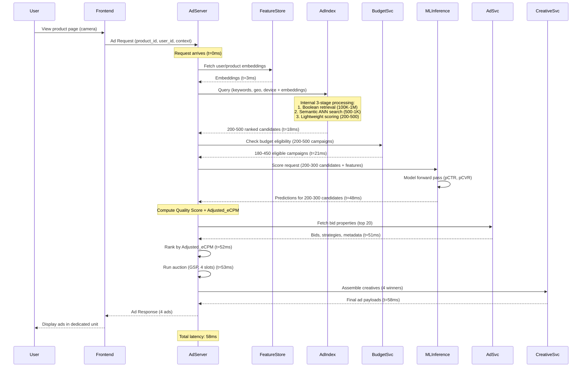
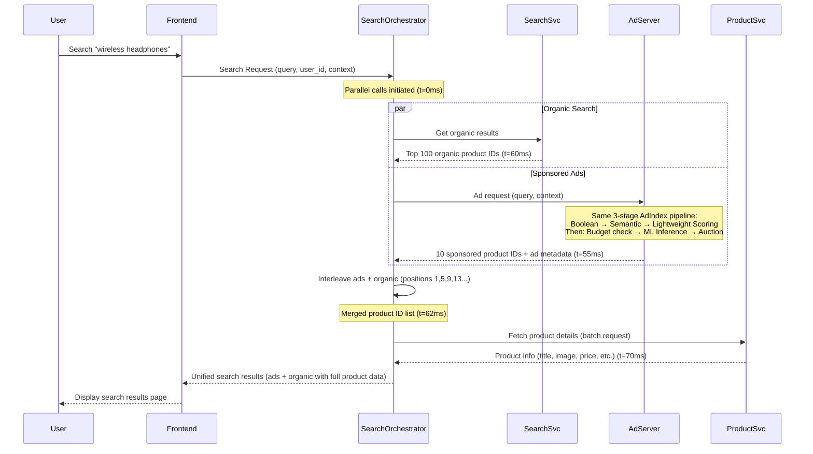

# Chapter 2: Ad Serving Architecture for Retail Media Networks

At its core, every ad serving system answers one fundamental question: which ads should we show to this user, on this page, right now? The answer must arrive in tens of milliseconds, satisfy dozens of business constraints, and maximize value for advertisers, the platform, and the user experience. In a retail media network, this challenge takes on additional complexity—ads must integrate seamlessly with e-commerce browsing, leverage first-party shopping signals, and support a marketplace where thousands of advertisers compete for limited inventory.

This chapter introduces the architecture of a production-grade RMN ad serving path. We examine the core subsystems—Ad Index, Budget & Pacing, Retrieval, Scoring, Auction, and Creative Assembly—that work in concert to deliver ads at scale. We walk through the end-to-end request flow from a shopper's page load to ad impression, highlighting the time budgets, decision points, and data flows that govern the system. We then examine each component's responsibilities and how they interact to enable sub-100ms response times at tens of thousands of queries per second.


By the end of this chapter, you will understand the architectural blueprint that underlies modern RMN ad serving, the latency and scale requirements that shape design decisions, and how the pieces fit together to create a real-time decisioning engine that handles billions of requests per day.

---
- [Chapter 2: Ad Serving Architecture for Retail Media Networks](#chapter-2-ad-serving-architecture-for-retail-media-networks)
  - [1. End-to-End Request Flow and Component Interactions](#1-end-to-end-request-flow-and-component-interactions)
    - [1.1 Standalone Ad Placement Flow](#11-standalone-ad-placement-flow)
    - [1.2 Search-Integrated Ad Placement Flow](#12-search-integrated-ad-placement-flow)
    - [1.3 Architectural Implications](#13-architectural-implications)
    - [1.4 Time Budget Allocation](#14-time-budget-allocation)
    - [1.5 Scale Requirements](#15-scale-requirements)
  - [2. Core Components of the Ad Serving Path](#2-core-components-of-the-ad-serving-path)
    - [2.1 AdServer](#21-adserver)
    - [2.2 ML Inference Service](#22-ml-inference-service)
    - [2.3 FeatureStore](#23-featurestore)
    - [2.4 AdIndex](#24-adindex)
    - [2.5 BudgetSvc (Budget \& Pacing Service)](#25-budgetsvc-budget--pacing-service)
    - [2.6 AdSvc (Ad Campaign Service)](#26-adsvc-ad-campaign-service)
    - [2.7 CreativeSvc (Creative Assembly Service)](#27-creativesvc-creative-assembly-service)
    - [2.8 ProductSvc (Product Catalog Service)](#28-productsvc-product-catalog-service)
  - [3. Design Principles and Trade-offs](#3-design-principles-and-trade-offs)
    - [3.1 Latency vs. Accuracy](#31-latency-vs-accuracy)
    - [3.2 Recall vs. Precision](#32-recall-vs-precision)
    - [3.3 Consistency vs. Availability](#33-consistency-vs-availability)
    - [3.4 Statelessness](#34-statelessness)
    - [3.5 Observability](#35-observability)
  - [4. Summary and Next Steps](#4-summary-and-next-steps)
  - [References and Further Reading](#references-and-further-reading)
    - [Industry Engineering Blogs on Ad Serving Architecture](#industry-engineering-blogs-on-ad-serving-architecture)
    - [Technology Documentation](#technology-documentation)
    - [Academic Research on Ad Auctions](#academic-research-on-ad-auctions)

---

## 1. End-to-End Request Flow and Component Interactions

To understand how an RMN ad serving system operates, we examine two distinct serving patterns: **standalone ad placements** and **search-integrated ad placements**. Each has different architectural implications for latency budgets, component interactions, and system design.

### 1.1 Standalone Ad Placement Flow

The first pattern serves ads independently on non-search pages such as the homepage, product detail pages, category browse pages, or checkout flow. The ad server operates autonomously, receiving an ad request and returning a complete ad response without coordinating with other page-rendering systems.

We trace a typical scenario: a user views a product detail page for a camera, and the ad server must return sponsored product ads for complementary items (lenses, tripods, memory cards) to display in a dedicated ad unit below the product description.

**Figure 2.1: Standalone Ad Placement Request Flow**



In this flow, the **AdServer** orchestrates the complete pipeline from retrieval through auction. It first fetches user and product embeddings from the FeatureStore, then queries the AdIndex with enriched context (keywords, geo, device, embeddings). 

The **AdIndex** performs a 3-stage pipeline internally: Boolean retrieval (100K-1M candidates) → Semantic ANN search (500-1K) → Lightweight scoring (200-500), returning ranked candidates in ~15ms (detailed in Chapter 4). This multi-stage retrieval architecture [1] reduces candidates by multiple orders of magnitude at each stage under tight latency constraints.

After budget checking via BudgetSvc, the **AdServer** sends ~200-300 eligible candidates to the **ML Inference Service** (TorchServe/TensorFlow Serving), which returns pCTR/pCVR predictions in 25-30ms.

The AdServer then computes **Quality Score** using the multiplicative formula `(pCVR)^w1 × (Ad_Relevance)^w2 × (Landing_Page_Quality)^w3` (see Chapter 3), distinct from AdIndex's lightweight score as it uses fresh ML predictions. Final ranking uses Adjusted_eCPM = Bid × pCTR × 1000 × Quality_Score.

The entire flow completes in ~58ms. The frontend makes asynchronous JavaScript calls to fetch ads, so latency doesn't block page rendering—common for display ads and below-the-fold placements.

### 1.2 Search-Integrated Ad Placement Flow

The second pattern integrates ads directly into search results, with sponsored products interleaved among organic listings. This requires tight coordination between the ad server and the e-commerce search/ranking system, and imposes stricter latency constraints since ads must be ready before the search results page is rendered.

We trace a search scenario: a user searches for "wireless headphones," and the system must return a unified result set with sponsored products at positions 1, 5, 9, and 13, blended with organic products.

**Figure 2.2: Search-Integrated Ad Placement Request Flow**



Key differences in the search-integrated flow:

**Parallel Execution:**
- The Search Orchestrator (or API Gateway) issues parallel requests to both the organic search service (SearchSvc) and the ad server, reducing total wall-clock time.
- SearchSvc returns ranked organic product IDs (~100 products) in 60ms, while AdServer returns sponsored product IDs with ad metadata (~10 ads) in 55ms.
- Both services perform their own relevance ranking independently before results are merged.

**Product Detail Assembly:**
- After receiving product IDs from both SearchSvc and AdServer, the orchestrator first interleaves them according to configured ad positions (e.g., slots 1, 5, 9, 13).
- A batch request to ProductSvc fetches full product details (title, image, price, inventory status) for the interleaved set only, minimizing unnecessary data fetching.
- This two-phase approach (IDs first, then details) is more efficient than each service independently fetching product data.

**Tighter Latency Budget:**
- The ad server targets p99 latency <60ms (vs. <100ms for standalone placements) to stay within the organic search window and avoid delaying page load.
- Total orchestration latency including product detail fetching is ~70ms, still within typical search page budgets (80-100ms).
- This often requires more aggressive scoring optimizations: smaller models, feature caching, or two-stage ranking (lightweight first-pass, heavy re-rank on top-20).

**Interleaving Logic:**
- The Search Orchestrator merges ads and organic product IDs using a configured interleaving pattern (e.g., fixed ad slots at positions 1, 5, 9, 13, or dynamic allocation based on relevance scores).
- Some systems use **unified ranking**, where the ad scoring and organic relevance scores are comparable, enabling joint ranking. Others use **position-based allocation**, where ad slots are pre-determined and ads fill those positions regardless of score.

**Request for More Ads:**
- The orchestrator may request 10 ads but only use 4, to ensure high-quality ads are available even if some are filtered during interleaving (e.g., duplicate products, policy violations).

### 1.3 Architectural Implications

The choice between standalone and search-integrated patterns drives several architectural decisions:

**Table 2.1: Comparison of Standalone vs. Search-Integrated Ad Placement Patterns**

| **Aspect**               | **Standalone Placement**                  | **Search-Integrated Placement**              |
|--------------------------|------------------------------------------|---------------------------------------------|
| **Latency Budget**       | ~100ms (p99)                              | ~60ms (p99) to match organic search          |
| **Coordination**         | Ad server operates independently          | Requires orchestrator to merge ads + organic |
| **Ranking Optimization** | Moderate pressure (30-40ms for ranking)   | High pressure (20-30ms for ranking)          |
| **Failure Handling**     | Return empty ad response, no page impact  | Degrade to organic-only results              |
| **Interleaving**         | Not applicable                            | Complex merging logic, position allocation   |

For the remainder of this chapter, we focus on time budgets and scale requirements for the **standalone placement pattern** (the more relaxed case). The search-integrated pattern's tighter constraints are addressed in Chapter 4, where we explore ranking model optimizations that enable sub-30ms inference.

### 1.4 Time Budget Allocation

A typical RMN ad server targets **p99 latency under 100ms** for standalone placements to avoid degrading page load times. Within that budget, the subsystems allocate time roughly as follows:

**Table 2.2: Latency Budget Breakdown for Standalone Ad Placement (Target: <100ms p99)**

| **Stage**                                      | **Time Budget** | **Percentage** | **Component**     | **Primary Bottleneck**                |
|------------------------------------------------|-----------------|----------------|-------------------|---------------------------------------|
| Feature Fetching (user/product embeddings)    | 2–3ms           | 3%             | FeatureStore      | Redis [2]/Memcached lookups           |
| **AdIndex (multi-stage retrieval+scoring):**   | **12–18ms**     | **18%**        | **AdIndex**       | **Index lookup, ANN search, scoring** |
| - Boolean retrieval                            | 2–5ms           | 5%             | AdIndex           | Inverted index lookup                 |
| - Semantic ANN search                          | 3–8ms           | 8%             | AdIndex           | Vector similarity computation         |
| - Lightweight scoring                          | 1–2ms           | 2%             | AdIndex           | Dot products, weighted combinations   |
| - Internal overhead                            | 1–3ms           | 3%             | AdIndex           | Network, data fetching                |
| Budget Check (on 200-500 candidates)          | 2–3ms           | 3%             | BudgetSvc         | Distributed counter reads             |
| ML Inference (200-300 candidates)              | 20–30ms         | 30%            | MLInference       | GPU forward pass, batching overhead   |
| Quality Score Computation (auction)            | 1ms             | 1%             | AdServer          | Formula evaluation                    |
| Final Ranking (Adjusted_eCPM)                  | 1ms             | 1%             | AdServer          | eCPM compute, sorting                 |
| Auction (GSP)                                  | 1ms             | 1%             | AdServer          | Winner selection, price calculation   |
| Bid Property Fetching                          | 2–3ms           | 3%             | AdSvc             | Cache/DB lookups                      |
| Creative Assembly                              | 3–8ms           | 8%             | CreativeSvc       | Asset retrieval, JSON serialization   |
| Network & Overhead                             | 10–20ms         | 20%            | Infrastructure    | Request parsing, logging, response    |

**ML Inference** consumes 20-30ms for GPU inference on 200-300 candidates. The architecture reduces this cost dramatically compared to naive approaches:
- **Without AdIndex optimization:** Scoring 100K candidates would require ~10-20 seconds (infeasible for real-time).
- **With AdIndex 3-stage pipeline:** Narrows 100K → 200-500 in 12-18ms, then scores 200-300 with ML (~25ms).

**AdIndex Processing** happens entirely within AdIndex before returning to AdServer. The 3-stage pipeline uses inverted indices (Boolean), vector similarity (ANN), and simple scoring formulas on stored features (lightweight scoring). Chapter 4 covers implementation details.

**Quality Score for Auction** is computed in AdServer after ML inference returns pCTR/pCVR. Uses multiplicative formula (Chapter 3) taking ~1ms for 200-300 candidates.

**Auction, Bid Fetching, and Creative Assembly** are lightweight, each completing in single-digit milliseconds. Poor design (e.g., synchronous database queries) can introduce tail latency spikes that violate SLAs.

### 1.5 Scale Requirements

Production RMN ad servers handle **10,000–50,000 queries per second (QPS)** sustained, with peak traffic 2–3× higher during promotional events (Black Friday, Prime Day). To meet this scale:

- **Horizontal Scaling:** All services (Ad Index, Budget, Ranking, Auction, Creative) are stateless and horizontally scalable behind load balancers.
- **Caching:** Frequently accessed data (popular keywords, top campaigns, creative assets) are cached in Redis [2] or Memcached to reduce backend load.
- **Asynchronous Logging:** Impression and click events are logged asynchronously to Kafka [3] or Kinesis to avoid blocking the critical path.
- **Regional Deployment:** Geo-distributed deployments reduce network latency for global traffic.

We explore scalability patterns, caching strategies, and infrastructure considerations in Chapter 5.

---

## 2. Core Components of the Ad Serving Path

Having traced the request flows, we now examine each component in detail. The ad serving system consists of several specialized services, each with distinct responsibilities. Together, they transform an inbound ad request into a ranked list of eligible, budget-compliant, auction-winning ads ready for display.

### 2.1 AdServer

The **AdServer** is the central orchestrator of the ad serving pipeline and also implements the real-time auction of Ads. It receives ad requests from the frontend or API gateway and coordinates all stages from candidate retrieval through final creative assembly. 

Key responsibilities:

**Request Orchestration:**
- Parse incoming ad requests, extract context (user_id, product_id, query), and validate request format.
- Coordinate parallel or sequential calls to FeatureStore, AdIndex, BudgetSvc, ML Inference Service, AdSvc, and CreativeSvc.
- Handle timeouts, retries, and fallbacks gracefully (e.g., serve cached ads if ML inference times out).

**Feature Fetching & AdIndex Query:**
- Fetch user and product embeddings from FeatureStore.
- Query AdIndex with enriched context (keywords, geo, device, embeddings).
- **Note:** AdIndex executes its 3-stage pipeline (Boolean → Semantic → Lightweight scoring) internally and returns 200-500 ranked candidates (Chapter 4).

**Budget Filtering:**
- Call BudgetSvc to filter candidates that have exhausted budgets or require pacing.
- Operates on 200-500 candidates from AdIndex.

**ML Inference Coordination:**
- Prepare feature vectors for budget-eligible candidates (~200-300) and call ML Inference Service (TorchServe, TensorFlow Serving).
- Receive pCTR and pCVR predictions from the stateless inference backend.
- Handle batching if multiple ad requests arrive concurrently (dynamic batching at inference service).

**Quality Score Computation & Final Ranking:**
- Compute **Quality Score** using multiplicative formula (Chapter 3):
  `Quality_Score = (pCVR)^w1 × (Ad_Relevance)^w2 × (Landing_Page_Quality)^w3`
- Uses fresh ML predictions, unlike AdIndex's lightweight score which uses historical features.
- Compute Adjusted_eCPM = Bid × pCTR × 1000 × Quality_Score and rank candidates.
- Select top 20-50 for auction.

**Auction:**
- Fetch bid properties (max bid, bid strategy, campaign metadata) from AdSvc.
- Run auction mechanism (Generalized Second-Price [7][8] or VCG) to select winners and calculate prices.

**Creative Assembly:**
- Call CreativeSvc to assemble final ad payloads for winning campaigns.
- Package the final ad slate into JSON or structured format and return to the frontend.

The AdServer is stateless and can be dynamically scaled out for high request throughput. 

**Architectural Rationale:**

This design separates orchestration (AdServer, CPU) from specialized computation (ML Inference, GPU; AdIndex retrieval/scoring; FeatureStore, Redis [2]). Benefits:
- **Independent Scaling:** Scale GPUs, CPUs, and retrieval clusters separately.
- **Computation Order Optimization:** Narrow candidates cheaply before expensive ML inference.
- **Clear Separation of Concerns:** AdServer orchestrates; specialized services compute.
- **Technology Flexibility:** Swap ML frameworks or feature stores without changing orchestration.

This matches the architecture used by major platforms where serving layers orchestrate while specialized services compute.

**For auction mechanics and Quality Score details, see Chapter 3.**

### 2.2 ML Inference Service

The **ML Inference Service** is a pure stateless backend that performs machine learning inference. It receives feature vectors from the AdServer and returns predictions (pCTR, pCVR) for ranking. Unlike the previous "ScoringSvc" design that combined orchestration with ML inference, this service has a single, well-defined responsibility: execute model forward passes efficiently.

**Core Functionality:**
- **Model Hosting:** Serve multi-tower ranking models (Chapter 5) trained offline and deployed as serialized artifacts (TorchScript, SavedModel, ONNX).
- **Batch Inference:** Accept batches of feature vectors (200-300 candidates × 50-100 features) and return predictions in a single forward pass.
- **GPU Acceleration:** Leverage GPU for matrix operations to reduce inference latency from 100ms (CPU) to 20-30ms (GPU).
- **Dynamic Batching:** Automatically batch multiple concurrent requests to maximize GPU utilization (configurable batch size and timeout).

**Technology Stack:**
- **PyTorch + TorchServe:** Most common for research-driven teams. TorchServe provides built-in dynamic batching, model versioning, and metrics.
- **TensorFlow + TensorFlow Serving:** Strong gRPC support, mature ecosystem, efficient CPU inference with XLA compilation.
- **NVIDIA Triton:** Framework-agnostic (supports PyTorch, TensorFlow, ONNX), optimized for GPU inference, concurrent model execution.
- **ONNX Runtime:** Cross-platform, supports models exported from PyTorch/TensorFlow, efficient CPU/GPU inference.

**API Contract:**

The service exposes a simple request/response interface:

```python
# Request
{
  "candidates": [
    {
      "campaign_id": "12345",
      "features": {
        "user_purchase_history_embedding": [0.23, 0.45, ...],  # 128-dim
        "product_category_id": 42,
        "hour_of_day": 14,
        "campaign_historical_ctr": 0.03,
        ...
      }
    },
    # ... 250 candidates
  ]
}

# Response
{
  "predictions": [
    {
      "campaign_id": "12345",
      "pCTR": 0.042,
      "pCVR": 0.008
    },
    # ... 250 predictions
  ],
  "inference_time_ms": 22
}
```

**Deployment Architecture:**

```
AdServer (CPU)
    |
    | gRPC/HTTP (batch of 250 candidates)
    v
Load Balancer
    |
    v
[ML Inference Pod 1] [ML Inference Pod 2] ... [ML Inference Pod N]
   (GPU: Tesla T4)      (GPU: Tesla T4)           (GPU: Tesla T4)
```

Each pod runs a stateless inference service with a GPU attached. Kubernetes or cloud autoscaling adjusts the number of pods based on request volume. No state is stored in the pods—models are loaded from S3/GCS at startup, and predictions are computed on-the-fly.

**Optimization Strategies:**
- **Model Distillation:** Train smaller models that approximate larger teacher models, reducing inference time by 2-3×.
- **Quantization:** Use INT8 or FP16 precision instead of FP32 to reduce memory bandwidth and increase throughput (1.5-2× speedup).
- **Feature Caching:** If many candidates share features (e.g., user embeddings), cache embeddings in Redis [2] and reuse across requests.
- **Early Exit:** For two-stage ranking, use a lightweight model for initial scoring and a heavy model for re-ranking top-20.

**Statelessness & Scalability:**

The ML Inference Service is entirely stateless. It does not:
- Store feature data (features are passed by the AdServer)
- Track budget or pacing state (handled by BudgetSvc)
- Maintain session history (AdServer fetches from FeatureStore)
- Execute business logic (auction, quality scores—all in AdServer)

This enables:
- **Horizontal Scaling:** Add/remove inference pods dynamically based on traffic.
- **Model Updates:** Deploy new model versions with blue/green or canary strategies without downtime.
- **Framework Flexibility:** Replace PyTorch with TensorFlow or switch to ONNX without affecting AdServer.

**Separation from Orchestration:**

This decouples business logic (AdServer) from ML computation. AdServer decides which candidates to score and how to rank them; ML Inference Service simply computes pCTR/pCVR. This matches industry best practices where serving layers orchestrate and specialized backends compute.

For details on multi-tower model architecture, training, and feature engineering, see Chapter 5.

### 2.3 FeatureStore

The **FeatureStore** provides low-latency access to features required for scoring. It bridges offline feature engineering (batch ETL pipelines) and online serving, ensuring that features used for training match those used for inference (avoiding train/serve skew).

**Feature Categories:**
- **User Features:** Purchase history, browsing behavior, cart contents, segment memberships, lifetime value.
- **Product/Context Features:** Category, price, inventory status, popularity, seasonality indicators.
- **Campaign Features:** Historical CTR, conversion rate, spend rate, quality score.

**Technology Choices:**
- **Online Store:** Redis [2] or DynamoDB for sub-5ms feature lookups.
- **Offline Store:** Parquet files on S3, BigQuery, or Snowflake for batch feature materialization.
- **Feature Platforms:** Feast [6] (open-source), Tecton (managed), Hopsworks (enterprise).

The FeatureStore ensures consistency between training and serving environments, a critical requirement for ML model performance.

### 2.4 AdIndex

The **AdIndex** executes a 3-stage pipeline (Boolean retrieval → Semantic ANN → Lightweight scoring) to return ranked candidates to AdServer. This offloads retrieval and preliminary filtering, enabling evaluation of millions of campaigns before expensive ML inference.

**3-Stage Pipeline:**

1. **Boolean Retrieval:** Inverted index matching on targeting (keywords, product IDs, geo, device) → 100K-1M candidates (2-5ms)

2. **Semantic ANN Search:** Embedding-based vector similarity (FAISS [5], ScaNN) merged with Boolean results → 500-1K candidates (3-8ms). Note: it may run in parallel to stage 1.

3. **Lightweight Scoring:** Rank using stored features (historical CTR, conversion rate, ad relevance, landing page quality, budget health) via simple formulas → Top 200-500 candidates (1-2ms)

**Total Latency:** 12-18ms (including 1-3ms overhead)

**Stored Properties for each Ad:**

- **Targeting:** Keywords, product IDs, categories, segments
- **Embeddings:** Query and product vectors for ANN
- **Quality Metrics:** Historical CTR, conversions, relevance scores, landing page quality
- **Metadata:** Bid, campaign_id, advertiser_id, creative_id

Features computed offline (hourly/daily ETL) and materialized during indexing, enabling fast scoring without real-time lookups or ML calls.

**Two Quality Concepts:**

- **Lightweight quality score (AdIndex):** Historical features + simple formulas → Fast filtering (1-2ms/1K ads), less accurate
- **Quality Score (AdServer auction):** Fresh ML predictions + multiplicative formula → Accurate ranking (Chapter 3), expensive (20-30ms with GPU)

**Technology:**
- **Elasticsearch/OpenSearch:** Inverted index + ANN plugin, near-real-time updates (1-5s), distributed sharding [4]
- **FAISS/ScaNN:** Vector similarity for ANN search [5]
- **Custom Scoring:** Painless scripts or plugins for lightweight scoring

**Benefits:**
- 50-75% reduction in ML inference load
- Independent scaling based on retrieval workload
- Read-optimized design with near-real-time write capability

**Updates:**
- **Real-Time:** Kafka [3] → Elasticsearch [4] (1-5s latency)
- **Batch:** Hourly/daily ETL recomputes quality metrics

**Chapter 4 covers implementation details.**

### 2.5 BudgetSvc (Budget & Pacing Service)

The **BudgetSvc** tracks campaign spending in real time and enforces advertiser-defined budget caps (daily, weekly, lifetime). It answers: should we show another impression for this campaign right now, or are we at risk of overspending?

**Budget Enforcement:**
- **Hard Constraints:** If a campaign has exhausted its budget, exclude it from serving entirely.
- **Pacing Logic:** If a campaign has budget remaining but is spending too quickly, apply throttling (reduce participation rate or adjust effective bid) to spread spend evenly over the remaining time window.

**Pacing Mechanisms:**
- **PID Controllers:** Proportional-integral-derivative feedback controllers modulate bid adjustments or participation rates based on observed spend rate vs. target spend rate.
- **Day-Parting:** Time-varying pacing targets (e.g., allocate 60% of daily budget to peak hours 9am-9pm, 40% to off-peak).
- **Event-Driven Pacing:** Adjust targets dynamically for traffic spikes (flash sales, promotional events).

**Technology Stack:**
- **Counters:** Redis [2] sorted sets or atomic counters for real-time spend tracking.
- **Pacing Logic:** Python/Go services implementing PID controllers.
- **Persistence:** Periodic snapshots to PostgreSQL for recovery and auditing.

The system must handle delayed feedback (impressions logged milliseconds after the auction decision) and distributed state (budget counters sharded across servers). We explore PID-based pacing algorithms, distributed budget counters, and overspend mitigation strategies in later chapters.

### 2.6 AdSvc (Ad Campaign Service)

The **AdSvc** supplies bid properties and campaign metadata required for auction execution. After the AdServer computes Adjusted_eCPM for scored candidates, it queries AdSvc to fetch detailed information for the top candidates:
- **Bid Information:** Maximum bid (CPC or CPM), bid strategy (manual, target ROAS, maximize clicks).
- **Campaign Metadata:** Advertiser ID, campaign budget status, quality score, policy compliance flags.
- **Creative References:** Pointers to creative assets (handled by CreativeSvc for assembly).

**Technology Stack:**
- **Primary Store:** PostgreSQL or MySQL for campaign configuration (the source of truth).
- **Cache Layer:** Redis [2] for frequently accessed campaigns (top 10% of campaigns serve 80%+ of traffic).
- **API:** RESTful or gRPC interface for batch fetching (retrieve 20-50 campaigns in a single request).

The AdSvc must support high read throughput (10K-50K QPS) while maintaining consistency with the campaign database. Caching strategies and eventual consistency trade-offs are key design considerations.

### 2.7 CreativeSvc (Creative Assembly Service)

The **CreativeSvc** constructs the final ad payload for each winning campaign. It retrieves creative assets (images, titles, descriptions), applies dynamic creative optimization (DCO), and serializes the response.

**Creative Assembly Steps:**
1. **Asset Retrieval:** Fetch creative metadata from a creative store (Redis [2] cache fronting PostgreSQL or S3).
2. **Dynamic Substitution:** Insert real-time data (current price, inventory status, user-specific messaging, promotional badges).
3. **Format Compliance:** Ensure the ad meets placement requirements (image dimensions, character limits, required fields).
4. **Response Serialization:** Package the ad slate into JSON or structured format expected by the frontend.

**Technology Stack:**
- **Cache:** Redis [2] for frequently accessed creative metadata.
- **Asset Storage:** S3 or CDN for images, videos, product feeds.
- **Fallbacks:** Default creatives or dynamic fallback logic for missing assets.

Creative Assembly must execute in <5ms to stay within the overall latency budget. Dynamic creative optimization and personalized messaging strategies are explored in later chapters.

### 2.8 ProductSvc (Product Catalog Service)

The **ProductSvc** provides product details (title, image, price, inventory) for rendering search results and ad creatives. In search-integrated flows, it is called after interleaving to batch-fetch product information for the merged result set.

**Key Responsibilities:**
- **Batch Product Lookup:** Fetch details for 100+ product IDs in a single request (~5-10ms).
- **Real-Time Pricing:** Return current prices and inventory status (may differ from cached feature store values).
- **Product Metadata:** Category, brand, ratings, reviews, shipping eligibility.

**Technology Stack:**
- **Primary Store:** Product catalog database (PostgreSQL, MongoDB, or specialized e-commerce platforms).
- **Cache Layer:** Redis [2] or Memcached for frequently viewed products.
- **API:** Batch-optimized RESTful or gRPC interface.

The ProductSvc is shared across ad serving and organic search systems, requiring careful capacity planning to handle combined traffic.

---

## 3. Design Principles and Trade-offs

Several architectural principles guide RMN ad serving design:

### 3.1 Latency vs. Accuracy

Ranking models with more parameters or deeper architectures generally improve ad relevance but increase inference latency. Common strategies to balance this trade-off:
- **Model Distillation:** Train a smaller "student" model to approximate a larger "teacher" model.
- **Two-Stage Ranking:** Use a lightweight model for initial scoring (top-k selection) and a heavy model for final re-ranking (top-10).
- **Feature Pruning:** Remove low-signal features to reduce input size and computation.

### 3.2 Recall vs. Precision

Retrieval prioritizes **recall** (not missing relevant ads) because downstream ranking can filter out poor candidates. However, excessively large candidate sets (>2,000) overwhelm the ranking stage. Strategies:
- **Hard Filters:** Exclude campaigns with low historical CTR or poor quality scores during retrieval.
- **Approximate Matching:** Use embedding similarity with a tuned threshold to limit candidate set size.

### 3.3 Consistency vs. Availability

Budget enforcement requires consistent state across distributed servers. If a campaign's budget is exhausted, all servers must stop serving it immediately. However, strict consistency (e.g., distributed locks) introduces latency. Pragmatic approaches:
- **Eventual Consistency:** Accept slight overspend (1-2%) in exchange for low latency.
- **Periodic Sync:** Budget counters sync every 100ms–1s; pacing logic tolerates stale reads.
- **Circuit Breakers:** If budget service is unavailable, serve ads at reduced throttle rather than failing entirely.

### 3.4 Statelessness

All serving components (Ad Server, Ranking, Auction, Creative Assembly) are stateless, relying on external stores (Redis [2], PostgreSQL, S3) for state. This enables:
- **Horizontal Scaling:** Add/remove servers dynamically based on load.
- **Fault Tolerance:** Restart failed servers without data loss.
- **Simplified Deployment:** Blue/green or canary deployments with minimal coordination.

### 3.5 Observability

Production ad serving systems instrument every stage with metrics (latency, error rate, throughput), logs (structured JSON logs to Elasticsearch [4]), and traces (distributed tracing with Jaeger or Datadog). Key metrics:
- **Latency Percentiles:** p50, p95, p99 per service.
- **Error Rates:** 4xx/5xx responses, timeout rates.
- **Business Metrics:** Fill rate (percentage of requests with ads), eCPM (effective cost per thousand impressions).

Dashboards (Grafana) and alerts (PagerDuty) enable rapid incident response.

---

## 4. Summary and Next Steps

This chapter introduced the RMN ad serving architecture through end-to-end request flows, core components, and design principles. Two serving patterns (standalone and search-integrated) were examined alongside eight specialized services.

**Architectural Highlights:**
- **AdIndex's 3-stage pipeline** reduces millions of campaigns to 200-500 ranked candidates in 12-18ms before expensive ML inference
- **Separation of concerns:** Orchestration (AdServer, CPU) decoupled from specialized computation (AdIndex retrieval, ML inference on GPU, FeatureStore)
- **Optimized computation order:** Cheap filtering before expensive ML, reducing inference load 50-75%
- **Stateless services** enable horizontal scaling to 10K-50K QPS sustained

**Next Chapters:**

- **Chapter 3:** Auction mechanisms, Quality Score formula, GSP auction, platform weight tuning
- **Chapter 4:** AdIndex implementation—inverted indices, ANN search (FAISS/ScaNN), lightweight scoring algorithms  
- **Chapter 5:** Multi-tower ML models for pCTR/pCVR prediction, embeddings, deployment strategies

---

## References and Further Reading

### Industry Engineering Blogs on Ad Serving Architecture

[1] Sun, C., Yu, N., Lu, H., Wang, L., Pu, Y., Liu, G., Musumeci, G-P., & Bhatia, N. (2024). *Meta Andromeda: Supercharging Advantage+ Automation with the Next-Gen Personalized Ads Retrieval Engine*. Meta Engineering Blog. Retrieved from https://engineering.fb.com/2024/12/02/production-engineering/meta-andromeda-advantage-automation-next-gen-personalized-ads-retrieval-engine/ (Production-scale ads retrieval engine processing three orders of magnitude more candidates than ranking stage under tight latency constraints, with hierarchical indexing and GPU-optimized deep neural networks - relevant to Sections 2.1-2.4 on multi-stage retrieval and latency budgeting)

### Technology Documentation

[2] Redis Documentation. (2025). *Redis Documentation*. Retrieved from https://redis.io/docs/ (In-memory data structure store for sub-millisecond caching, mentioned in Sections 2.1, 2.3, 2.5, 2.6, 2.7, 2.8 for feature caching, budget counters, and campaign metadata)

[3] Apache Kafka Documentation. (2025). *Apache Kafka Documentation*. Retrieved from https://kafka.apache.org/documentation/ (Distributed event streaming platform for asynchronous logging and real-time data pipelines, mentioned in Sections 2.5 and 2.4)

[4] Elasticsearch Documentation. (2025). *Elasticsearch Guide*. Retrieved from https://www.elastic.co/guide/ (Search and analytics engine with inverted index and ANN capabilities, mentioned in Section 2.4 for AdIndex implementation)

[5] FAISS. (2025). *FAISS: A Library for Efficient Similarity Search*. Facebook Research. Retrieved from https://github.com/facebookresearch/faiss (Vector similarity search library for ANN in Section 2.4)

[6] Feast Documentation. (2025). *Feast: Feature Store for Machine Learning*. Retrieved from https://feast.dev/ (Open-source feature store for online/offline serving, mentioned in Section 2.3)

### Academic Research on Ad Auctions

[7] Edelman, B., Ostrovsky, M., & Schwarz, M. (2007). *Internet Advertising and the Generalized Second-Price Auction: Selling Billions of Dollars Worth of Keywords*. American Economic Review, 97(1), 242-259. Retrieved from https://www.benedelman.org/publications/gsp-060801.pdf (Foundational paper on GSP auction mechanism used in sponsored search, cited in Section 2.1 for auction pricing where winners pay minimum to beat next competitor)

[8] Varian, H. R. (2007). *Position Auctions*. International Journal of Industrial Organization, 25(6), 1163-1178. (Analysis of position auctions and Nash equilibria in sponsored search, providing theoretical foundation for auction mechanisms mentioned in Sections 2.1 and 2.6)

**Note on Citation Practice:** This chapter describes production system architecture based on industry practices. Reference [1] is an engineering blog post from Meta detailing real-world retrieval engine implementation. References [2]-[6] are technology documentation for tools mentioned as implementation examples throughout the chapter text. References [7]-[8] provide theoretical foundations for auction mechanisms (GSP) mentioned in Sections 2.1 and 2.6. While complete end-to-end ad serving system architectures are rarely published due to their proprietary nature, these references cover the key subsystems and algorithms that compose production systems. Academic literature on complete advertising system architecture is limited, as proprietary production systems are rarely published in scholarly venues.

**Related Chapters:** Chapters 3 (Auction Mechanisms), 4 (AdIndex Implementation Details), and 5 (Multi-Tower ML Models) provide algorithmic details for components mentioned in this architecture overview.


