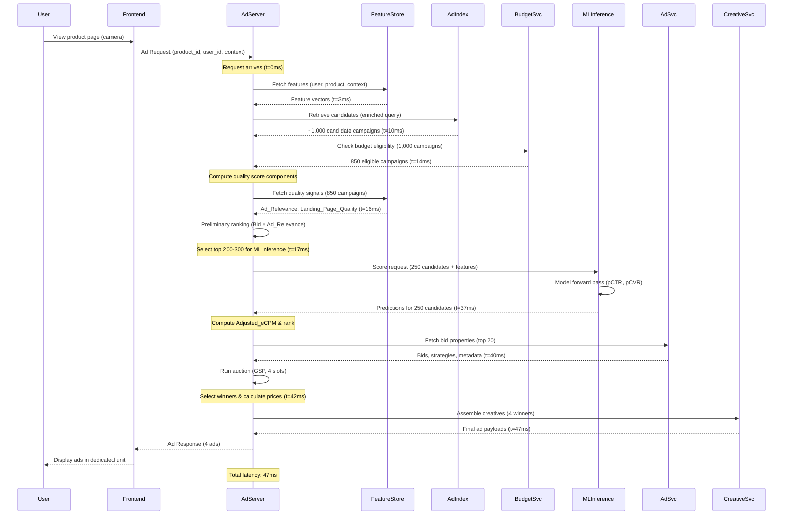
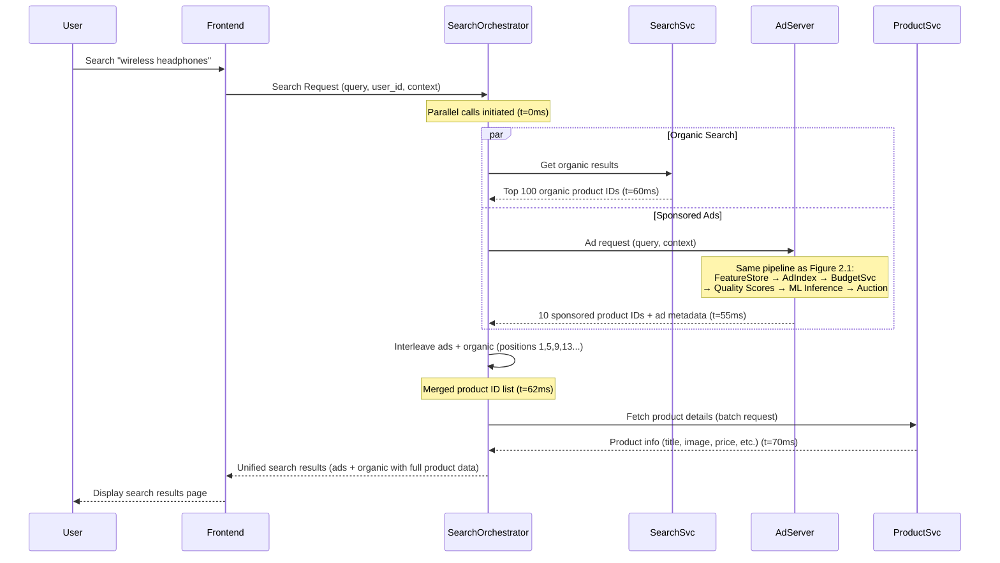

# Chapter 2: Ad Serving Architecture for Retail Media Networks

At its core, every ad serving system answers one fundamental question: which ads should we show to this user, on this page, right now? The answer must arrive in tens of milliseconds, satisfy dozens of business constraints, and maximize value for advertisers, the platform, and the user experience. In a retail media network, this challenge takes on additional complexity—ads must integrate seamlessly with e-commerce browsing, leverage first-party shopping signals, and support a marketplace where thousands of advertisers compete for limited inventory.

This chapter introduces the architecture of a production-grade RMN ad serving path. We examine the core subsystems—Ad Index, Budget & Pacing, Retrieval, Scoring, Auction, and Creative Assembly—that work in concert to deliver ads at scale. We walk through the end-to-end request flow from a shopper's page load to ad impression, highlighting the time budgets, decision points, and data flows that govern the system. We then examine each component's responsibilities and how they interact to enable sub-100ms response times at tens of thousands of queries per second.

This chapter maintains a high-level architectural view, establishing the conceptual framework and system boundaries. Subsequent chapters dive deep into each subsystem: Chapter 3 details auction mechanisms and quality scoring, Chapter 4 explores retrieval with embedding-based models, Chapter 5 examines multi-tower ranking architectures, and later chapters cover budget control algorithms and creative optimization strategies. Our goal here is to build a mental model of the complete system—what happens, in what order, and why—before we examine the internals of each component.

By the end of this chapter, you will understand the architectural blueprint that underlies modern RMN ad serving, the latency and scale requirements that shape design decisions, and how the pieces fit together to create a real-time decisioning engine that handles billions of requests per day.

---
- [Chapter 2: Ad Serving Architecture for Retail Media Networks](#chapter-2-ad-serving-architecture-for-retail-media-networks)
  - [1. End-to-End Request Flow and Component Interactions](#1-end-to-end-request-flow-and-component-interactions)
    - [1.1 Standalone Ad Placement Flow](#11-standalone-ad-placement-flow)
    - [2.2 Search-Integrated Ad Placement Flow](#22-search-integrated-ad-placement-flow)
    - [2.3 Architectural Implications](#23-architectural-implications)
    - [2.4 Time Budget Allocation](#24-time-budget-allocation)
    - [2.5 Scale Requirements](#25-scale-requirements)
  - [2. Core Components of the Ad Serving Path](#2-core-components-of-the-ad-serving-path)
    - [2.1 AdServer](#21-adserver)
    - [2.2 ML Inference Service](#22-ml-inference-service)
    - [2.3 FeatureStore](#23-featurestore)
    - [2.4 AdIndex](#24-adindex)
    - [2.5 BudgetSvc (Budget \& Pacing Service)](#25-budgetsvc-budget--pacing-service)
    - [2.6 AdSvc (Ad Campaign Service)](#26-adsvc-ad-campaign-service)
    - [2.7 CreativeSvc (Creative Assembly Service)](#27-creativesvc-creative-assembly-service)
    - [2.8 ProductSvc (Product Catalog Service)](#28-productsvc-product-catalog-service)
  - [3. Design Principles and Trade-offs](#3-design-principles-and-trade-offs)
    - [4.1 Latency vs. Accuracy](#41-latency-vs-accuracy)
    - [4.2 Recall vs. Precision](#42-recall-vs-precision)
    - [4.3 Consistency vs. Availability](#43-consistency-vs-availability)
    - [4.4 Statelessness](#44-statelessness)
    - [4.5 Observability](#45-observability)
  - [4. Summary and Next Steps](#4-summary-and-next-steps)
  - [References and Further Reading](#references-and-further-reading)

---

## 1. End-to-End Request Flow and Component Interactions

To understand how an RMN ad serving system operates, we examine two distinct serving patterns: **standalone ad placements** and **search-integrated ad placements**. Each has different architectural implications for latency budgets, component interactions, and system design.

### 1.1 Standalone Ad Placement Flow

The first pattern serves ads independently on non-search pages such as the homepage, product detail pages, category browse pages, or checkout flow. The ad server operates autonomously, receiving an ad request and returning a complete ad response without coordinating with other page-rendering systems.

We trace a typical scenario: a user views a product detail page for a camera, and the ad server must return sponsored product ads for complementary items (lenses, tripods, memory cards) to display in a dedicated ad unit below the product description.

**Figure 2.1: Standalone Ad Placement Request Flow**



In this flow, the **AdServer** orchestrates the complete pipeline from retrieval through auction. It first fetches features from the FeatureStore, then queries the AdIndex for ~1,000 candidates matching targeting criteria. After filtering by budget eligibility, it computes lightweight quality score components (Ad_Relevance, Landing_Page_Quality) on all 850 candidates (~2ms), then performs preliminary ranking using Bid × Ad_Relevance to select the top 200-300 candidates for expensive ML inference.

The **ML Inference Service** is a pure stateless backend (TorchServe or TensorFlow Serving) that receives feature vectors and returns pCTR/pCVR predictions (~20ms). The AdServer then computes Adjusted_eCPM = Bid × pCTR × 1000 × Quality_Score for final ranking, fetches bid properties from AdSvc for the top 20, runs the auction (GSP mechanism), and assembles final creatives via CreativeSvc.

This architecture optimizes computation order: cheap quality score computation on 1,000 ads before expensive ML inference on 250 ads, saving 10-20ms and reducing GPU costs. The entire flow completes in ~47ms, well within the 100ms latency budget for standalone placements. The frontend makes an asynchronous JavaScript call to fetch ads after the main page content loads, so ad latency does not block page rendering. This pattern is common for display ads, recommendation widgets, and below-the-fold placements.

### 2.2 Search-Integrated Ad Placement Flow

The second pattern integrates ads directly into search results, with sponsored products interleaved among organic listings. This requires tight coordination between the ad server and the e-commerce search/ranking system, and imposes stricter latency constraints since ads must be ready before the search results page is rendered.

We trace a search scenario: a user searches for "wireless headphones," and the system must return a unified result set with sponsored products at positions 1, 5, 9, and 13, blended with organic products.

**Figure 2.2: Search-Integrated Ad Placement Request Flow**



Key differences in the search-integrated flow:

**Parallel Execution:**
- The Search Orchestrator (or API Gateway) issues parallel requests to both the organic search service (SearchSvc) and the ad server, reducing total wall-clock time.
- SearchSvc returns ranked organic product IDs (~100 products) in 60ms, while AdServer returns sponsored product IDs with ad metadata (~10 ads) in 55ms.
- Both services perform their own relevance ranking independently before results are merged.

**Product Detail Assembly:**
- After receiving product IDs from both SearchSvc and AdServer, the orchestrator first interleaves them according to configured ad positions (e.g., slots 1, 5, 9, 13).
- A batch request to ProductSvc fetches full product details (title, image, price, inventory status) for the interleaved set only, minimizing unnecessary data fetching.
- This two-phase approach (IDs first, then details) is more efficient than each service independently fetching product data.

**Tighter Latency Budget:**
- The ad server targets p99 latency <60ms (vs. <100ms for standalone placements) to stay within the organic search window and avoid delaying page load.
- Total orchestration latency including product detail fetching is ~70ms, still within typical search page budgets (80-100ms).
- This often requires more aggressive scoring optimizations: smaller models, feature caching, or two-stage ranking (lightweight first-pass, heavy re-rank on top-20).

**Interleaving Logic:**
- The Search Orchestrator merges ads and organic product IDs using a configured interleaving pattern (e.g., fixed ad slots at positions 1, 5, 9, 13, or dynamic allocation based on relevance scores).
- Some systems use **unified ranking**, where the ad scoring and organic relevance scores are comparable, enabling joint ranking. Others use **position-based allocation**, where ad slots are pre-determined and ads fill those positions regardless of score.

**Request for More Ads:**
- The orchestrator may request 10 ads but only use 4, to ensure high-quality ads are available even if some are filtered during interleaving (e.g., duplicate products, policy violations).

### 2.3 Architectural Implications

The choice between standalone and search-integrated patterns drives several architectural decisions:

| **Aspect**               | **Standalone Placement**                  | **Search-Integrated Placement**              |
|--------------------------|------------------------------------------|---------------------------------------------|
| **Latency Budget**       | ~100ms (p99)                              | ~60ms (p99) to match organic search          |
| **Coordination**         | Ad server operates independently          | Requires orchestrator to merge ads + organic |
| **Ranking Optimization** | Moderate pressure (30-40ms for ranking)   | High pressure (20-30ms for ranking)          |
| **Failure Handling**     | Return empty ad response, no page impact  | Degrade to organic-only results              |
| **Interleaving**         | Not applicable                            | Complex merging logic, position allocation   |

For the remainder of this chapter, we focus on time budgets and scale requirements for the **standalone placement pattern** (the more relaxed case). The search-integrated pattern's tighter constraints are addressed in Chapter 4, where we explore ranking model optimizations that enable sub-30ms inference.

### 2.4 Time Budget Allocation

A typical RMN ad server targets **p99 latency under 100ms** for standalone placements to avoid degrading page load times. Within that budget, the subsystems allocate time roughly as follows:

| **Stage**                     | **Time Budget** | **Percentage** | **Primary Bottleneck**                |
|-------------------------------|-----------------|----------------|---------------------------------------|
| Feature Fetching              | 2–3ms           | 3%             | Redis/Memcached lookups               |
| Retrieval (Ad Index)          | 5–10ms          | 10%            | Index lookup, network I/O             |
| Budget Check                  | 2–5ms           | 5%             | Distributed counter reads             |
| Quality Score Computation     | 1–2ms           | 2%             | FeatureStore lookups, formula compute |
| Preliminary Ranking           | 1–2ms           | 2%             | In-memory sorting                     |
| ML Inference                  | 20–30ms         | 30%            | GPU forward pass, batching overhead   |
| Final Ranking & Auction       | 2–5ms           | 5%             | eCPM compute, winner selection        |
| Bid Property Fetching         | 2–3ms           | 3%             | AdSvc cache/DB lookups                |
| Creative Assembly             | 3–8ms           | 8%             | Asset retrieval, JSON serialization   |
| Network & Overhead            | 10–20ms         | 20%            | Request parsing, logging, response    |

**ML Inference** is the most expensive stage, consuming 20-30ms for GPU inference on 200-300 candidates. However, the optimized architecture significantly reduces this cost compared to naive approaches:
- **Without preliminary ranking:** Scoring 1,000 candidates would take ~80-100ms.
- **With preliminary ranking:** Scoring 250 candidates takes ~25ms, saving 55-75ms.
- **Cost savings:** Reducing GPU inference set size by 75% (1,000 → 250) reduces inference costs proportionally.

**Quality Score Computation** is lightweight (~1-2ms for 1,000 ads) because it involves simple feature lookups from FeatureStore (cached in Redis) and formula evaluation (Bid × Ad_Relevance × Landing_Page_Quality × pCVR_factor). This cheap operation happens *before* expensive ML inference, enabling efficient preliminary ranking.

**Retrieval** must be fast to leave headroom for ranking. Index sharding, in-memory data structures, and approximate nearest neighbor (ANN) search (for embedding-based retrieval) keep this stage under 10ms. Chapter 4 details these techniques.

**Auction, Bid Fetching, and Creative Assembly** are lightweight by comparison, each completing in single-digit milliseconds. However, poor design (e.g., synchronous database queries in Creative Assembly) can introduce tail latency spikes that violate SLAs.

**Latency Optimization Insight:**

The key architectural decision is **computation order**: run cheap operations (quality scores, preliminary ranking) on the full candidate set (1,000 ads) *before* expensive operations (ML inference) on a reduced set (250 ads). This reduces end-to-end latency by 20-40% and GPU costs by 70-80% compared to scoring all candidates with ML.

### 2.5 Scale Requirements

Production RMN ad servers handle **10,000–50,000 queries per second (QPS)** sustained, with peak traffic 2–3× higher during promotional events (Black Friday, Prime Day). To meet this scale:

- **Horizontal Scaling:** All services (Ad Index, Budget, Ranking, Auction, Creative) are stateless and horizontally scalable behind load balancers.
- **Caching:** Frequently accessed data (popular keywords, top campaigns, creative assets) are cached in Redis or Memcached to reduce backend load.
- **Asynchronous Logging:** Impression and click events are logged asynchronously to Kafka or Kinesis to avoid blocking the critical path.
- **Regional Deployment:** Geo-distributed deployments reduce network latency for global traffic.

We explore scalability patterns, caching strategies, and infrastructure considerations in Chapter 5.

---

## 2. Core Components of the Ad Serving Path

Having traced the request flows, we now examine each component in detail. The ad serving system consists of several specialized services, each with distinct responsibilities. Together, they transform an inbound ad request into a ranked list of eligible, budget-compliant, auction-winning ads ready for display.

### 2.1 AdServer

The **AdServer** is the central orchestrator of the ad serving pipeline and also implements the real-time auction of Ads. It receives ad requests from the frontend or API gateway and coordinates all stages from candidate retrieval through final creative assembly. 

Key responsibilities:

**Request Orchestration:**
- Parse incoming ad requests, extract context (user_id, product_id, query), and validate request format.
- Coordinate parallel or sequential calls to FeatureStore, AdIndex, BudgetSvc, ML Inference Service, AdSvc, and CreativeSvc.
- Handle timeouts, retries, and fallbacks gracefully (e.g., serve cached ads if ML inference times out).

**Candidate Retrieval Pipeline:**
- Fetch features from FeatureStore (user history, product attributes, context signals).
- Query AdIndex with enriched query to retrieve ~1,000 candidate campaigns matching targeting criteria.
- Call BudgetSvc to filter out campaigns that have exhausted budgets or require pacing throttling.

**Quality Score Computation:**
- Fetch quality signal features (Ad_Relevance, Landing_Page_Quality, pCVR components) from FeatureStore for budget-eligible candidates.
- Compute quality scores using platform-defined multiplicative formula (typically 0.5–1.5 range).
- This is a lightweight operation (~1-2ms for 1,000 ads) executed on CPU.

**Preliminary Ranking:**
- Rank candidates by Bid × Ad_Relevance (or Bid × Quality_Score if pCVR is pre-computed).
- Select top 200-300 candidates for expensive ML inference, reducing GPU costs and latency.
- This optimization ensures expensive operations (20-40ms) run on a smaller candidate set.

**ML Inference Coordination:**
- Prepare feature vectors for top candidates and call ML Inference Service (TorchServe, TensorFlow Serving).
- Receive pCTR and pCVR predictions from the stateless inference backend.
- Handle batching if multiple ad requests arrive concurrently (dynamic batching at inference service).

**Final Ranking & Auction:**
- Compute Adjusted_eCPM = Bid × pCTR × 1000 × Quality_Score for each candidate.
- Rank by Adjusted_eCPM and select top 20-50 for auction.
- Fetch bid properties (max bid, bid strategy, campaign metadata) from AdSvc.
- Run auction mechanism (Generalized Second-Price or VCG) to select winners and calculate prices.

**Creative Assembly:**
- Call CreativeSvc to assemble final ad payloads for winning campaigns.
- Package the final ad slate into JSON or structured format and return to the frontend.

The AdServer is stateless and can be dynamically scaled out for high request throughput. 

**Architectural Rationale:**

This design separates **orchestration logic** (AdServer, CPU-optimized) from **specialized computation** (ML Inference Service, GPU-optimized; FeatureStore, Redis-backed). Key benefits:
- **Independent Scaling:** Scale ML inference GPUs separately from orchestration CPUs based on workload.
- **Computation Order Optimization:** Run cheap operations (quality scores) on large candidate sets before expensive operations (ML inference) on small sets.
- **Clear Separation of Concerns:** AdServer owns all business logic (ranking, auction, quality scores); backend services are pure computation engines.
- **Technology Flexibility:** Replace ML framework (PyTorch → TensorFlow) or feature store (Feast → Tecton) without changing orchestration logic.

This matches the architecture used by Google Ads and Meta Ads, where serving layers orchestrate while specialized services compute.

**For complete details on auction mechanics and how Ads are scored in an auction, see Chapter 3: Auction Mechanisms and Quality Scoring.**

### 2.2 ML Inference Service

The **ML Inference Service** is a pure stateless backend that performs machine learning inference. It receives feature vectors from the AdServer and returns predictions (pCTR, pCVR) for ranking. Unlike the previous "ScoringSvc" design that combined orchestration with ML inference, this service has a single, well-defined responsibility: execute model forward passes efficiently.

**Core Functionality:**
- **Model Hosting:** Serve multi-tower ranking models (Chapter 5) trained offline and deployed as serialized artifacts (TorchScript, SavedModel, ONNX).
- **Batch Inference:** Accept batches of feature vectors (200-300 candidates × 50-100 features) and return predictions in a single forward pass.
- **GPU Acceleration:** Leverage GPU for matrix operations to reduce inference latency from 100ms (CPU) to 20-30ms (GPU).
- **Dynamic Batching:** Automatically batch multiple concurrent requests to maximize GPU utilization (configurable batch size and timeout).

**Technology Stack:**
- **PyTorch + TorchServe:** Most common for research-driven teams. TorchServe provides built-in dynamic batching, model versioning, and metrics.
- **TensorFlow + TensorFlow Serving:** Strong gRPC support, mature ecosystem, efficient CPU inference with XLA compilation.
- **NVIDIA Triton:** Framework-agnostic (supports PyTorch, TensorFlow, ONNX), optimized for GPU inference, concurrent model execution.
- **ONNX Runtime:** Cross-platform, supports models exported from PyTorch/TensorFlow, efficient CPU/GPU inference.

**API Contract:**

The service exposes a simple request/response interface:

```python
# Request
{
  "candidates": [
    {
      "campaign_id": "12345",
      "features": {
        "user_purchase_history_embedding": [0.23, 0.45, ...],  # 128-dim
        "product_category_id": 42,
        "hour_of_day": 14,
        "campaign_historical_ctr": 0.03,
        ...
      }
    },
    # ... 250 candidates
  ]
}

# Response
{
  "predictions": [
    {
      "campaign_id": "12345",
      "pCTR": 0.042,
      "pCVR": 0.008
    },
    # ... 250 predictions
  ],
  "inference_time_ms": 22
}
```

**Deployment Architecture:**

```
AdServer (CPU)
    |
    | gRPC/HTTP (batch of 250 candidates)
    v
Load Balancer
    |
    v
[ML Inference Pod 1] [ML Inference Pod 2] ... [ML Inference Pod N]
   (GPU: Tesla T4)      (GPU: Tesla T4)           (GPU: Tesla T4)
```

Each pod runs a stateless inference service with a GPU attached. Kubernetes or cloud autoscaling adjusts the number of pods based on request volume. No state is stored in the pods—models are loaded from S3/GCS at startup, and predictions are computed on-the-fly.

**Optimization Strategies:**
- **Model Distillation:** Train smaller models that approximate larger teacher models, reducing inference time by 2-3×.
- **Quantization:** Use INT8 or FP16 precision instead of FP32 to reduce memory bandwidth and increase throughput (1.5-2× speedup).
- **Feature Caching:** If many candidates share features (e.g., user embeddings), cache embeddings in Redis and reuse across requests.
- **Early Exit:** For two-stage ranking, use a lightweight model for initial scoring and a heavy model for re-ranking top-20.

**Statelessness & Scalability:**

The ML Inference Service is entirely stateless. It does not:
- Store feature data (features are passed by the AdServer)
- Track budget or pacing state (handled by BudgetSvc)
- Maintain session history (AdServer fetches from FeatureStore)
- Execute business logic (auction, quality scores—all in AdServer)

This enables:
- **Horizontal Scaling:** Add/remove inference pods dynamically based on traffic.
- **Model Updates:** Deploy new model versions with blue/green or canary strategies without downtime.
- **Framework Flexibility:** Replace PyTorch with TensorFlow or switch to ONNX without affecting AdServer.

**Separation from Orchestration:**

This design decouples **business logic** (AdServer) from **ML computation** (ML Inference Service). The AdServer decides *which* candidates to score, *how* to rank them (Adjusted_eCPM formula), and *which* to auction. The ML Inference Service simply computes pCTR/pCVR given feature vectors. This matches industry best practices (Google, Meta, Amazon) where serving layers orchestrate and specialized backends compute.

For details on multi-tower model architecture, training, and feature engineering, see Chapter 5.

### 2.3 FeatureStore

The **FeatureStore** provides low-latency access to features required for scoring. It bridges offline feature engineering (batch ETL pipelines) and online serving, ensuring that features used for training match those used for inference (avoiding train/serve skew).

**Feature Categories:**
- **User Features:** Purchase history, browsing behavior, cart contents, segment memberships, lifetime value.
- **Product/Context Features:** Category, price, inventory status, popularity, seasonality indicators.
- **Campaign Features:** Historical CTR, conversion rate, spend rate, quality score.

**Technology Choices:**
- **Online Store:** Redis or DynamoDB for sub-5ms feature lookups.
- **Offline Store:** Parquet files on S3, BigQuery, or Snowflake for batch feature materialization.
- **Feature Platforms:** Feast (open-source), Tecton (managed), Hopsworks (enterprise).

The FeatureStore ensures consistency between training and serving environments, a critical requirement for ML model performance.

### 2.4 AdIndex

The **AdIndex** is the queryable representation of all active ad campaigns and their targeting rules. It stores mappings from targeting attributes (keywords, product IDs, category IDs, audience segments) to campaigns, enabling fast candidate retrieval.

**Index Types:**
- **Structured Index:** Exact-match lookups for product IDs, category IDs, audience segments. Implemented with hash maps, tries, or bitmap indices.
- **Unstructured Index:** Full-text search for keywords with tokenization, stemming, synonym expansion. Implemented with Elasticsearch or Apache Solr.
- **Embedding Index:** Vector similarity search for semantic keyword matching or product recommendation. Implemented with FAISS (Facebook) or ScaNN (Google).

**Implementation Patterns:**
- **Elasticsearch/Solr:** Production-grade inverted indices supporting both structured filters and unstructured text search. Near-real-time updates (1-5s refresh intervals), distributed sharding.
- **Custom In-Memory Indices:** Optimized for exact-match lookups (<5ms latency). Often used in combination with Elasticsearch (custom for structured, Elasticsearch for text).
- **Hybrid Retrieval:** Combine multiple index types (keyword + product + embedding) and merge results.

The AdIndex must handle near-real-time updates as advertisers create, pause, or modify campaigns. Sharding strategies partition the index by product catalog segments or keyword namespaces. We explore inverted index design, embedding-based retrieval, and hybrid strategies in Chapter 3.

### 2.5 BudgetSvc (Budget & Pacing Service)

The **BudgetSvc** tracks campaign spending in real time and enforces advertiser-defined budget caps (daily, weekly, lifetime). It answers: should we show another impression for this campaign right now, or are we at risk of overspending?

**Budget Enforcement:**
- **Hard Constraints:** If a campaign has exhausted its budget, exclude it from serving entirely.
- **Pacing Logic:** If a campaign has budget remaining but is spending too quickly, apply throttling (reduce participation rate or adjust effective bid) to spread spend evenly over the remaining time window.

**Pacing Mechanisms:**
- **PID Controllers:** Proportional-integral-derivative feedback controllers modulate bid adjustments or participation rates based on observed spend rate vs. target spend rate.
- **Day-Parting:** Time-varying pacing targets (e.g., allocate 60% of daily budget to peak hours 9am-9pm, 40% to off-peak).
- **Event-Driven Pacing:** Adjust targets dynamically for traffic spikes (flash sales, promotional events).

**Technology Stack:**
- **Counters:** Redis sorted sets or atomic counters for real-time spend tracking.
- **Pacing Logic:** Python/Go services implementing PID controllers.
- **Persistence:** Periodic snapshots to PostgreSQL for recovery and auditing.

The system must handle delayed feedback (impressions logged milliseconds after the auction decision) and distributed state (budget counters sharded across servers). We explore PID-based pacing algorithms, distributed budget counters, and overspend mitigation strategies in later chapters.

### 2.6 AdSvc (Ad Campaign Service)

The **AdSvc** supplies bid properties and campaign metadata required for auction execution. After the AdServer computes Adjusted_eCPM for scored candidates, it queries AdSvc to fetch detailed information for the top candidates:
- **Bid Information:** Maximum bid (CPC or CPM), bid strategy (manual, target ROAS, maximize clicks).
- **Campaign Metadata:** Advertiser ID, campaign budget status, quality score, policy compliance flags.
- **Creative References:** Pointers to creative assets (handled by CreativeSvc for assembly).

**Technology Stack:**
- **Primary Store:** PostgreSQL or MySQL for campaign configuration (the source of truth).
- **Cache Layer:** Redis for frequently accessed campaigns (top 10% of campaigns serve 80%+ of traffic).
- **API:** RESTful or gRPC interface for batch fetching (retrieve 20-50 campaigns in a single request).

The AdSvc must support high read throughput (10K-50K QPS) while maintaining consistency with the campaign database. Caching strategies and eventual consistency trade-offs are key design considerations.

### 2.7 CreativeSvc (Creative Assembly Service)

The **CreativeSvc** constructs the final ad payload for each winning campaign. It retrieves creative assets (images, titles, descriptions), applies dynamic creative optimization (DCO), and serializes the response.

**Creative Assembly Steps:**
1. **Asset Retrieval:** Fetch creative metadata from a creative store (Redis cache fronting PostgreSQL or S3).
2. **Dynamic Substitution:** Insert real-time data (current price, inventory status, user-specific messaging, promotional badges).
3. **Format Compliance:** Ensure the ad meets placement requirements (image dimensions, character limits, required fields).
4. **Response Serialization:** Package the ad slate into JSON or structured format expected by the frontend.

**Technology Stack:**
- **Cache:** Redis for frequently accessed creative metadata.
- **Asset Storage:** S3 or CDN for images, videos, product feeds.
- **Fallbacks:** Default creatives or dynamic fallback logic for missing assets.

Creative Assembly must execute in <5ms to stay within the overall latency budget. Dynamic creative optimization and personalized messaging strategies are explored in later chapters.

### 2.8 ProductSvc (Product Catalog Service)

The **ProductSvc** provides product details (title, image, price, inventory) for rendering search results and ad creatives. In search-integrated flows, it is called after interleaving to batch-fetch product information for the merged result set.

**Key Responsibilities:**
- **Batch Product Lookup:** Fetch details for 100+ product IDs in a single request (~5-10ms).
- **Real-Time Pricing:** Return current prices and inventory status (may differ from cached feature store values).
- **Product Metadata:** Category, brand, ratings, reviews, shipping eligibility.

**Technology Stack:**
- **Primary Store:** Product catalog database (PostgreSQL, MongoDB, or specialized e-commerce platforms).
- **Cache Layer:** Redis or Memcached for frequently viewed products.
- **API:** Batch-optimized RESTful or gRPC interface.

The ProductSvc is shared across ad serving and organic search systems, requiring careful capacity planning to handle combined traffic.

---

## 3. Design Principles and Trade-offs

Several architectural principles guide RMN ad serving design:

### 4.1 Latency vs. Accuracy

Ranking models with more parameters or deeper architectures generally improve ad relevance but increase inference latency. Common strategies to balance this trade-off:
- **Model Distillation:** Train a smaller "student" model to approximate a larger "teacher" model.
- **Two-Stage Ranking:** Use a lightweight model for initial scoring (top-k selection) and a heavy model for final re-ranking (top-10).
- **Feature Pruning:** Remove low-signal features to reduce input size and computation.

### 4.2 Recall vs. Precision

Retrieval prioritizes **recall** (not missing relevant ads) because downstream ranking can filter out poor candidates. However, excessively large candidate sets (>2,000) overwhelm the ranking stage. Strategies:
- **Hard Filters:** Exclude campaigns with low historical CTR or poor quality scores during retrieval.
- **Approximate Matching:** Use embedding similarity with a tuned threshold to limit candidate set size.

### 4.3 Consistency vs. Availability

Budget enforcement requires consistent state across distributed servers. If a campaign's budget is exhausted, all servers must stop serving it immediately. However, strict consistency (e.g., distributed locks) introduces latency. Pragmatic approaches:
- **Eventual Consistency:** Accept slight overspend (1-2%) in exchange for low latency.
- **Periodic Sync:** Budget counters sync every 100ms–1s; pacing logic tolerates stale reads.
- **Circuit Breakers:** If budget service is unavailable, serve ads at reduced throttle rather than failing entirely.

### 4.4 Statelessness

All serving components (Ad Server, Ranking, Auction, Creative Assembly) are stateless, relying on external stores (Redis, PostgreSQL, S3) for state. This enables:
- **Horizontal Scaling:** Add/remove servers dynamically based on load.
- **Fault Tolerance:** Restart failed servers without data loss.
- **Simplified Deployment:** Blue/green or canary deployments with minimal coordination.

### 4.5 Observability

Production ad serving systems instrument every stage with metrics (latency, error rate, throughput), logs (structured JSON logs to Elasticsearch), and traces (distributed tracing with Jaeger or Datadog). Key metrics:
- **Latency Percentiles:** p50, p95, p99 per service.
- **Error Rates:** 4xx/5xx responses, timeout rates.
- **Business Metrics:** Fill rate (percentage of requests with ads), eCPM (effective cost per thousand impressions).

Dashboards (Grafana) and alerts (PagerDuty) enable rapid incident response.

---

## 4. Summary and Next Steps

This chapter introduced the architecture of an RMN ad serving system through three lenses: end-to-end request flows, core components, and design principles. We examined two distinct serving patterns—standalone ad placements and search-integrated placements—and how they differ in latency budgets, orchestration, and interleaving logic. We then explored eight core components that power the ad serving path, from orchestration (AdServer) to ML inference (ML Inference Service) to creative assembly (CreativeSvc).

Key takeaways:
- **Request Flows:** Standalone placements allow ~100ms latency with asynchronous loading, while search-integrated placements require ~60ms to match organic search and include interleaving logic with ProductSvc for unified results.
- **AdServer as Orchestrator:** The AdServer owns the complete pipeline orchestration—from feature fetching through retrieval, quality score computation, preliminary ranking, ML inference coordination, final ranking, auction execution, and creative assembly. This centralizes business logic while delegating specialized computation to backend services.
- **ML Inference Service Architecture:** A pure stateless inference backend (TorchServe, TensorFlow Serving, or Triton) that receives feature vectors and returns pCTR/pCVR predictions. Separating ML computation from orchestration enables independent scaling (GPU for inference, CPU for orchestration) and technology flexibility.
- **Optimized Computation Order:** The architecture computes lightweight quality scores on 1,000 candidates (1-2ms) before expensive ML inference on 250 candidates (20-30ms), reducing latency by 20-40% and GPU costs by 70-80% compared to scoring all candidates.
- **Auction Mechanism:** The AdServer ranks candidates by adjusted eCPM (bid × pCTR × quality_score), balancing advertiser bids with ML-predicted engagement and quality scores. High-quality ads can outrank higher bids.
- **FeatureStore Role:** Bridges offline training and online serving, ensuring feature consistency and avoiding train/serve skew—a critical requirement for ML model performance.

The architecture balances competing demands: latency vs. accuracy, recall vs. precision, consistency vs. availability. Separating orchestration (AdServer, CPU) from specialized computation (ML Inference Service, GPU; FeatureStore, Redis) enables independent scaling and optimization. Stateless services, horizontal scaling, caching, and asynchronous logging enable the system to handle 10,000–50,000 QPS sustained, with peaks 2–3× higher during promotional events.

**Next Chapters:**

- **Chapter 3: Auction Mechanisms and Quality Scoring** — Deep dive into adjusted eCPM formulas (CPC vs CPM), quality score computation (multiplicative formulas, Ad_Relevance, Landing_Page_Quality), platform weight tuning through Bayesian Optimization, and integration with ML predictions.

- **Chapter 4: Retrieval and Candidate Generation** — Inverted index design (Elasticsearch, custom in-memory indices), embedding-based retrieval with FAISS/ScaNN, hybrid retrieval strategies, and algorithms that power sub-10ms candidate selection at scale.

- **Chapter 5: Multi-Tower Scoring Models** — Neural architectures for predicting pCTR/pCVR, separating static user features from dynamic context, dual-use embeddings (retrieval + ranking), multi-task learning, and deployment as stateless inference services.

Each subsequent chapter builds on the architectural foundation established here, diving deep into the algorithms, ML systems, and optimization techniques that power production RMN platforms.

---

## References and Further Reading

[To be populated with specific sources as content is validated]

**Ad Serving Architecture:**
- Google Ads Architecture (high-level overviews from Google Cloud blog posts)
- Amazon Advertising Engineering Blog (sponsored products architecture insights)

**Retrieval Systems:**
- Johnson, J., Douze, M., & Jégou, H. (2019). "Billion-scale similarity search with GPUs." *IEEE Transactions on Big Data*.
- FAISS documentation: https://github.com/facebookresearch/faiss

**Feature Stores:**
- Feast documentation: https://feast.dev/
- Tecton documentation: https://www.tecton.ai/

**Model Serving:**
- TorchServe documentation: https://pytorch.org/serve/
- TensorFlow Serving documentation: https://www.tensorflow.org/tfx/guide/serving