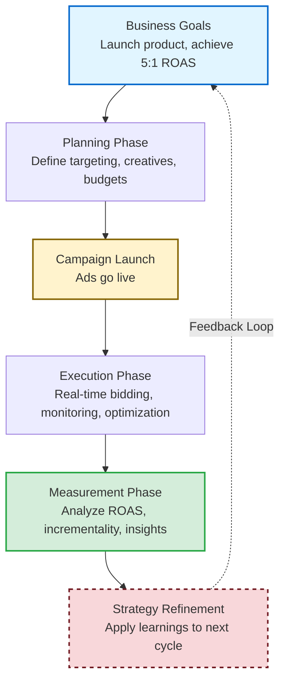

# Chapter 2: The Retail Media Network (RMN) Ecosystem

Retail media networks represent a fundamental architectural shift in digital advertising. Unlike traditional third-party ad networks (Chapter 1), which relied on cookie-based targeting and probabilistic attribution, RMNs exploit **vertical integration**: the retailer owns the e-commerce site, tracks shopper behavior through first-party data, and measures advertising effectiveness with deterministic closed-loop attribution. This integration changes everything: retrieval strategies, ranking objectives, measurement infrastructure, and privacy controls. It also introduces new engineering challenges at the intersection of e-commerce, ML systems, and real-time serving.

This chapter establishes the RMN problem domain before we build the systems in subsequent chapters. We follow the advertiser's journey: understanding what RMNs are and their core terminology, then walking through campaign planning, execution and optimization, and measurement. Understanding this landscape is essential: engineering choices cascade from business requirements, and we must architect systems that balance monetization, user experience, and privacy under brutal latency constraints (10–50ms at 10K–50K QPS).

---

Table of Contents

- [1. Introduction to RMN](#1-introduction-to-rmn)
  - [1.1. What is a Retail Media Network?](#11-what-is-a-retail-media-network)
  - [1.2. The Three Constituencies](#12-the-three-constituencies)
  - [1.3. How RMNs Differ from Traditional Ad Networks](#13-how-rmns-differ-from-traditional-ad-networks)
- [2. Core RMN Ontology](#2-core-rmn-ontology)
  - [2.1. Entity Hierarchy](#21-entity-hierarchy)
  - [2.2. Glossary of Core Terms](#22-glossary-of-core-terms)
- [3. The Advertiser Lifecycle](#3-the-advertiser-lifecycle)
- [4. Ads Planning: Campaign Setup](#4-ads-planning-campaign-setup)
  - [4.1. Campaign Management: Structuring the Campaign](#41-campaign-management-structuring-the-campaign)
  - [4.2. Creative Management: Ad Formats and Assets](#42-creative-management-ad-formats-and-assets)
  - [4.3. Targeting \& Audience Strategy](#43-targeting--audience-strategy)
    - [4.3.1. Placement Types](#431-placement-types)
    - [4.3.2. Targeting Mechanisms](#432-targeting-mechanisms)
    - [4.3.3. Common Combinations](#433-common-combinations)
- [5. Running Ads and Optimization](#5-running-ads-and-optimization)
  - [5.1. Budget Management](#51-budget-management)
  - [5.2. Bidding and Auctions](#52-bidding-and-auctions)
  - [5.3. Campaign Optimization Strategies](#53-campaign-optimization-strategies)
- [6. Measurement and Attribution](#6-measurement-and-attribution)
  - [6.1. Core Metrics](#61-core-metrics)
  - [6.2. Attribution Models](#62-attribution-models)
  - [6.3. Incrementality and Experimentation](#63-incrementality-and-experimentation)
  - [6.4. Closing the Loop](#64-closing-the-loop)
- [Summary and Next Steps](#summary-and-next-steps)
- [References and Further Reading](#references-and-further-reading)

---

## 1. Introduction to RMN

### 1.1. What is a Retail Media Network?

A **retail media network (RMN)** is an advertising platform operated by a retailer, enabling brands (often the retailer's suppliers or endemic advertisers) to place ads on the retailer's owned properties, including website, mobile app, and increasingly off-site placements via demand-side platform (DSP) integrations. Unlike traditional display or search ad networks (Chapter 1), which aggregate inventory from many publishers and rely on third-party cookies for targeting, RMNs control both the supply side (inventory) and the demand side (advertiser access to first-party shopper data). This vertical integration yields deterministic attribution: when a shopper clicks a sponsored product ad and purchases that item minutes later, the retailer's logs record both events under the same user ID, enabling precise measurement of ad-driven revenue.

**Why now?** Three forces converged: **privacy regulation, e-commerce scale, and technology maturity**. Privacy shifts (GDPR in 2018, CCPA in 2020, and browser cookie deprecation) eroded third-party tracking, making first-party data precious. Simultaneously, e-commerce penetration surged (accelerated by COVID-19), giving retailers tens of millions of daily active users and billions of impressions to monetize. Finally, ML infrastructure commoditized: open-source frameworks (PyTorch, TensorFlow), vector databases (FAISS, ScaNN), and feature stores made it feasible for non-FAANG companies to build production-grade ad serving and ranking systems. By 2021, Amazon Ads exceeded $30B in annual revenue [4], Walmart Connect and Target's Roundel scaled rapidly, and grocery chains (Kroger Precision Marketing, Albertsons Media Collective) launched RMNs backed by offline purchase data.

**The "Third Wave" context:** Digital advertising evolved from search/display networks (2000–2010, keyword targeting and GSP auctions) to social/programmatic (2010–2020, deep learning and micro-targeting via third-party cookies) to retail media (2020–present, first-party data and deterministic attribution). RMNs combine the auction mechanics of Wave 1, the ML sophistication of Wave 2, and a new constraint: data must stay within retailer control or move through privacy-preserving infrastructure (clean rooms, differential privacy).

### 1.2. The Three Constituencies

RMNs succeed because they deliver value to three constituencies with partially aligned incentives. Balancing these interests shapes platform design.

**For Retailers:**  
RMNs are high-margin revenue streams, with gross margins often exceeding 70% compared to 20–30% for retail operations, and diversify income beyond product sales. Advertising monetizes zero-revenue inventory (search result pages, category pages, product detail pages). More subtly, RMNs provide strategic leverage: retailers control which brands get visibility, can favor private-label products in ranking algorithms (within regulatory bounds), and use ad revenue to subsidize low-margin categories or loyalty programs. Successful platforms scale to billions in annual revenue (Amazon Ads, Walmart Connect, Instacart Ads).

**For Advertisers (Brands and Agencies):**  
RMNs offer targeting precision and attribution clarity unavailable elsewhere. Advertisers bid on high-intent shoppers, specifically users actively searching for "laundry detergent" or browsing the cleaning supplies aisle, and measure sales impact within hours, not weeks. Closed-loop attribution eliminates the ambiguity of multi-touch models: if a user clicked a Sponsored Product ad and bought the item, the causal link is direct (modulo organic cannibalization, which incremental lift studies address). First-party data enables granular segmentation: "users who bought competitor products in the past 30 days but haven't purchased our brand." For endemic brands (those sold on the retailer's site), RMNs are essential for shelf-space competition: winning the top Sponsored Product slot can double conversion rates.

**For Shoppers:**  
When executed well, RMN ads enhance discovery rather than intrude. Sponsored Product ads surface relevant alternatives ("here's a higher-rated detergent at a similar price") or new products ("this just-launched flavor matches your past purchases"). The key is *relevance*: ads that waste shopper attention degrade user experience, reduce organic engagement, and ultimately harm retailer revenue. Ranking models must balance advertiser revenue (eCPM) with user satisfaction (CTR, dwell time, conversion likelihood). RMN engineers build re-ranking layers that penalize low-quality creatives, diversity constraints that prevent a single advertiser from dominating all placements, and fatigue models that cap impression frequency per user.

### 1.3. How RMNs Differ from Traditional Ad Networks

The architectural delta between RMNs and traditional third-party networks (Chapter 1) stems from vertical integration and first-party data ownership. **Table 2.1** summarizes the key differences:

**Table 2.1: RMN vs. Traditional Ad Network Comparison**

| Dimension | Traditional Ad Networks | Retail Media Networks |
|-----------|------------------------|----------------------|
| **Inventory Source** | Aggregated from many publishers via exchanges | Retailer owns site/app; controls all placements |
| **Targeting Foundation** | Third-party cookies, probabilistic identity graphs | First-party data: logged-in user IDs, purchase history, deterministic identity |
| **Attribution** | Multi-touch, 7–30 day windows, probabilistic | Closed-loop: ad impression and conversion both logged under same user ID |
| **Retrieval Strategy** | Inverted indices (keyword matching) or vector search | Similar but richer context: cart, recently viewed products, brand affinity |
| **Ranking Objective** | Maximize eCPM = bid × pCTR | Multi-objective: ad revenue + organic revenue impact + user satisfaction |
| **Privacy & Compliance** | Post-GDPR/CCPA: heavy reliance on consent management | First-party data inside retailer's domain; compliance easier |

**In essence, two most important architectural shifts define RMNs**: (1) **Deterministic attribution** via first-party user IDs eliminates the probabilistic guesswork of cookie-based networks, enabling same-day ROAS reporting and causal measurement; (2) **Multi-objective ranking** balances ad revenue with organic sales and user satisfaction, requiring ranking models that account for cannibalization and UX degradation. This is fundamentally more complex than traditional networks' single-objective eCPM maximization.

**Key architectural implications:**

1. **Deterministic Attribution and Closed-Loop Measurement**: When a shopper is logged in, every event (ad impression, click, add-to-cart, purchase) logs the same persistent user ID. Attribution is deterministic, not probabilistic. This enables same-day ROAS reporting, fine-grained holdout experiments, and causal inference models that separate ad-driven purchases from organic purchases. From an engineering perspective, the *feature → label pipeline* is faster and cleaner than in traditional networks, enabling us to retrain CTR models hourly, not weekly.

2. **First-Party Data as a Moat**: RMNs own their data: every search query, product view, cart addition, and purchase is first-party. This data is richer than third-party cookies (full session histories, actual purchase amounts, timestamps to the second). But ownership creates responsibility: strict data access controls, clean rooms for advertiser queries, row-level security in feature stores. Violations risk GDPR fines up to 4% of global revenue.

3. **Latency and Scale Constraints**: High-frequency placements (Sponsored Product slots on search results pages) have 10–50ms latency budgets at 10K–50K QPS. We solve this via **multi-stage funnels**: Retrieval (1–5ms, fetch 500–1000 candidates) → L1 Ranking (2–10ms, prune to 50–100 finalists) → L2 Ranking (5–20ms, deep models on finalists) → Re-ranking & Auction (1–5ms).

---

## 2. Core RMN Ontology

Before diving into platform architecture, we establish a shared vocabulary. This section disambiguates key concepts, clarifies hierarchical relationships, and defines RMN-specific terminology used throughout the book.

### 2.1. Entity Hierarchy

**Campaign → Ad Group → Ad:**  
Advertisers organize spending in a three-level hierarchy:

1. **Campaign**: Top-level container with a business objective (e.g., "Q4 Holiday Promotion"), overall budget, date range, and default bidding strategy.
2. **Ad Group**: Within a campaign, groups ads by product category, audience, or targeting theme. Each ad group has:
   - **Targeting rules**: Keywords (for search ads) or audience segments (for display)
   - **Bid settings**: Default bid or bid adjustments
   - **Budget allocation**: Optional daily/lifetime budget caps
3. **Ad**: Individual creative unit (single SKU for Sponsored Products, banner image for display). Each ad:
   - **Inherits targeting and bidding** from its parent ad group
   - **Participates in auctions** as the atomic unit
   - **Has creative-specific attributes**: landing page URL, tracking parameters

**Key insight**: Targeting and bidding are configured at the ad group level, but individual ads within that group participate in auctions as distinct candidates.

**Other Entity Definitions:**

- **Creative**: The raw asset (product image, banner, video file)
- **Placement**: The location on a page where ads render (SRP top slot, PDP sidebar, homepage carousel)
- **Impression types**: **Served** (ad server returned the ad), **Rendered** (displayed on screen), **Viewable** (50%+ visible for ≥1 second)

### 2.2. Glossary of Core Terms

This glossary provides brief definitions with forward references to detailed sections.

**Targeting (see Section 4.3 for details):**
- **Keywords**: Advertiser-specified terms matched against user search queries (exact/phrase/broad match)
- **Audiences**: Target groups defined by boolean rules over user attributes (behavioral, demographic, transactional)
- **Segments**: Static or dynamic groups of users sharing a characteristic (used for reporting breakdowns)
- **Product targeting**: Ads target specific product pages (e.g., competitor conquest campaigns)

**Bidding & Auctions (see Section 5.2 for details):**
- **CPC (Cost Per Click)**: Advertiser pays only when user clicks the ad
- **CPM (Cost Per Mille)**: Advertiser pays per 1,000 impressions
- **eCPM (Effective CPM)**: Ranking metric combining bid and predicted engagement: `eCPM = bid × pCTR × 1000`
- **Second-price auction (GSP)**: Winner pays next-highest bid + $0.01
- **Bidding strategies**: Manual CPC/CPM, Dynamic bidding, Auto-bidding (Target ROAS/CPA, Maximize conversions)
- **Reserve price**: Minimum bid threshold to participate in auctions

**Budgeting (see Section 5.3 for details):**
- **Campaign budget**: Total spend limit (daily or lifetime)
- **Budget pacing**: How spend is distributed over time (even pacing vs. frontload/backload)
- **Shared budgets**: One budget pool shared across multiple campaigns

**Measurement & Attribution (see Section 6 for details):**
- **ROAS (Return on Ad Spend)**: `attributed_revenue / ad_spend`
- **CPA (Cost Per Acquisition)**: `ad_spend / conversions`
- **Attribution window**: Time period after ad interaction during which conversions are credited
- **Incrementality**: Lift in conversions caused by ads (vs. organic baseline)
- **Cannibalization**: Conversions that would have happened organically but are credited to ads
- **Multi-touch attribution**: Allocating credit across multiple ad interactions

**Data & Identity:**
- **First-party data**: Data collected directly by the retailer (search queries, browsing, purchases)
- **Pseudonymized ID**: Hashed or tokenized user identifier (preserves privacy while enabling targeting)
- **Clean room**: Secure environment where advertisers query aggregate data without accessing raw user IDs
- **Deterministic attribution**: Linking ad exposure to conversion via same user ID (vs. probabilistic via cookies)

---

## 3. The Advertiser Lifecycle

Before diving into each platform component, we provide an overview of the advertiser's journey through three phases: Planning, Execution, and Measurement. This lifecycle perspective reveals how platform components interact and where engineering investments pay dividends.

Understanding this lifecycle is critical because **RMNs fundamentally accelerate the feedback loop** compared to traditional ad networks. In traditional networks, measurement reports arrive 24-72 hours after campaigns run, attribution is probabilistic across fragmented publisher sites, and advertisers iterate weekly or monthly based on delayed, noisy signals. RMNs collapse these timescales: deterministic attribution links ad impressions to conversions within the same user session (often minutes), dashboards update every 5-15 minutes, and advertisers can adjust bids, budgets, or targeting multiple times per day based on fresh performance data. This near-real-time feedback transforms advertising from a slow, batch-oriented planning exercise into a continuous optimization process. Brands that master this rapid iteration cycle gain significant competitive advantage. The platform components we'll explore in Sections 4-6 all serve this goal: enabling advertisers to learn faster, optimize smarter, and compound improvements across successive campaign cycles.

**Figure 2.1: The Ad Lifecycle (Continuous Optimization Loop)**

*The lifecycle is iterative: insights from measurement inform the next planning cycle, creating a continuous improvement loop enabled by deterministic attribution and near-real-time reporting.*

**Table 2.2: Advertiser Lifecycle Phases and Platform Components**

| Phase | Activities | Key Metrics | Platform Components | Sections |
|-------|-----------|-------------|---------------------|----------|
| **Planning** | Define goals, select products/audiences, build campaigns, create creatives, set budgets/bids | Forecasted reach, estimated ROAS | Campaign Management, Creative Management, Targeting & Audience | Section 4 |
| **Execution** | Launch campaigns, monitor auctions, optimize bids/budgets, A/B test creatives, adjust targeting | Impressions, clicks, CTR, spend pacing, ROAS-to-date | Ad Serving, Bidding Engine, Budget Pacing, Real-time Dashboards | Section 5 |
| **Measurement** | Analyze ROAS/CPA, attribution breakdowns, incrementality studies, refine strategy for next cycle | Final ROAS/CPA, incremental conversions, audience insights | Reporting & Analytics, Attribution Engine, Experimentation Platform | Section 6 |

**Typical flow:** A brand starts with a business goal (e.g., launch new product, achieve 5:1 ROAS) → Plans campaign with targeting, creatives, and budget → Executes with real-time bidding and monitoring → Measures lift and performance → Feeds insights back into planning for next cycle. This closed loop is enabled by deterministic attribution and tight feedback between serving systems and analytics pipelines.

---

## 4. Ads Planning: Campaign Setup

Campaign planning is where advertisers translate business goals into platform configurations. This section surveys the key concepts; the engineering details are covered in the chapters referenced below.

### 4.1. Campaign Management: Structuring the Campaign

Advertisers organize spending into a three-level hierarchy (campaign → ad group → ad) that mirrors Google Ads and Facebook Ads Manager. Campaigns carry top-level settings: objective (awareness / consideration / conversion), daily or lifetime budget, flight dates, and dayparting rules. Ad groups subdivide a campaign by targeting strategy or product line, enabling fine-grained budget and bid control. Individual ads bind a creative asset to a set of targeting rules and a bid.

The platform translates objectives into bidding strategies: awareness campaigns bid on CPM (cost per thousand impressions), consideration campaigns on CPC (cost per click), and conversion campaigns on CPA or target ROAS. Forecasting tools use historical bid landscapes and competitive density to estimate reach and cost before launch.

When an advertiser clicks "Launch Campaign," the backend validates inputs, writes campaign metadata to the database, and publishes a config update that ad-serving clusters pick up within seconds (Chapter 3 details the propagation path).

### 4.2. Creative Management: Ad Formats and Assets

RMNs support several ad formats, each with distinct creative requirements:

- **Sponsored Products** — native ads rendered inline with organic product listings. The ad server assembles them at query time from catalog data (image, title, price, rating), so advertisers only specify SKU IDs. No creative production burden; assets update automatically when product metadata changes.
- **Display Ads (Banners)** — image, video, or HTML5 units on homepage hero slots, category sidebars, or post-purchase pages. Advertisers upload static assets; the frontend loads them from a CDN. Impression and viewability tracking follow IAB standards (50%+ visible for ≥1 second).
- **Video Ads** — pre-roll or mid-roll in recipe videos, product demos, or streaming content. Served via VAST XML; quartile events (25/50/75/100%) measure engagement depth.
- **Off-Site Placements** — display ads on external publishers using the retailer's first-party data, routed through DSP integrations and privacy-preserving clean rooms (hashed user IDs matched without exposing raw data).

**Dynamic Creative Optimization (DCO)** personalizes creatives in real time, varying images, copy, or pricing based on user context and affinity. The bandit-based selection and reward-modeling pipelines behind DCO are covered in Chapter 9.

### 4.3. Targeting & Audience Strategy

Targeting defines *whether* an ad is eligible to be shown to a given user in a given context. It has two orthogonal dimensions: **where** the ad appears (placement type) and **how** eligibility is determined (targeting mechanism). Understanding both, and how they combine, is essential for architecting retrieval and ranking systems.

#### 4.3.1. Placement Types

Placement determines the page surface where ads render. Each type has different latency profiles, creative formats, and user-intent signals:

- **Search results page (SRP):** Ads appear inline with organic search results. Highest commercial intent, because the user typed a query. Latency budget is tightest (sub-50ms for the full retrieval-to-auction pipeline).
- **Browse / category pages:** Ads on category listings, brand pages, or deal pages. Intent is moderate, as the user is exploring a category but hasn't issued a specific query.
- **Product detail page (PDP):** Ads on a competitor's or complementary product page ("conquest" or "cross-sell" placements). Intent is high but narrow.
- **Non-search surfaces:** Homepage hero banners (awareness), post-checkout interstitials (cross-sell), cart page recommendations (upsell / add-on). Intent varies by surface.
- **Off-site:** Display or video ads on external publishers using the retailer's first-party audience data, routed through DSP integrations and clean rooms.

#### 4.3.2. Targeting Mechanisms

Targeting mechanisms are independent of placement: they can be layered and combined across any surface:

**Keyword targeting.** Advertisers bid on search queries via match types: exact ("laundry detergent"), phrase ("best laundry detergent brands"), and broad (expanded via embeddings/synonyms to "stain cleaning products"). Negative keywords exclude irrelevant traffic. Keyword targeting is primarily used on SRP placements but also applies to browse pages when the platform maps category navigation to implicit queries. The retrieval system that resolves these matches at serving time is built in Chapter 5.

**Audience targeting.** Audiences are defined by boolean rules over first-party attributes: behavioral ("searched running shoes in past 7 days AND didn't purchase"), transactional ("purchased competitor brand 3+ times in 90 days"), or predictive ("propensity > 50% to purchase in category X this week"). At serve time the ad server evaluates these rules against user features fetched from a feature store. Audience targeting works on *every* placement type: it can narrow SRP ads to high-value users, power display banners on the homepage, or define off-site retargeting segments. Advertisers never see user-level data, only aggregate audience sizes and campaign metrics. For predictive audience construction using ML models, see [Chapter 10](ch10_predictive_audiences.md).

**Contextual targeting.** Ads match the current page rather than the user: a specific product detail page (conquest campaigns on competitor ASINs), a product category (optionally refined by price range or rating), or complementary products (coffee ads on espresso-machine pages). Contextual targeting has zero dependency on user identity or feature stores, so it works with sub-millisecond latency and raises no privacy concerns.

#### 4.3.3. Common Combinations

In practice, campaigns layer mechanisms using boolean AND / OR / negation logic. The most effective combinations pair a placement with multiple targeting signals:

**Table 2.3: Common Placement-Targeting Combinations**

| Placement | Typical Targeting Stack | Example |
|-----------|------------------------|---------|
| SRP | Keyword, Product (Contextual), Audience | Bid on "protein bar" only for users with >3 prior purchases in snacks |
| PDP | Contextual, Audience | Show ad on competitor ASIN pages to users who bought your brand before |
| Browse page | Contextual, Keyword (implicit) | Target "Sports & Outdoors" category for users browsing running shoes |
| Homepage banner | Audience only | Retarget cart abandoners with a personalized display ad |
| Off-site | Audience (via clean room) | Reach past purchasers on external publisher inventory |

Layering audience filters on contextual or keyword rules typically improves ROAS 2–3×, because it restricts impressions to users with higher conversion propensity.

---

## 5. Running Ads and Optimization

Once campaigns are live, three subsystems execute them in real time: budget controls, auctions, and ongoing optimization.

### 5.1. Budget Management

Budgets come in several flavors: daily, lifetime, ad-group-level, and shared (one pool across multiple campaigns). The core engineering challenge is **pacing**: distributing spend over the day to maximize value without early exhaustion or late under-delivery. Chapter 7 builds three progressively sophisticated approaches: probabilistic throttling (randomly drop auctions to hit a target spend rate; Ch 7 §3.2), PID-based feedback control (adjust participation rate based on the gap between actual and target spend curves; Ch 7 §3.3), and **shadow-price bid shading** (compute the opportunity cost of each dollar spent via Lagrangian duality, then shade bids downward so the campaign spends exactly its budget on the highest-value impressions; Ch 7 §4). Shadow pricing is particularly important for auto-bidding campaigns, where the platform (not the advertiser) controls per-auction bids.

### 5.2. Bidding and Auctions

Each page load triggers a real-time auction. Ads rank by **eCPM** to balance advertiser value and user experience:
- **CPC campaigns:** `eCPM = CPC_bid × pCTR × 1000`
- **CPM campaigns:** `eCPM = CPM_bid` (bid directly in cost-per-mille)
- **Value-based campaigns (target ROAS):** `eCPM = pCVR × expected_order_value × 1000`

RMNs predominantly use **generalized second-price (GSP)** auctions: the winner pays just enough to beat the next-highest competitor, encouraging truthful bidding. A reserve price (bid floor) excludes low-quality ads. Chapter 4 details adjusted eCPM ranking, quality scores, GSP pricing mechanics, and cost-tracking infrastructure.

**Bidding strategies** differ in who controls the bid and what the platform optimizes for. The choice is tightly coupled to campaign objective:

**Table 2.4: Campaign Goals and Bidding Strategies**

| Campaign Goal | Typical Bidding Strategy | Who Sets the Bid | Platform's Role |
|---------------|--------------------------|-------------------|-----------------|
| Awareness (maximize reach) | Manual CPM | Advertiser | Auction only |
| Consideration (drive traffic) | Manual CPC | Advertiser | Auction only |
| Consideration (drive traffic) | Dynamic bidding (CPC) | Advertiser sets base bid; platform adjusts | Multiply bid per-auction by a modifier based on pCTR or pCVR |
| Conversion (maximize sales) | Auto-bid: target CPA | Platform | Set bid per-auction to hit the CPA target |
| Conversion (maximize revenue) | Auto-bid: target ROAS | Platform | Set bid per-auction to hit the ROAS target |
| Conversion (maximize volume) | Auto-bid: max conversions | Platform | Spend full budget to maximize total conversions |

The key distinction between **dynamic bidding** and **auto-bidding** is control:

- **Dynamic bidding** is a *bid modifier* on top of the advertiser's manual bid. The advertiser sets a base CPC (say $1.20); the platform scales it up or down per-auction based on real-time conversion signals (e.g., Amazon's "dynamic bids – up and down" [5] multiplies the base bid by up to 100% for high-likelihood impressions, or reduces it for low-likelihood ones). The advertiser retains control over the bid anchor and the maximum spend per click.
- **Auto-bidding** removes the per-auction bid entirely. The advertiser specifies a business constraint (target CPA [1], target ROAS [3], or "maximize conversions within budget" [2]), and the platform's bid optimizer computes the optimal bid for every auction to satisfy that constraint over the campaign's lifetime. This requires real-time pCVR models, a budget-pacing controller, and tight serving-to-training feedback loops (Chapters 6 and 7). Auto-bidding is standard in Google Ads and emerging in RMNs.

### 5.3. Campaign Optimization Strategies

Advertisers monitor dashboards for pacing, CTR trends, and segment-level ROAS, and make in-flight adjustments: raising bids on high-performing keywords, pausing low-CTR creatives, reallocating budget to winning ad groups, and expanding audiences via lookalike models. Auto-bidding and DCO systems (Chapters 7 and 8) automate many of these levers; A/B testing creatives with proper randomization validates changes before scaling them.

---

## 6. Measurement and Attribution

Measurement closes the advertiser lifecycle loop introduced in Section 3. RMNs' deterministic attribution, where every event (impression, click, purchase) is logged under the same first-party user ID, enables same-day ROAS reporting and causal inference that traditional networks cannot match. Chapter 12 covers the engineering infrastructure (event joining, attribution pipelines, incrementality experimentation) end to end; this section defines the key concepts.

### 6.1. Core Metrics

**Table 2.5: Core RMN Performance Metrics**

| Metric | Formula | What it measures |
|--------|---------|-----------------|
| **ROAS** | `attributed_revenue / ad_spend` | Revenue per dollar spent; the primary performance signal of a campaign or ad group for advertisers|
| **CPA** | `ad_spend / conversions` | Cost per acquisition |
| **CTR** | `clicks / impressions` | Ad relevance and creative quality |
| **CVR** | `conversions / clicks` | Landing page and product-market fit |
| **Incrementality** | `(treatment_conv − control_conv) / treatment_conv` | Causal ad-driven lift vs. organic baseline |
| **New-to-Brand** | `first-time_purchasers / total_converters` | Customer acquisition effectiveness |

### 6.2. Attribution Models

- **Last-touch** — all credit to the last clicked ad. Default in most RMNs; simple but ignores earlier awareness touchpoints.
- **Multi-touch (MTA)** — distributes credit across touchpoints (linear, time-decay, position-based, or data-driven). More accurate but requires larger datasets and modelling infrastructure.
- **Attribution windows** — conversions credited within a time window (typically same-session for online purchases; 1–7 days for in-store via loyalty-card matching).
- **View-through vs. click-through** — view-through conversions (user saw ad but didn't click) are credited within a shorter window and weighted lower to avoid over-attribution.

### 6.3. Incrementality and Experimentation

The gold standard for causal measurement is **holdout experiments**: randomly withhold ads from a control group and measure lift. Geo experiments (test vs. matched control markets) reduce spillover and are essential for measuring offline impact. PSA controls (showing neutral ads to the control group) isolate the effect of the specific ad message versus the mere presence of any ad.

Most RMNs run internal incrementality studies but do not yet expose self-serve experimentation tools to advertisers, a significant gap compared to mature platforms like Google Campaign Experiments. Chapter 12 covers holdout design, geo experiments, and clean-room analytics in detail.

### 6.4. Closing the Loop

Measurement insights feed directly into the next planning cycle: refine audience definitions, shift budget to high-ROAS campaigns, update creative strategy, and switch from manual to auto-bidding once sufficient data supports it. The speed of this feedback loop (hours in RMNs versus weeks in traditional networks) is the competitive moat that makes RMNs indispensable for performance-focused brands.

---

## Summary and Next Steps

This chapter introduced the retail media network ecosystem from the advertiser's perspective: understanding what RMNs are, their core terminology, and the complete workflow from campaign planning through execution to measurement. Two themes emerged as foundational to RMN engineering:

1. **Vertical Integration and First-Party Data:** RMNs own inventory, audience data, and conversion signals, enabling deterministic attribution and closed-loop measurement. This demands streaming data pipelines, nearline feature stores, and strict access controls.

2. **Multi-Objective Optimization:** Unlike third-party networks optimizing solely for ad revenue, RMNs balance ad monetization, organic sales impact, and user satisfaction. Ranking models penalize ads that cannibalize organic purchases or degrade shopper experience.

We walked through the advertiser lifecycle (Planning → Execution → Measurement) and mapped the platform's core components (campaign management, creative management, targeting, bidding/budgeting, ad serving, reporting). Each component presents engineering challenges that subsequent chapters will address.

**Transition to Chapter 3:**  
We have surveyed the RMN landscape. Now we build it. Chapter 3 dives into **ad serving architecture**, the real-time system that stitches together retrieval, ranking, auctions, and creative assembly to serve ads in milliseconds. We will design the service topology (load balancers, server clusters, caching layers), define SLAs (latency percentiles, availability), implement multi-stage ranking pipelines, and instrument monitoring/alerting to detect and mitigate failures. The advertiser's simple click on "Launch Campaign" triggers a cascade of low-level systems engineering; Chapter 3 shows you how to build those systems to scale, survive, and satisfy latency budgets that leave no room for error.

---

## References and Further Reading

[1] Google Ads Help. "About Target CPA bidding." Google Support, 2025. https://support.google.com/google-ads/answer/6268632 (Accessed November 2025). Describes how Target CPA bidding automatically computes bids per auction using predicted conversion rates and advertiser-specified cost-per-acquisition targets.

[2] Google Ads Help. "About Maximize conversions bidding." Google Support, 2025. https://support.google.com/google-ads/answer/7381968 (Accessed November 2025). Explains the Maximize conversions strategy that optimizes bids to get the most conversions within a daily budget, with optional target CPA constraints.

[3] Google Ads Help. "About Maximize conversion value bidding." Google Support, 2025. https://support.google.com/google-ads/answer/7684216 (Accessed November 2025). Details the Maximize conversion value strategy that optimizes for total revenue within budget using conversion value predictions, with optional target ROAS.

[4] Amazon.com, Inc. "Q4 2021 Earnings Release." Amazon Investor Relations, February 2022. https://ir.aboutamazon.com/quarterly-results/default.aspx (Accessed November 2025). Amazon's advertising services (including Amazon Ads) generated $31.2 billion in revenue for fiscal year 2021, representing the company's retail media network growth.

[5] Amazon Advertising. "Sponsored Products." Amazon Ads Product Pages, 2025. https://advertising.amazon.com/solutions/products/sponsored-products (Accessed November 2025). Describes Amazon's Sponsored Products offering including dynamic bidding options that adjust bids based on conversion likelihood in real-time auctions.
