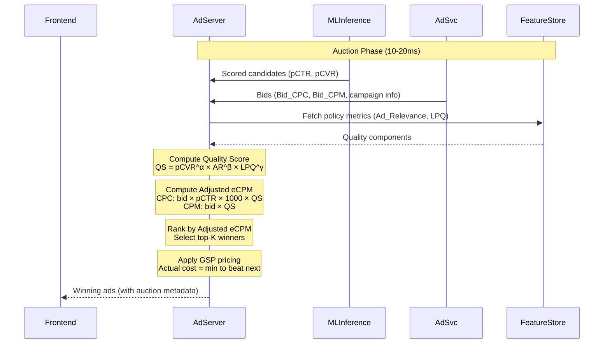
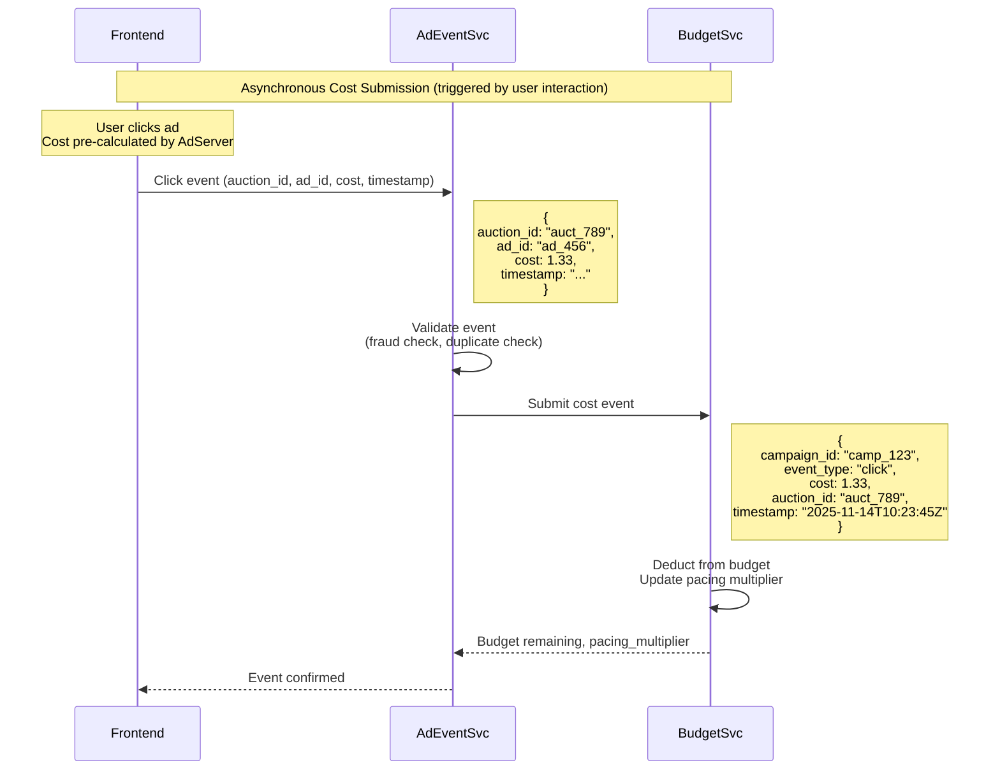

# Chapter 3: Auction and Cost Tracking

In Chapter 2, we traced the end-to-end ad serving flow and examined the architectural components that power a retail media network. We saw that the **AdServer** orchestrates a multi-stage pipeline: candidate retrieval, scoring, budget filtering, and finally the **auction**—the moment where the platform decides which ads to show and how much advertisers pay.

This chapter focuses on that critical auction stage in AdServer. We examine how modern ad platforms rank candidates using **adjusted eCPM** formulas that balance advertiser bids with predicted user engagement and ad quality. We detail the **quality score** mechanism—a multiplicative formula combining conversion likelihood, ad relevance, and landing page quality—and explain how each component is computed in practice. We then explore how platforms **tune the quality score weights** through online A/B experiments and offline Bayesian Optimization to optimize revenue, user experience, and advertiser satisfaction simultaneously.

By the end of this chapter, you will understand:
- How adjusted eCPM differs between CPC and CPM pricing models
- Why quality scores use multiplicative (not additive) formulas
- How platforms compute Ad_Relevance and Landing_Page_Quality from technical and behavioral metrics
- How Bayesian Optimization finds optimal quality score weights in 50-100 evaluations (vs 1000+ for grid search)
- How auction design integrates with ML scoring predictions (pCTR, pCVR) to create a unified ranking system

This is the business logic layer that sits atop the technical infrastructure—the rules that govern which advertisers win, what they pay, and how the platform balances short-term revenue against long-term ecosystem health.

---
- [Chapter 3: Auction and Cost Tracking](#chapter-3-auction-and-cost-tracking)
  - [1. Auction Ranking Formula: Adjusted eCPM](#1-auction-ranking-formula-adjusted-ecpm)
    - [1.1 CPC (Cost-Per-Click) Campaigns](#11-cpc-cost-per-click-campaigns)
    - [1.2 CPM (Cost-Per-Impression) Campaigns](#12-cpm-cost-per-impression-campaigns)
    - [1.3 Example Comparison](#13-example-comparison)
  - [2. Quality Score Computation](#2-quality-score-computation)
    - [2.1 CPC Campaign Quality Score](#21-cpc-campaign-quality-score)
    - [2.2 CPM Campaign Quality Score](#22-cpm-campaign-quality-score)
    - [2.3 Why This Functional Form?](#23-why-this-functional-form)
  - [3. Computing Quality Score Components](#3-computing-quality-score-components)
    - [3.0 Why Separate Quality Components from pCTR/pCVR?](#30-why-separate-quality-components-from-pctrpcvr)
    - [3.1 Ad\_Relevance Computation](#31-ad_relevance-computation)
      - [3.1.1 Query-Ad Text Match (for search ads)](#311-query-ad-text-match-for-search-ads)
      - [3.1.2 Product-Ad Match (for product detail page ads)](#312-product-ad-match-for-product-detail-page-ads)
      - [3.1.3 Audience-Ad Match](#313-audience-ad-match)
    - [3.2 Landing\_Page\_Quality Computation](#32-landing_page_quality-computation)
      - [3.2.1 Technical Metrics](#321-technical-metrics)
      - [3.2.2 Behavioral Metrics](#322-behavioral-metrics)
      - [3.2.3 Content Quality](#323-content-quality)
    - [3.3 Pre-computation vs. Real-time](#33-pre-computation-vs-real-time)
    - [3.4 Integration with ML Scoring](#34-integration-with-ml-scoring)
  - [4. Platform Weight Tuning](#4-platform-weight-tuning)
    - [4.1 Define Optimization Objectives](#41-define-optimization-objectives)
    - [4.2 Online A/B Experiments](#42-online-ab-experiments)
    - [4.3 Offline Simulation (Replay Tuning)](#43-offline-simulation-replay-tuning)
    - [4.4 Why Bayesian Optimization Excels for Weight Tuning](#44-why-bayesian-optimization-excels-for-weight-tuning)
    - [4.5 Bayesian Optimization Implementation](#45-bayesian-optimization-implementation)
    - [4.6 Multi-Objective Bayesian Optimization](#46-multi-objective-bayesian-optimization)
    - [4.7 Counterfactual Evaluation with Inverse Propensity Scoring](#47-counterfactual-evaluation-with-inverse-propensity-scoring)
    - [4.8 Gradient-Based Optimization](#48-gradient-based-optimization)
    - [4.9 Periodic Re-tuning](#49-periodic-re-tuning)
    - [4.10 Practical Constraints](#410-practical-constraints)
  - [5. Auction Pricing Mechanisms](#5-auction-pricing-mechanisms)
    - [5.1 Generalized Second-Price (GSP) Auction](#51-generalized-second-price-gsp-auction)
    - [5.2 Quality Score Adjustments in Pricing](#52-quality-score-adjustments-in-pricing)
    - [5.3 Multi-Slot Auctions](#53-multi-slot-auctions)
    - [5.4 Reserve Prices and Minimum Bids](#54-reserve-prices-and-minimum-bids)
  - [6. Cost Tracking and Billing](#6-cost-tracking-and-billing)
    - [6.1 Cost Submission to BudgetSvc](#61-cost-submission-to-budgetsvc)
      - [7.1.4 Fraud Prevention: Signed Tracking URLs](#714-fraud-prevention-signed-tracking-urls)
    - [6.2 Budget Tracking and Pacing](#62-budget-tracking-and-pacing)
    - [6.3 Billing Integration](#63-billing-integration)
  - [7. End-to-End Flow](#7-end-to-end-flow)
    - [7.1 Auction Execution](#71-auction-execution)
    - [7.2 Event-Driven Cost Submission](#72-event-driven-cost-submission)
  - [Summary and Next Steps](#summary-and-next-steps)
  - [References and Further Reading](#references-and-further-reading)

---

## 1. Auction Ranking Formula: Adjusted eCPM

The auction does not simply select the highest bidder. Instead, it ranks candidates by **adjusted eCPM** (effective cost per thousand impressions), which balances advertiser willingness to pay with predicted user engagement and ad quality. This ensures the platform maximizes revenue while maintaining user experience.

The adjusted eCPM formula differs based on the campaign's pricing model:

### 1.1 CPC (Cost-Per-Click) Campaigns

$$
\mathrm{AdjustedECPM}_{\mathrm{CPC}} = \mathrm{Bid}_{\mathrm{CPC}} \times \mathrm{pCTR} \times 1000 \times \mathrm{QualityScore}_{\mathrm{CPC}} \tag{3.1}
$$

Where:
- $\mathrm{Bid}_{\mathrm{CPC}}$: Advertiser's maximum cost-per-click bid (e.g., \$1.50)
- $\mathrm{pCTR}$: Predicted click-through rate from ML Inference Service (e.g., 0.05 = 5%)
- $\mathrm{QualityScore}_{\mathrm{CPC}}$: Platform-defined quality multiplier based on conversion likelihood, ad relevance, and landing page quality (typically 0.5–1.5)

The formula converts a CPC bid into an eCPM (cost per thousand impressions) by multiplying the bid by the predicted click rate and 1000. The quality score acts as a multiplier that rewards high-quality ads and penalizes poor ones.

### 1.2 CPM (Cost-Per-Impression) Campaigns

$$
\mathrm{AdjustedECPM}_{\mathrm{CPM}} = \mathrm{Bid}_{\mathrm{CPM}} \times \mathrm{QualityScore}_{\mathrm{CPM}} \tag{3.2}
$$

Where:
- $\mathrm{Bid}_{\mathrm{CPM}}$: Advertiser's cost-per-thousand-impressions bid (e.g., \$10.00)
- $\mathrm{QualityScore}_{\mathrm{CPM}}$: Quality multiplier based on ad relevance, landing page quality, and historical engagement (typically 0.5–1.5)

Note that CPM campaigns do not include pCTR directly in the adjusted eCPM calculation (unlike CPC campaigns), because the advertiser already pays per impression regardless of clicks. However, engagement quality is still enforced through the Quality Score's `pCTR` component (detailed in Section 2.2).

### 1.3 Example Comparison

Consider two CPC campaigns competing for a single ad slot:

| Campaign | Bid (CPC) | pCTR | Quality Score | Adjusted eCPM |
|----------|-----------|------|---------------|---------------|
| A        | \$2.00    | 3%   | 0.8           | \$2.00 × 0.03 × 1000 × 0.8 = **\$48.00** |
| B        | \$1.50    | 5%   | 1.2           | \$1.50 × 0.05 × 1000 × 1.2 = **\$90.00** |

Campaign B wins despite having a lower bid, because its higher predicted engagement (pCTR) and better quality score yield a higher adjusted eCPM. This mechanism incentivizes advertisers to create relevant, high-quality ads rather than simply bidding higher.

---

## 2. Quality Score Computation

The quality score is the platform's lever to balance revenue maximization with user experience and advertiser quality. It differs between CPC and CPM campaigns because they optimize for different advertiser goals.

### 2.1 CPC Campaign Quality Score

$$
\mathrm{QualityScore}_{\mathrm{CPC}} = \mathrm{pCVR}^{\alpha} \times \mathrm{AdRelevance}^{\beta} \times \mathrm{LandingPageQuality}^{\gamma} \tag{3.3}
$$

Where:
- $\mathrm{pCVR}$: Predicted conversion rate (favors ads likely to drive purchases)
- $\mathrm{AdRelevance}$: Relevance score based on query-ad match, product-ad match
- $\mathrm{LandingPageQuality}$: Landing page load time, mobile-friendliness, user experience metrics
- $\alpha, \beta, \gamma$: Platform-tuned weights (e.g., $\alpha = 0.5$, $\beta = 0.3$, $\gamma = 0.2$)

CPC campaigns optimize for conversions (purchases, sign-ups), so the quality score emphasizes **pCVR** (conversion likelihood) as the primary signal.

**Typical Quality Score Ranges:**
Quality scores typically range from **0.5** (poor quality) to **1.5** (excellent quality), with **1.0** representing average quality. Platforms normalize the component ranges (pCVR, Ad_Relevance, Landing_Page_Quality) to achieve this distribution:
- **QS < 0.8**: Poor quality—ad loses auction priority and pays higher costs
- **QS = 0.8–1.2**: Average quality—neutral impact on ranking and pricing
- **QS > 1.2**: Excellent quality—boosted in auctions and pays lower costs

For example, an ad with QS = 1.5 pays ~33% less than an ad with QS = 1.0 for the same auction rank (due to GSP pricing adjustments in Section 5.2).

### 2.2 CPM Campaign Quality Score

$$
\mathrm{QualityScore}_{\mathrm{CPM}} = \mathrm{pCTR}^{\delta} \times \mathrm{AdRelevance}^{\beta} \times \mathrm{LandingPageQuality}^{\gamma} \tag{3.4}
$$

Where:
- $\mathrm{pCTR}$: Predicted click-through rate (rewards engaging CPM ads, even though payment is per impression)
- $\mathrm{AdRelevance}$: Same as CPC
- $\mathrm{LandingPageQuality}$: Same as CPC
- $\delta, \beta, \gamma$: Platform-tuned weights (e.g., $\delta = 0.4$, $\beta = 0.3$, $\gamma = 0.3$)

CPM campaigns optimize for reach and awareness (impressions, brand visibility), but the quality score still includes **pCTR** to ensure ads are engaging. Using real-time pCTR predictions (rather than historical averages) allows the quality score to adapt to the specific user and context.

### 2.3 Why This Functional Form?

The quality score uses a **multiplicative form** (product of factors raised to powers) rather than an additive form (weighted sum) for several important reasons:

1. **Non-compensatory**: If any component is very poor (close to 0), the overall quality score is low, even if other components are excellent. A highly relevant ad with a broken landing page gets penalized proportionally, not just additively.

2. **Diminishing Returns**: The exponents (α, β, γ, δ) typically sum to less than 1.0, creating diminishing returns. For example, improving pCVR from 0.01 to 0.02 (100% relative increase) has more impact than improving from 0.10 to 0.11 (10% increase).

3. **Interpretable Weights**: The exponents represent the relative importance of each factor. In the CPC formula with α=0.5, β=0.3, γ=0.2, conversion likelihood (pCVR) matters most, followed by ad relevance, then landing page quality.

4. **Scale Invariance**: Multiplicative forms are less sensitive to the absolute scale of individual components, making the formula more robust to changes in how Ad_Relevance or Landing_Page_Quality are computed.

5. **Empirical Validation**: Major ad platforms (Google Ads [1], Facebook Ads [2]) use multiplicative quality scores because they perform better in A/B tests for both revenue and user experience metrics.

---

## 3. Computing Quality Score Components

The quality score components (Ad_Relevance, Landing_Page_Quality) are **derived metrics, NOT ML predictions from ML Inference Service**:

- **Ad_Relevance**: **Hybrid computation** combining:
  - Vector similarities (embedding cosine distance, dot products)
  - Rule-based matching (keyword BM25, category overlap, boolean segment checks)
  - ML-assisted scoring (BERT classifiers for semantic relevance)
  - Timing: Partially real-time (embeddings), partially pre-computed (rules, lookups)

- **Landing_Page_Quality**: **Policy-driven aggregation** of platform-monitored metrics (page load time, bounce rate, content compliance) - fully pre-computed, stored and served from the **Feature Store**

Unlike pCTR and pCVR (which are neural network predictions of future behavior), these components combine **retrieval signals** (how well ad matches context) and **policy enforcement** (platform quality standards).

### 3.0 Why Separate Quality Components from pCTR/pCVR?

**Q: The main scoring model already predicts pCTR and pCVR. Why do we need separate Ad_Relevance and Landing_Page_Quality scores?**

This is a critical design question. The key differences are:

**1. pCTR vs Ad_Relevance:**
- **pCTR** (from ML Inference Service): $P(\text{click} \mid \text{user}, \text{ad}, \text{context})$ - **personalized** prediction
  - Uses: User demographics, behavior history, user embeddings, contextual signals
  - Answers: "Will **this specific user** click **this ad** right now?"
  - Example: A user who clicks everything might have high pCTR even for irrelevant ads
  
- **Ad_Relevance**: $P(\text{relevant} \mid \text{query}, \text{ad})$ or match score - **content-based** relevance
  - Uses: Only query text, ad text/creative, product attributes (NO user features)
  - Answers: "Does this ad **semantically match the search query**, regardless of who searches?"
  - Example: "winter jackets" query → jacket ad (high relevance) vs. random trending product (low relevance)

**Why both?**
- **Quality enforcement**: Prevents advertisers from gaming the system by bidding on irrelevant queries and relying solely on high pCTR from clickbait
- **Long-term platform health**: Users who consistently see irrelevant ads (even if they click) will eventually lose trust and leave
- **Separation of concerns**: pCTR optimizes for immediate clicks; Ad_Relevance enforces content appropriateness
- **Explainability**: Advertisers can understand why their ad lost auction ("low relevance to query") vs. opaque pCTR

**2. pCVR vs Landing_Page_Quality:**
- **pCVR** (from ML Inference Service): $P(\text{conversion} \mid \text{user}, \text{ad}, \text{click})$ - **personalized** prediction
  - Uses: User purchase history, browsing patterns, likelihood to convert
  - Answers: "Will **this user** convert if they click?"
  - Example: A high-intent user might convert even on a slow, poorly-designed landing page
  
- **Landing_Page_Quality**: Aggregated **observed metrics** from platform monitoring
  - Uses: Page load time, bounce rate, content compliance, mobile-friendliness (aggregated over all users)
  - Answers: "Is this landing page **objectively good** based on platform standards?"
  - Example: Page that loads in 8 seconds gets penalized regardless of user patience

**Why both?**
- **Conversion not applicable to all landing pages**: It applies to product page, but not directly to store page.
- **Platform policy enforcement**: RMN platforms must enforce minimum quality standards (GDPR compliance, page speed, content policy) independent of conversion predictions
- **User experience protection**: High pCVR might capture that "desperate users convert anyway," but platform still wants to penalize bad experiences
- **Advertiser incentives**: Encourages advertisers to improve landing pages, not just rely on targeting high-intent users
- **Legal/compliance**: Some quality criteria (data privacy, accessibility) are regulatory requirements, not ML optimization targets

**In Summary:**
- **pCTR/pCVR**: Optimize for **personalized revenue** (will this user click/convert?)
- **Ad_Relevance**: Enforce **content appropriateness** (does the ad match the query?)
- **Landing_Page_Quality**: Enforce **platform standards** (does the experience meet quality thresholds?)

This separation allows the platform to balance **short-term revenue** (pCTR/pCVR) with **long-term ecosystem health** (relevance + quality).

### 3.1 Ad_Relevance Computation

Ad_Relevance measures how well the ad matches the user's intent and context. It combines **vector similarities** (from embeddings) with **rule-based matching** and **boolean logic**:

#### 3.1.1 Query-Ad Text Match (for search ads)

**Approach 1: Embedding-based (vector similarity):**
- **Cosine similarity** between query embedding and ad creative text embedding (e.g., using Sentence-BERT or ad-specific embedding models)
- Output: Continuous similarity score ∈ [0, 1]
- Computation: `cosine_similarity(embed_query(q), embed_ad(a))`

**Approach 2: Rule-based (symbolic matching):**
- **Keyword match score**: Exact match (1.0) > phrase match (0.7) > broad match (0.5) based on advertiser-specified keywords
- **BM25 score**: Traditional IR term-frequency scoring for keyword relevance without embeddings
- Output: Discrete or continuous score based on term overlap

**Approach 3: Hybrid (supervised classifier):**
- **BERT-based binary classifier** trained on historical user engagement data
- Training data: Query-ad pairs with outcomes
  - Positive labels: Impressions that received clicks or conversions (user engaged)
  - Negative labels: Impressions without clicks (user ignored)
  - Optional: Human annotations for semantic relevance (expensive but higher quality)
- Model: Fine-tuned BERT taking `[CLS] query [SEP] ad_text [SEP]` as input
- Output: $P(\text{user will engage} \mid \text{query}, \text{ad})$ - probability of engagement given query-ad pair
- **What BERT learns**: The model captures both **semantic relevance** (does ad match query meaning?) AND **commercial intent** (do users actually click this type of ad for this query?). Training on clicks means the model learns which query-ad pairs drive engagement, not just similarity.
- Computation: Combines query-ad representations in transformer layers, outputs classification probability via sigmoid/softmax

**Why three approaches?**
- **Embedding**: Fast, generalizes to new queries, captures semantic similarity
- **Rule-based**: Explainable, respects advertiser keywords, handles exact matches well
- **Hybrid BERT**: Learns from user behavior (actual engagement patterns), balancing semantic relevance with commercial viability

#### 3.1.2 Product-Ad Match (for product detail page ads)

**Rule-based (categorical logic):**
- **Category overlap**: Boolean check with scoring (same category = 1.0, parent category = 0.7, sibling category = 0.5)
- **Complementary product score**: Rule-based lookup tables or product graphs (e.g., "camera → lens" predefined pairs)

**Attribute-based (mixed):**
- **Product attribute similarity**: Can use vector embeddings (brand/category embeddings) OR simple rule-based matching (same brand = 1.0, same price tier = 0.8)

#### 3.1.3 Audience-Ad Match

**Rule-based (set intersection):**
- **User segment alignment**: Boolean set intersection (is user in targeted segment?) with scoring based on segment hierarchy

**Embedding-based:**
- **Personalization score** from collaborative filtering or user-ad embedding similarity (vector dot product in learned latent space)

**Example computation:**
$$
\text{Ad\_Relevance} = 0.4 \times \text{Query\_Match} + 0.3 \times \text{Product\_Match} + 0.3 \times \text{Audience\_Match} \tag{3.5}
$$

Where:
- **Query_Match**: Can use any of the three approaches or combine them:
  - Option A: Pure embedding (cosine similarity)
  - Option B: Pure rule-based (keyword + BM25)
  - Option C: Weighted ensemble: 0.5 × embedding + 0.3 × keyword + 0.2 × BERT_P(relevant)
- **Product_Match**: Rule-based category logic (0.5 weight) + attribute similarity (0.5 weight, may use embeddings or rules)
- **Audience_Match**: Boolean segment check (0.7 weight) + CF personalization score (0.3 weight, embedding-based)

Each component is normalized to [0, 1]. The result is typically further normalized to a range like [0.5, 1.5] so that poor relevance (score < 1.0) penalizes adjusted eCPM, while excellent relevance (score > 1.0) boosts it.

**Key insight:** Ad_Relevance is **NOT purely vector similarity**—it combines:
1. **Vector-based**: Embedding similarities (cosine distance between query-ad, user-ad embeddings)
2. **Rule-based**: Keyword matching (BM25, exact/phrase/broad), category logic, boolean segment checks
3. **Supervised learning**: BERT classifiers predicting $P(\text{relevant})$ or $P(\text{click})$ from historical user behavior

**What does BERT predict?** The BERT classifier predicts $P(\text{user will find this ad relevant given the query})$, trained on:
- Positive examples: Query-ad pairs that received clicks or conversions
- Negative examples: Query-ad pairs that were shown but not clicked
- This captures both semantic similarity AND commercial intent (what users actually engage with)

This hybrid approach balances the **semantic understanding** of embeddings with the **interpretability and control** of rule-based systems, plus the **behavioral learning** from user interactions.

### 3.2 Landing_Page_Quality Computation

Landing_Page_Quality measures the user experience of the destination page. **This is a policy-driven metric**, not an ML prediction—the platform aggregates observable metrics from monitoring systems and user behavior logs to enforce landing page quality standards.

The computation combines three categories of metrics:

#### 3.2.1 Technical Metrics

- **Page load time**: p50, p95 latency from real user monitoring
- **Mobile-friendliness score**: responsive design, tap targets, font sizes
- **HTTPS enabled**: security and trust signals
- **No intrusive interstitials or pop-ups**

#### 3.2.2 Behavioral Metrics

- **Bounce rate**: percentage of users who leave immediately
- **Time on page**: average session duration
- **Conversion rate**: for e-commerce landing pages, percentage of visitors who purchase

#### 3.2.3 Content Quality

- **Product availability**: Is the advertised product in stock?
- **Price accuracy**: Does the landing page price match the ad?
- **Content relevance**: Does the landing page content match the ad promise?

**Example computation:**
$$
\text{Landing\_Page\_Quality} = \text{Technical\_Score}^{0.4} \times \text{Behavioral\_Score}^{0.4} \times \text{Content\_Score}^{0.2} \tag{3.6}
$$

Each sub-score is computed from aggregated historical data (e.g., average page load time over the past 7 days, bounce rate for the campaign's landing page). The result is normalized to [0.5, 1.5], where:
- 1.0 = average landing page quality
- < 1.0 = below-average (penalized in auction)
- > 1.0 = above-average (boosted in auction)

**Key distinction**: Unlike pCTR/pCVR (which predict future user actions using ML), Landing_Page_Quality **measures past observed quality** through platform monitoring and policy enforcement. The platform sets thresholds (e.g., "page load time > 3s results in 0.8 LPQ score") and applies them uniformly based on logged data.

### 3.3 Pre-computation vs. Real-time

**Computation Timing:**
- **pCTR, pCVR** (from ML Inference Service): Real-time ML predictions computed per request (20-40ms latency)
- **Ad_Relevance**: **Hybrid timing** - Some components real-time (query/ad embedding similarity), some pre-computed (category rules, segment lookups cached in FeatureStore)
- **Landing_Page_Quality**: Fully pre-computed (aggregated daily or hourly from logs), updated asynchronously, cached in AdSvc or FeatureStore

**Nature of Computation:**
- **ML Predictions** (pCTR, pCVR): Neural network forward pass predicting future user behavior
- **Policy Metrics** (Landing_Page_Quality): Rule-based aggregation of observed platform metrics (no ML inference)
- **Hybrid Metrics** (Ad_Relevance): 
  - **Vector-based components**: Embedding similarities (cosine distance, dot products) - may use ML embeddings but computation is simple linear algebra
  - **Rule-based components**: Keyword matching (BM25, exact/phrase/broad), category overlap (boolean logic), segment checks (set intersection)
  - **ML-assisted components**: BERT classifiers for semantic relevance (uses embeddings + learned classification head)

**Implementation patterns:**
- **Query-Ad embedding similarity**: Computed real-time (query embedding from real-time inference, ad embeddings pre-computed and stored in vector database)
- **Keyword match**: Real-time rule evaluation (advertiser keywords stored in AdIndex)
- **Category overlap**: Pre-computed lookup table or real-time boolean check
- **Segment alignment**: Pre-computed (user segments cached in FeatureStore, ad targeting rules in AdSvc)

These metrics are designed to be **platform-controllable levers** that balance advertiser demand (bids) with user experience (relevance, page quality), enabling the platform to optimize for long-term user engagement rather than short-term revenue maximization. Landing_Page_Quality specifically gives the platform direct control over quality enforcement without relying on ML model predictions.

### 3.4 Integration with ML Scoring

The AdServer orchestrates three data sources when computing adjusted eCPM for auction ranking:

**1. ML predictions** (from ML Inference Service, Chapter 5):
- **pCTR, pCVR**: Real-time personalized engagement predictions per candidate

**2. Policy metrics** (from AdSvc/FeatureStore, computed as detailed in 3.1-3.2):
- **Ad_Relevance**: Semantic matching scores (embeddings, keywords, targeting rules)
- **Landing_Page_Quality**: Platform quality standards (page speed, bounce rate, compliance)

**3. Bid properties** (from AdSvc):
- **Bid_CPC, Bid_CPM**: Advertiser's maximum willingness to pay
- **Campaign metadata**: Budget, pacing strategy, targeting configuration

**Integration flow:**
AdServer receives ML predictions (pCTR, pCVR) → fetches policy metrics and bids → computes Quality Score using platform weights α, β, γ, δ (Section 4) → applies to ranking formula (Section 1) to produce Adjusted_eCPM → ranks candidates and runs auction (Section 5).

This architectural separation enables independent optimization: ML models improve predictions without changing auction logic, while the platform adjusts quality thresholds and weights without retraining models. See Section 7 for complete execution flow with sequence diagrams.

---

## 4. Platform Weight Tuning

The exponent weights (α, β, γ, δ) in the quality score formulas are not arbitrary—they are **tuned through large-scale online experimentation and offline optimization** to maximize platform objectives. This section details the tuning methodology.

### 4.1 Define Optimization Objectives

Platforms balance multiple, often competing objectives:
- **Revenue Metrics**: Total revenue, revenue per user, advertiser spend
- **User Experience Metrics**: Click-through rate, bounce rate, time on site, repeat visit rate
- **Advertiser Metrics**: Cost per acquisition (CPA), return on ad spend (ROAS), campaign renewal rate
- **Ecosystem Health**: Diversity of winning advertisers, small advertiser win rate, inventory fill rate

The most common approach is to define a **composite metric** that combines these:

$$
\text{Platform\_OEC} = w_1 \times \text{Revenue} + w_2 \times \text{User\_Engagement} - w_3 \times \text{Bounce\_Rate} + w_4 \times \text{Advertiser\_Satisfaction} \tag{3.7}
$$

Where OEC = Overall Evaluation Criterion, and $w_1, w_2, w_3, w_4$ are strategically set (often with revenue as primary but constrained by UX thresholds).

### 4.2 Online A/B Experiments

The most reliable method is **live A/B testing**:

**Treatment Groups**: Different cohorts of users see ads ranked with different weight configurations. For example:
- Control: α=0.5, β=0.3, γ=0.2
- Treatment A: α=0.6, β=0.25, γ=0.15 (higher weight on pCVR)
- Treatment B: α=0.4, β=0.4, γ=0.2 (higher weight on Ad_Relevance)

**Duration**: Run experiments for 1-2 weeks to capture weekly seasonality and allow learning effects to stabilize.

**Sample Size**: Typically 5-10% of traffic per treatment to achieve statistical significance (p < 0.05) on key metrics.

**Multi-Armed Bandits**: Advanced platforms use bandit algorithms (Thompson Sampling, Upper Confidence Bound) to dynamically allocate traffic to better-performing weight configurations during the experiment.

### 4.3 Offline Simulation (Replay Tuning)

Before running costly online experiments, platforms use **counterfactual evaluation** on logged data:

**Replay Logs**: Take historical auction logs (past 7-30 days) containing all candidates, their features, bids, and outcomes (impressions, clicks, conversions).

**Re-rank with New Weights**: Simulate what would have happened if different weights were used. Recompute adjusted eCPM for each candidate and determine new winners.

**Estimate Metrics**: Use causal inference techniques (inverse propensity scoring, doubly robust estimation) to estimate revenue and user engagement under the counterfactual ranking.

**Optimization Methods**: Choose from several approaches to search the weight space:
- **Grid Search**: Exhaustively test predefined weight combinations (e.g., α ∈ {0.3, 0.4, 0.5, 0.6}). Simple but inefficient—requires 100-1000+ evaluations.
- **Bayesian Optimization (Preferred)** [3]: Use probabilistic models (Gaussian Processes) to intelligently select which weights to evaluate next, focusing on promising regions. Finds optimal weights in 50-100 evaluations.
- **Random Search**: Randomly sample weight combinations as a baseline. More efficient than grid search but less sophisticated than Bayesian Optimization.

### 4.4 Why Bayesian Optimization Excels for Weight Tuning

Bayesian Optimization (BO) is the **preferred methodology** for tuning platform weights because it addresses the unique challenges of this problem:

1. **Expensive Objective Function**: Each weight evaluation requires simulating auctions over 7-30 days of logs (millions of requests), which can take 30 minutes to several hours. BO minimizes the number of evaluations needed by building a surrogate model (Gaussian Process) that predicts objective values, allowing intelligent exploration vs. exploitation trade-offs.

2. **Low Dimensionality**: Weight tuning typically involves 3-5 parameters (α, β, γ, δ), which is the sweet spot for BO. BO works well up to ~10-20 dimensions, unlike neural architecture search which requires specialized methods.

3. **Smooth Objective Surface**: Platform revenue and engagement metrics are smooth, continuous functions of the weights—small weight changes lead to small metric changes. Gaussian Processes model this smoothness effectively, unlike tree-based methods which assume piecewise constant functions.

4. **Constraint Handling**: BO naturally handles constraints like α + β + γ = 1.0 through constrained acquisition functions (Expected Improvement with constraints) or by parameterizing the search space (e.g., search only α, β and set γ = 1 - α - β).

5. **Noise Tolerance**: Counterfactual estimates (IPS) have inherent variance due to sampling and propensity estimation errors. BO's probabilistic framework accounts for this noise, unlike grid search which treats all measurements as deterministic.

### 4.5 Bayesian Optimization Implementation

```python
from skopt import gp_minimize
from skopt.space import Real
from skopt.utils import use_named_args

# Define search space for weights
space = [
    Real(0.2, 0.7, name='alpha'),  # pCVR weight
    Real(0.1, 0.5, name='beta'),   # Ad_Relevance weight
    Real(0.1, 0.5, name='gamma'),  # Landing_Page_Quality weight
]

@use_named_args(space)
def objective(alpha, beta, gamma):
    """Objective function to minimize (BO minimizes, so negate revenue)."""
    # Enforce constraint: alpha + beta + gamma ≈ 1.0
    if abs(alpha + beta + gamma - 1.0) > 0.1:
        return -float('inf')  # Penalize constraint violations
    
    # Simulate auctions with these weights
    revenue, clicks, engagement = simulate_auction(logs, alpha, beta, gamma)
    
    # Combine metrics into Overall Evaluation Criterion (OEC)
    oec = 0.7 * revenue + 0.2 * clicks + 0.1 * engagement
    
    return -oec  # Negate because BO minimizes

# Run Bayesian Optimization
result = gp_minimize(
    objective,
    space,
    n_calls=100,          # Number of evaluations (vs 1000+ for grid search)
    n_random_starts=10,   # Initial random exploration
    acq_func='EI',        # Expected Improvement acquisition function
    noise=0.1,            # Account for IPS variance
    random_state=42
)

print(f"Best weights: α={result.x[0]:.3f}, β={result.x[1]:.3f}, γ={result.x[2]:.3f}")
print(f"Best OEC: {-result.fun:.2f}")
```

### 4.6 Multi-Objective Bayesian Optimization

In practice, platforms often need to optimize multiple competing objectives (revenue, user engagement, advertiser satisfaction) simultaneously. Multi-objective BO finds the **Pareto frontier**—the set of weight configurations where improving one metric requires sacrificing another:

```python
from pymoo.algorithms.moo.nsga2 import NSGA2
from pymoo.optimize import minimize
from pymoo.core.problem import Problem
import numpy as np

class WeightTuningProblem(Problem):
    def __init__(self):
        super().__init__(n_var=3, n_obj=2, n_constr=1, 
                         xl=[0.2, 0.1, 0.1], xu=[0.7, 0.5, 0.5])
    
    def _evaluate(self, X, out, *args, **kwargs):
        # X is a batch of weight configurations
        revenues = []
        engagements = []
        constraints = []
        
        for weights in X:
            alpha, beta, gamma = weights
            revenue, _, engagement = simulate_auction(logs, alpha, beta, gamma)
            revenues.append(-revenue)  # Minimize negative revenue (maximize revenue)
            engagements.append(-engagement)  # Maximize engagement
            constraints.append(abs(alpha + beta + gamma - 1.0))  # Constraint
        
        out["F"] = np.column_stack([revenues, engagements])
        out["G"] = np.array(constraints) - 0.1  # g(x) ≤ 0 constraint

# Run multi-objective optimization (NSGA-II algorithm) [4]
algorithm = NSGA2(pop_size=50)
result = minimize(WeightTuningProblem(), algorithm, ('n_gen', 100), seed=42)

# Result contains Pareto frontier: each solution is a valid trade-off
for i, solution in enumerate(result.X):
    alpha, beta, gamma = solution
    revenue = -result.F[i][0]
    engagement = -result.F[i][1]
    print(f"Config {i}: α={alpha:.3f}, β={beta:.3f}, γ={gamma:.3f} "
          f"→ Revenue=${revenue:.2f}, Engagement={engagement:.2f}")
```

### 4.7 Counterfactual Evaluation with Inverse Propensity Scoring

Offline weight tuning relies on counterfactual evaluation techniques to estimate how different weights would have performed without running live experiments [5].

```python
# Pseudo-code for offline weight tuning
def simulate_auction(logs, alpha, beta, gamma):
    total_revenue = 0
    total_clicks = 0
    for request in logs:
        for candidate in request.candidates:
            # Recompute quality score with new weights
            quality_score = (candidate.pCVR ** alpha * 
                            candidate.ad_relevance ** beta * 
                            candidate.lpq ** gamma)
            candidate.adjusted_ecpm = (candidate.bid * candidate.pCTR * 
                                       1000 * quality_score)
        
        # Select winners under new ranking
        winners = top_k(request.candidates, by=adjusted_ecpm, k=4)
        
        # Estimate counterfactual outcomes using IPS
        for winner in winners:
            propensity = winner.historical_serve_probability
            total_revenue += (winner.actual_revenue / propensity)
            total_clicks += (winner.actual_clicks / propensity)
    
    return total_revenue, total_clicks

# Grid search over weight space (baseline comparison)
best_revenue = 0
for alpha in [0.3, 0.4, 0.5, 0.6]:
    for beta in [0.2, 0.3, 0.4]:
        gamma = 1.0 - alpha - beta  # Constraint: sum ≈ 1.0
        revenue, clicks = simulate_auction(logs, alpha, beta, gamma)
        if revenue > best_revenue:
            best_weights = (alpha, beta, gamma)
            best_revenue = revenue
# Note: Grid search requires 4×3 = 12 evaluations for this coarse grid.
# A finer grid (0.05 increments) would require 400+ evaluations vs 50-100 for BO.
```

### 4.8 Gradient-Based Optimization

Some platforms treat weight tuning as a **differentiable optimization problem**:

- Model the expected platform objective (revenue, engagement) as a differentiable function of the weights.
- Use gradient descent or Adam optimizer to find weights that maximize the objective on historical data.
- Requires careful handling of ranking's non-differentiability (use smooth approximations like softmax or Taylor expansions).

### 4.9 Periodic Re-tuning

Optimal weights drift over time due to:
- **Seasonality**: Holiday shopping has different optimal weights than regular periods.
- **Ecosystem Changes**: As advertisers improve creative quality, the optimal weight on Landing_Page_Quality may decrease.
- **Model Updates**: When the scoring model (pCTR/pCVR predictor) is retrained, weight re-tuning is necessary.

Best practice: Re-tune weights **quarterly** or after major model/system changes, with continuous monitoring of key metrics to detect drift.

### 4.10 Practical Constraints

- **Stability**: Frequent weight changes confuse advertisers (their campaign performance fluctuates unpredictably). Changes are made gradually with multi-week ramp-ups.
- **Explainability**: Simpler weight configurations (e.g., α=0.5, β=0.3, γ=0.2) are preferred over complex values (α=0.4837, β=0.2915) for transparency with advertisers.
- **Regulatory Compliance**: Some jurisdictions require auction mechanisms to be "explainable" and "fair," limiting the complexity of quality score formulas.

---

## 5. Auction Pricing Mechanisms

After ranking ads by adjusted eCPM and selecting winners, the platform must determine **what winners actually pay**. This section covers pricing mechanisms including Generalized Second-Price (GSP) auctions, quality score adjustments, multi-slot auctions, and reserve prices.

### 5.1 Generalized Second-Price (GSP) Auction

Most ad platforms use **Generalized Second-Price (GSP)** auctions [6], where winners pay just enough to beat the next competitor, not their full bid. This encourages truthful bidding and maximizes long-term revenue.

**Single-slot GSP (one ad winner):**

For a **CPC campaign**, the winner pays:

$$
\text{Actual CPC} = \frac{\text{Adjusted eCPM}_{\text{2nd place}}}{\text{pCTR}_{\text{winner}} \times 1000 \times \text{QS}_{\text{winner}}} + \epsilon \tag{3.8}
$$

Where:
- $\text{Adjusted eCPM}_{\text{2nd place}}$: The adjusted eCPM of the second-place ad
- $\text{pCTR}_{\text{winner}}$: Predicted CTR of the winning ad
- $\text{QS}_{\text{winner}}$: Quality score of the winning ad
- $\epsilon$: Small increment (e.g., $0.01) to ensure winner still wins

**Intuition:** The winner pays the **minimum bid needed to beat the next competitor** (with their own pCTR and quality score).

**Example:**
- Winner: Bid = \$2.00, pCTR = 0.05, QS = 1.2 → Adjusted eCPM = 2.00 × 0.05 × 1000 × 1.2 = \$120
- 2nd place: Bid = \$1.80, pCTR = 0.04, QS = 1.1 → Adjusted eCPM = 1.80 × 0.04 × 1000 × 1.1 = \$79.20

Winner pays:
$$
\text{Actual CPC} = \frac{79.20}{0.05 \times 1000 \times 1.2} + 0.01 = \frac{79.20}{60} + 0.01 = \$1.33 \tag{3.9}
$$

**Winner bid \$2.00 but pays \$1.33** (just enough to beat 2nd place).

For a **CPM campaign**, the calculation is simpler:

$$
\text{Actual CPM} = \frac{\text{Adjusted eCPM}_{\text{2nd place}}}{\text{QS}_{\text{winner}}} + \epsilon \tag{3.10}
$$

### 5.2 Quality Score Adjustments in Pricing

Quality scores affect not only **ranking** but also **pricing**. Ads with higher quality scores pay **less per click/impression** for the same rank.

**Example showing quality score impact:**

Two ads compete for the same slot:
- **Ad A**: Bid = \$2.00, pCTR = 0.05, QS = 1.5 → Adjusted eCPM = \$150
- **Ad B**: Bid = \$2.50, pCTR = 0.04, QS = 1.0 → Adjusted eCPM = \$100

**Ad A wins** (higher adjusted eCPM) despite lower bid. Ad A pays:
$$
\text{Actual CPC}_A = \frac{100}{0.05 \times 1000 \times 1.5} + 0.01 = \frac{100}{75} + 0.01 = \$1.34 \tag{3.11}
$$

**Key insight:** Ad A bid \$2.00 but pays \$1.34 because of its **superior quality score (1.5 vs 1.0)**. This incentivizes advertisers to improve ad quality, landing pages, and relevance—benefiting the entire ecosystem.

If Ad A had the same quality score as Ad B (QS = 1.0), it would pay \$2.00 (matching its bid) to beat Ad B.

### 5.3 Multi-Slot Auctions

When multiple ad slots exist (e.g., search results page with 3 sponsored slots, product page with 2 banner placements), the pricing extends to **multi-slot GSP**.

**Pricing formula for slot $k$ (kth winner):**

$$
\text{Actual CPC}_k = \frac{\text{Adjusted eCPM}_{k+1}}{\text{pCTR}_k \times 1000 \times \text{QS}_k} + \epsilon \tag{3.12}
$$

Each winner pays just enough to beat the next competitor below them.

**Example with 3 slots:**

| Rank | Bid | pCTR | QS | Adj. eCPM | Actual CPC |
|------|-----|------|-------|-----------|-----------|
| 1st (Slot 1) | \$3.00 | 0.06 | 1.4 | \$252 | Pays to beat 2nd: \$2.44 |
| 2nd (Slot 2) | \$2.80 | 0.05 | 1.3 | \$182 | Pays to beat 3rd: \$2.05 |
| 3rd (Slot 3) | \$2.50 | 0.04 | 1.2 | \$120 | Pays to beat 4th: \$1.68 |
| 4th (no slot) | \$2.00 | 0.04 | 1.1 | \$88 | - |

Calculation for 1st place:
$$
\text{Actual CPC}_1 = \frac{182}{0.06 \times 1000 \times 1.4} + 0.01 = \frac{182}{84} + 0.01 = \$2.17 + 0.01 = \$2.18 \tag{3.13}
$$

(Note: Example shows \$2.44 assuming slightly different calculation or reserve price.)

### 5.4 Reserve Prices and Minimum Bids

Platforms often set **reserve prices** (floor prices) to ensure minimum revenue:

$$
\text{Actual CPC} = \max\left(\frac{\text{Adjusted eCPM}_{\text{next}}}{\text{pCTR} \times 1000 \times \text{QS}} + \epsilon, \, \text{Reserve Price}\right) \tag{3.14}
$$

**Reserve price strategies:**
- **Fixed reserve**: \$0.10 minimum CPC for all advertisers
- **Dynamic reserve**: Based on predicted value of showing an organic result instead
- **Quality-adjusted reserve**: Lower reserve for high-quality ads (e.g., reserve = \$0.50 / QS)

**Example with reserve price:**
- Winner: Bid = \$1.00, pCTR = 0.03, QS = 1.1 → Adj. eCPM = \$33
- 2nd place: Bid = \$0.20, pCTR = 0.02, QS = 1.0 → Adj. eCPM = \$4
- GSP price: $\frac{4}{0.03 \times 1000 \times 1.1} = \$0.12$
- Reserve price: \$0.25
- **Actual CPC: \$0.25** (reserve price applies)

Reserve prices prevent advertisers from winning slots at unreasonably low prices when competition is weak.

---

## 6. Cost Tracking and Billing

After the auction determines pricing, the platform must track costs in real-time, manage campaign budgets, and process billing. This section covers cost event submission, budget tracking with pacing algorithms, and billing integration.

### 6.1 Cost Submission to BudgetSvc

After determining pricing, the AdEventSvc submits **cost events** to the **BudgetSvc** for budget tracking. This happens at different points depending on pricing model:

**CPC campaigns (Cost-Per-Click):**
1. **Impression served**: AdServer logs the impression but does **not** charge yet
2. **User clicks ad**: Frontend or tracking pixel sends click event to AdServer
3. **AdServer validates click**: Checks for fraud, duplicate clicks, invalid traffic
4. **Cost calculation**: Applies GSP pricing formula to determine Actual_CPC
5. **Submit to BudgetSvc**: 
   ```json
   {
     "campaign_id": "camp_123",
     "ad_id": "ad_456",
     "event_type": "click",
     "cost": 1.33,
     "currency": "USD",
     "timestamp": "2025-11-14T10:23:45Z",
     "auction_id": "auct_789",
     "user_id_hash": "user_abc"
   }
   ```
6. **BudgetSvc response**: Returns remaining budget, may trigger pacing adjustments

**CPM campaigns (Cost-Per-Impression):**

CPM charging depends on **ad position** and **viewability**:

1. **Above-the-fold ads (immediately visible):**
   - AdServer serves impression
   - Frontend immediately fires impression tracking pixel
   - Cost calculated: $\text{Actual CPM} / 1000$
   - Submit to BudgetSvc within milliseconds (synchronous or near-synchronous)

2. **Below-the-fold ads (require scrolling):**
   - AdServer serves impression but does **not** charge yet
   - Frontend registers **viewport observer** (Intersection Observer API)
   - When user scrolls and ad becomes **viewable** (e.g., 50% of ad pixels visible for 1+ second):
     - Fires viewability event to AdServer
     - AdServer validates viewability (checks timing, fraud signals)
     - Cost calculation: $\text{Actual CPM} / 1000$
     - Submit to BudgetSvc with `"event_type": "viewable_impression"`

**Viewability standards (IAB/MRC guidelines):**
- **Display ads**: 50% of pixels visible for ≥1 continuous second
- **Video ads**: 50% of pixels visible for ≥2 continuous seconds
- **Large ads (>242,500 px²)**: 30% of pixels visible for ≥1 second

**Example cost event for viewable CPM:**
```json
{
  "campaign_id": "camp_123",
  "ad_id": "ad_456",
  "event_type": "viewable_impression",
  "cost": 0.012,
  "currency": "USD",
  "timestamp": "2025-11-14T10:23:45Z",
  "auction_id": "auct_789",
  "viewability": {
    "time_visible_ms": 1250,
    "percent_visible": 65,
    "position": "below_fold"
  }
}
```

**Why viewability matters:**
- **Advertiser protection**: Only pay for impressions users could actually see
- **Quality enforcement**: Prevents charging for ads loaded but never viewed (user navigated away)
- **Industry standards**: Aligns with IAB viewability requirements

**Implementation strategies:**
- **vCPM (Viewable CPM)**: Only charge for viewable impressions (standard for most platforms)
- **CPM (Served)**: Charge when ad is served, regardless of viewability (rare, legacy model)
- **Hybrid**: Charge lower CPM for served, higher for viewable (e.g., 50% on serve, 50% on viewability)

Most modern RMN platforms use **vCPM** as the default pricing model for CPM campaigns.

**Event Processing Architecture:**

The cost submission flow uses a pre-calculated pricing approach for efficiency:

1. **Cost pre-calculation (during auction - Section 6):**
   - AdServer calculates actual cost using GSP formula during auction phase
   - Encodes cost into tracking pixel/click URL returned to frontend
   - Example: `https://track.ad-platform.com/click?auction_id=789&ad_id=456&cost=1.33`
   - No recalculation needed later—cost is "frozen" at auction time

2. **Event submission (on user interaction):**
   - Frontend fires event when user clicks ad (CPC) or ad becomes viewable (CPM)
   - Event includes pre-calculated cost from auction phase
   - AdEventSvc receives event with all necessary data

3. **Validation and submission:**
   - **AdEventSvc** validates event (fraud detection, duplicate checks, cost tampering checks)
   - Submits validated cost event to BudgetSvc for budget deduction
   - BudgetSvc deducts cost and updates pacing multiplier based on spend rate

**Why pre-calculate cost?**
- **Efficiency**: No need to retrieve auction metadata or recalculate GSP pricing at event time
- **Simplicity**: AdEventSvc is stateless, doesn't need auction context storage
- **Consistency**: Cost calculated once during auction, guaranteed to match auction logic
- **Scale**: Event processing can handle millions of events/second without auction context lookups

**Key fields in cost event:**
- `cost`: Actual amount charged (pre-calculated using GSP pricing, not bid)
- `auction_id`: Links cost to specific auction for debugging/auditing
- `original_bid`: Bid submitted by advertiser (for reporting)
- `quality_score`: Quality score used in auction (for advertiser transparency)
- `rank`: Position won in auction (for multi-slot auctions)
- `viewability` (for CPM): Visibility metrics proving ad was viewable

#### 7.1.4 Fraud Prevention: Signed Tracking URLs

To prevent cost tampering, platforms use **cryptographic signatures** to ensure tracking URLs cannot be modified:

**Signed URL Generation (during auction):**
```python
import hmac
import hashlib
import urllib.parse

def generate_signed_tracking_url(auction_id, ad_id, cost, secret_key):
    """Generate tamper-proof tracking URL with HMAC signature."""
    # Create payload with cost and metadata
    params = {
        'auction_id': auction_id,
        'ad_id': ad_id,
        'cost': f"{cost:.4f}",  # Precision to 4 decimal places
        'timestamp': int(time.time())
    }
    
    # Generate HMAC signature over payload
    payload = '&'.join(f"{k}={v}" for k, v in sorted(params.items()))
    signature = hmac.new(
        secret_key.encode('utf-8'),
        payload.encode('utf-8'),
        hashlib.sha256
    ).hexdigest()
    
    params['signature'] = signature
    return f"https://track.ad-platform.com/click?{urllib.parse.urlencode(params)}"
```

**Example signed URL:**
```
https://track.ad-platform.com/click?
  auction_id=auct_789&
  ad_id=ad_456&
  cost=1.3300&
  timestamp=1700000000&
  signature=a7f8d9e2b3c4... (64-char hex)
```

**Validation (when event received):**
```python
def validate_tracking_event(params, secret_key):
    """Verify HMAC signature to detect tampering."""
    received_signature = params.pop('signature')
    
    # Recompute signature from received params
    payload = '&'.join(f"{k}={v}" for k, v in sorted(params.items()))
    expected_signature = hmac.new(
        secret_key.encode('utf-8'),
        payload.encode('utf-8'),
        hashlib.sha256
    ).hexdigest()
    
    # Constant-time comparison to prevent timing attacks
    if not hmac.compare_digest(received_signature, expected_signature):
        raise FraudException("Invalid signature - cost tampering detected")
    
    # Check timestamp freshness (prevent replay attacks)
    if time.time() - int(params['timestamp']) > 3600:  # 1 hour
        raise FraudException("Expired tracking URL")
    
    return True
```

**Security Properties:**
- **Tampering prevention**: Any modification to `cost`, `auction_id`, or `ad_id` invalidates the signature
- **Replay protection**: Timestamp ensures URLs expire after 1 hour
- **Key management**: Secret key rotated quarterly, old keys maintained for validation window

**Additional Protections:**
- **Encryption**: Some platforms encrypt the entire payload (AES-256) instead of just signing, hiding cost information from users
- **Rate limiting**: AdEventSvc enforces per-IP and per-user rate limits to prevent automated fraud
- **Duplicate detection**: Track processed `auction_id` values in distributed cache (Redis) to prevent double-charging

**Note**: This section covers cost tampering prevention only. Comprehensive fraud detection (click farms, bot traffic, invalid impressions) is covered in **Chapter 9: Ad Fraud Detection and Prevention**, including:
- Click fraud patterns and detection algorithms
- Bot traffic identification using behavioral signals
- Device fingerprinting and user verification
- Real-time fraud scoring models
- Advertiser refund policies and reconciliation

### 6.2 Budget Tracking and Pacing

**BudgetSvc** maintains real-time budget state for each campaign:

```python
class CampaignBudget:
    campaign_id: str
    daily_budget: float  # e.g., $500/day
    total_budget: float  # e.g., $10,000 lifetime
    daily_spent: float   # spent so far today
    total_spent: float   # spent lifetime
    pacing_multiplier: float  # 0.0-1.0, controls bid adjustment
    
    def deduct_cost(self, cost: float) -> bool:
        """Deduct cost and update pacing. Returns False if over budget."""
        if self.daily_spent + cost > self.daily_budget:
            return False  # reject, would exceed daily budget
        if self.total_spent + cost > self.total_budget:
            return False  # reject, would exceed total budget
            
        self.daily_spent += cost
        self.total_spent += cost
        
        # Update pacing multiplier for next auction
        self.update_pacing()
        return True
    
    def update_pacing(self):
        """Adjust bid multiplier based on spend rate."""
        time_through_day = current_hour() / 24.0
        spend_rate = self.daily_spent / self.daily_budget
        
        if spend_rate > time_through_day + 0.1:
            # Spending too fast, reduce bids
            self.pacing_multiplier *= 0.95
        elif spend_rate < time_through_day - 0.1:
            # Spending too slow, increase bids
            self.pacing_multiplier *= 1.05
        
        # Clamp to [0.5, 1.0]
        self.pacing_multiplier = max(0.5, min(1.0, self.pacing_multiplier))
```

**Budget check timing:**
- **Option A (Pre-auction)**: BudgetSvc filters out campaigns with exhausted budgets **before** auction (during candidate retrieval in AdSvc)
- **Option B (Post-auction)**: BudgetSvc validates budget **after** auction wins, may reject cost submission if budget depleted since auction started

Most platforms use **Option A (pre-auction filtering)** to avoid wasting compute on ineligible campaigns. The flow:

1. AdSvc queries BudgetSvc: "Which campaigns have budget remaining?"
2. BudgetSvc returns: `["camp_123", "camp_456"]` (campaigns with available budget)
3. AdSvc retrieves candidates only from eligible campaigns
4. Auction proceeds with budget-eligible campaigns only
5. After impression/click, cost deducted from BudgetSvc

**Pacing strategies:**
- **Even pacing**: Spread budget evenly throughout the day (adjust bids to hit spend target)
- **ASAP pacing**: Spend budget as fast as possible (maximize impression volume)
- **Optimized pacing**: ML model predicts best times to bid aggressively vs conservatively

### 6.3 Billing Integration

BudgetSvc aggregates costs and sends billing events to the **BillingSvc** (financial backend):

**Daily aggregation job (runs at midnight):**
```python
# Pseudocode for daily billing aggregation
for campaign in active_campaigns:
    daily_costs = budgetsvc.get_daily_costs(campaign.id, yesterday)
    
    billing_event = {
        "advertiser_id": campaign.advertiser_id,
        "campaign_id": campaign.id,
        "date": yesterday,
        "total_cost": daily_costs.total,
        "impressions": daily_costs.impression_count,
        "clicks": daily_costs.click_count,
        "conversions": daily_costs.conversion_count,
        "currency": "USD",
        "breakdown": {
            "cpc_campaigns": daily_costs.cpc_total,
            "cpm_campaigns": daily_costs.cpm_total
        }
    }
    
    billingsvc.submit_charge(billing_event)
```

**BillingSvc responsibilities:**
- **Ledger maintenance**: Track advertiser account balance, prepaid credits, credit lines
- **Payment processing**: Charge credit cards, process invoices for enterprise accounts
- **Tax calculation**: Apply VAT, GST, sales tax based on advertiser location
- **Refunds/adjustments**: Handle invalid click refunds, fraud adjustments
- **Reporting**: Generate invoices, statements, spend reports for advertisers

**Invoice generation:**
Monthly invoices summarize all campaigns:
```
Invoice #INV-2025-11
Advertiser: BrandCo Inc.
Period: Nov 1-30, 2025

Campaign         | Impressions | Clicks | Cost
---------------------------------------------------
Winter Sale CPC  | 1,245,000   | 6,225  | $8,123.50
Brand Awareness  | 2,500,000   | 15,000 | $4,200.00
Retargeting CPM  | 850,000     | 1,275  | $1,020.00
---------------------------------------------------
Total                                    | $13,343.50
Tax (10% VAT)                            | $1,334.35
---------------------------------------------------
Amount Due                               | $14,677.85
```

**Real-time budget checks during invoice generation:**
- If advertiser has prepaid balance: Deduct automatically
- If advertiser has credit line: Accrue charges, bill at end of month
- If advertiser is pay-as-you-go: Charge credit card immediately when daily spend exceeds threshold (e.g., \$100)

**Integration points:**
- **AdServer → BudgetSvc**: Submit cost events (real-time)
- **BudgetSvc → BillingSvc**: Aggregate daily costs (batch, midnight)
- **BillingSvc → Payment Gateway**: Charge credit cards (batch or real-time depending on strategy)
- **BillingSvc → Advertiser Portal**: Display spend, invoices, payment history

**Fraud and quality controls:**
- **Click fraud detection**: BudgetSvc may reject cost submissions flagged as fraudulent (invalid clicks, bot traffic)
- **Cost reconciliation**: Nightly job compares BudgetSvc costs vs AdServer logs, flags discrepancies
- **Refund processing**: Invalid clicks refunded within 48 hours, credited back to campaign budget

This end-to-end flow ensures that auction pricing translates accurately into budget deductions and advertiser charges, with proper tracking, pacing, and financial controls at each step.

---

## 7. End-to-End Flow

This section provides detailed sequence diagrams showing the auction execution and billing flow.

### 7.1 Auction Execution

This diagram shows the core auction flow:

**Figure 3.1: Auction Execution Flow with Quality Score and GSP Pricing**



**Auction Phase (10-20ms):**
- AdServer receives scored candidates (pCTR/pCVR) from ML Inference Service
- AdServer receives bids and campaign info from AdSvc
- Fetches policy metrics (Ad_Relevance, Landing_Page_Quality) from FeatureStore
- Computes Quality Score and Adjusted eCPM for each candidate
- Ranks by Adjusted eCPM, selects top-K winners
- Applies GSP pricing to determine actual costs (not yet charged)
- Returns winning ads to frontend with auction metadata

### 7.2 Event-Driven Cost Submission

This diagram visualizes the cost submission flow described in Section 6.1. The cost is pre-calculated during the auction and encoded in the tracking event.

**Figure 3.2: Cost Submission and Budget Tracking Flow**



**Flow summary:**
- Frontend fires event when user clicks (CPC) or ad becomes viewable (CPM)
- Event includes cost pre-calculated during auction phase (Section 7.1)
- AdEventSvc validates and forwards to BudgetSvc
- BudgetSvc deducts from budget and updates pacing

For detailed explanation of cost calculation, viewability standards, and event processing architecture, see Section 6.1.

---

## Summary and Next Steps

This chapter covered the complete auction pipeline in retail media networks:

**Ranking and Quality**: Ads are ranked by adjusted eCPM, which combines advertiser bids with quality scores. Quality scores incorporate ML predictions (pCTR, pCVR), content matching (Ad_Relevance), and platform standards (Landing_Page_Quality) to balance revenue with user experience.

**Auction Pricing**: Winners are determined by adjusted eCPM, but actual costs follow Generalized Second-Price (GSP) rules—advertisers pay just enough to beat the next competitor. This incentivizes quality improvements while maximizing platform revenue through multi-slot auctions and reserve prices.

**Cost Tracking and Billing**: Costs are pre-calculated during the auction and encoded in tracking URLs. When users interact with ads (clicks) or ads become viewable (impressions), events flow through AdEventSvc to BudgetSvc for real-time budget tracking and pacing, then to BillingSvc for financial settlement.

The next chapters explore the underlying systems: Chapter 4 examines the multi-tower neural architectures that predict pCTR and pCVR, while Chapter 5 details advanced budget pacing strategies.

---

## References and Further Reading

[1] Google Ads Help Center. "About Quality Score." How Google uses landing page experience, ad relevance, and expected CTR in auction ranking. https://support.google.com/google-ads/answer/6167118

[2] Meta Business Help Center. "How the Ad Auction Works." Detailed explanation of how Facebook ranks ads using bid, estimated action rates, and ad quality. https://www.facebook.com/business/help/430291176997542

[3] Scikit-Optimize Documentation. "Bayesian Optimization for Hyperparameter Tuning." Tutorial on using scikit-optimize (skopt) for efficient search. https://scikit-optimize.github.io/stable/

[4] Pymoo Documentation. "NSGA-II: Multi-Objective Optimization." Tutorial on Pareto frontier discovery. https://pymoo.org/algorithms/moo/nsga2.html

[5] Bottou, L., Peters, J., et al. (2013). "Counterfactual Reasoning and Learning Systems: The Example of Computational Advertising." Journal of Machine Learning Research, 14, 3207-3260.

[6] Edelman, B., Ostrovsky, M., & Schwarz, M. (2007). "Internet Advertising and the Generalized Second-Price Auction: Selling Billions of Dollars Worth of Keywords." American Economic Review, 97(1), 242-259.
