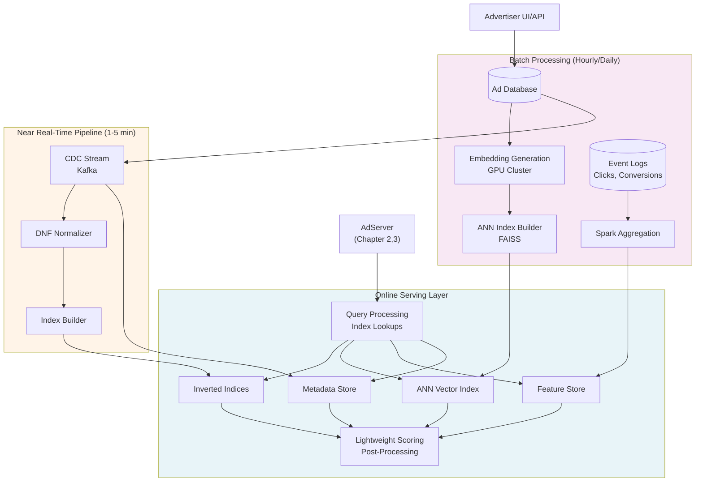
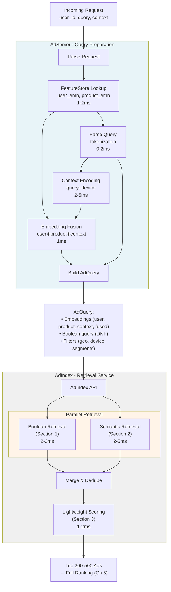

# Chapter 4: Ads Retrieval

We presented the overall Ads serving pipeline in Chapter 2, where we established that the Ad Index (AdSvc) must retrieve relevant ad candidates from millions of possibilities within brutal latency constraints. This chapter zooms into the **Ads Retrieval** step, addressing a fundamental challenge: **How do you find relevant ads from millions of candidates in under 15 milliseconds?**

Ads retrieval consists of two critical stages:

1. **Recall/Matching (Candidate Generation)**: Narrow 10M ads → 500-1000 candidates through targeting-based matching and semantic similarity.
2. **Preliminary Scoring**: Fast scoring of candidates using lightweight features and computations before expensive full scoring that involves looking up external features and complex scoring models. In Chapter 2 and 3, such full scoring is performed in AdServer at the time of auction.

Traditional form of ads targeting is essentially a boolean expression of criteria. But we have seen new targeting forms of implicit semantics, like targeting at a product (sometimes the subject product of the Ad). Semantic targeting requires methods of semantic similarity. Some ads use combination of boolean targeting and semantic targeting.

Semantic similarity is not only required for semantic targeting, but also often used to augment boolean targeting or serves as part of preliminary scoring to quickly filter down a large result set.

**The complete retrieval pipeline**:
1. **Boolean-targeting-based matching** (Section 1): Inverted index queries match ads to user/context based on targeting rules → 100K-1M eligible ads
2. **Semantic similarity** (Section 2): Vector embeddings + ANN search for personalization → Top 500-1000 semantically relevant ads
3. **Preliminary scoring** (Section 4): Lightweight scoring using dot products, bids, quality scores → Top 200-500 for full ranking

---
- [Chapter 4: Ads Retrieval](#chapter-4-ads-retrieval)
  - [1. Boolean-Targeting-Based Retrieval](#1-boolean-targeting-based-retrieval)
    - [1.1 Inverted Index Fundamentals](#11-inverted-index-fundamentals)
      - [1.1.1 Document Model: Fields and Values](#111-document-model-fields-and-values)
      - [1.1.2 Tokenization and Position Tracking](#112-tokenization-and-position-tracking)
      - [1.1.3 The Inverted Index Structure](#113-the-inverted-index-structure)
    - [1.2 Mapping Ad Targeting to Document Structure](#12-mapping-ad-targeting-to-document-structure)
      - [1.2.1 The Challenge: Heterogeneous Boolean Expressions](#121-the-challenge-heterogeneous-boolean-expressions)
      - [1.2.2 The Solution: DNF Normalization + Criterion-Level Indexing](#122-the-solution-dnf-normalization--criterion-level-indexing)
      - [1.2.3 Types of Targeting Criteria](#123-types-of-targeting-criteria)
      - [1.2.4 Complete Example: Ad\_123 as Criterion Documents](#124-complete-example-ad_123-as-criterion-documents)
      - [1.2.5 Why This Model Works](#125-why-this-model-works)
    - [1.3 Query Construction and Matching Algorithm](#13-query-construction-and-matching-algorithm)
      - [1.3.1 From User Request to Criterion Queries](#131-from-user-request-to-criterion-queries)
      - [1.3.2 From matched Criteria to matched Ads](#132-from-matched-criteria-to-matched-ads)
      - [1.3.3 Concrete Example Walkthrough](#133-concrete-example-walkthrough)
      - [1.3.4 Performance Optimizations](#134-performance-optimizations)
  - [2. Semantic Similarity-Based Retrieval (Embedding-Based)](#2-semantic-similarity-based-retrieval-embedding-based)
    - [2.1 Embedding vs. Boolean Retrieval: use cases and challenges](#21-embedding-vs-boolean-retrieval-use-cases-and-challenges)
    - [2.2 Query and Ad Representation in Vector Space](#22-query-and-ad-representation-in-vector-space)
    - [2.3 Approximate Nearest Neighbor (ANN) Search](#23-approximate-nearest-neighbor-ann-search)
    - [2.4 Hybrid Retrieval: Combining Boolean and Semantic](#24-hybrid-retrieval-combining-boolean-and-semantic)
      - [2.4.1 Why Hybrid is Necessary](#241-why-hybrid-is-necessary)
      - [2.4.2 Hybrid Architecture Patterns](#242-hybrid-architecture-patterns)
      - [2.4.3 Geo and Category Partitioning](#243-geo-and-category-partitioning)
      - [2.4.4 Embedding Compression and Quantization](#244-embedding-compression-and-quantization)
  - [3. Lightweight Scoring in AdIndex](#3-lightweight-scoring-in-adindex)
    - [3.1 Lightweight Scoring Functions](#31-lightweight-scoring-functions)
      - [3.1.1 Dot Product Similarity (for semantic retrieval)](#311-dot-product-similarity-for-semantic-retrieval)
      - [3.1.2 Weighted Linear Combination](#312-weighted-linear-combination)
      - [3.1.3 Lightweight Logistic Regression](#313-lightweight-logistic-regression)
    - [3.2 Top-K Selection and Filtering](#32-top-k-selection-and-filtering)
      - [3.2.1 Scoring and Sorting](#321-scoring-and-sorting)
      - [3.2.2 Diversity and Business Rules](#322-diversity-and-business-rules)
  - [4. AdIndex System Architecture](#4-adindex-system-architecture)
    - [4.1 System Architecture Overview](#41-system-architecture-overview)
      - [4.1.1 Request Processing Flow](#411-request-processing-flow)
    - [4.2 Production Considerations](#42-production-considerations)
      - [4.2.1 Update Frequencies and Data Freshness](#421-update-frequencies-and-data-freshness)
      - [4.2.2 Scalability Through Sharding](#422-scalability-through-sharding)
      - [4.2.3 Technology Choices](#423-technology-choices)
  - [Summary and Next Steps](#summary-and-next-steps)
  - [References and Further Reading](#references-and-further-reading)

---

## 1. Boolean-Targeting-Based Retrieval

An inverted index is a popular abstraction for support boolean-expresson based retrieval of documents that has both structured fields and fields of unstructured texts. We will start with fundamental of inverted index and then explain how to use it to implement boolean-targeting-based retrieval.

### 1.1 Inverted Index Fundamentals

An **inverted index** is a data structure that enables efficient full-text search by mapping terms to the documents that contain them. Let's start with a simple non-ad example.

#### 1.1.1 Document Model: Fields and Values

A **document** is a structured collection of **fields**, where each field has a **name** and a **value**:

**Example document (blog post)**:
```
Document_1:
  doc_id: "post_42"
  title: "Best Running Shoes for Marathon Training"
  author: "Jane Smith"
  category: "fitness"
  publish_date: "2024-03-15"
  body: "Marathon training requires proper footwear. The Nike Pegasus and Adidas Ultraboost are excellent choices for long-distance running..."
```

Each field can be configured with three independent properties:

1. **Stored**: Is the field value stored in the index for retrieval? (e.g., return `title` in search results)
2. **Indexed**: Is the field included in the inverted index for search? (e.g., enable search on `body` text)
3. **Tokenized**: Is the field value split into tokens before indexing? (e.g., "running shoes" → `["running", "shoes"]`)

**Field configuration examples**:

| Field | Stored? | Indexed? | Tokenized? | Purpose |
|-------|---------|----------|------------|---------|
| `doc_id` | ✅ Yes | ✅ Yes | ❌ No | Unique identifier (stored as atomic term) |
| `title` | ✅ Yes | ✅ Yes | ✅ Yes | Full-text search + display |
| `author` | ✅ Yes | ✅ Yes | ❌ No | Exact name matching + display |
| `category` | ✅ Yes | ✅ Yes | ❌ No | Category filtering (stored as atomic term) |
| `publish_date` | ✅ Yes | ✅ Yes | ❌ No | Range queries (numeric/date) |
| `body` | ❌ No | ✅ Yes | ✅ Yes | Full-text search only (not returned in results) |

#### 1.1.2 Tokenization and Position Tracking

**Tokenization** transforms a text value into a sequence of **tokens** (terms) with optional **position** information.

**Example**: Field `title` with value `"Best Running Shoes for Marathon Training"`

**Tokenization steps** (using standard analyzer):
1. **Lowercase normalization**: "best running shoes for marathon training"
2. **Punctuation removal**: (none in this case)
3. **Stopword removal** (optional): Remove "for" → "best running shoes marathon training"
4. **Token extraction**: `["best", "running", "shoes", "marathon", "training"]`
5. **Position assignment**:
   - `"best"` at position 0
   - `"running"` at position 1
   - `"shoes"` at position 2
   - `"marathon"` at position 3
   - `"training"` at position 4

**Why positions matter?**

- **Without positions**: Can only check if term exists (e.g., does document contain "running"?)
- **With positions**: Can perform phrase queries (e.g., does document contain "running shoes" as a phrase?)

**Field configuration for position tracking**:

- **`title`** (indexed with positions): Supports phrase queries like `"marathon training"` (requires tokens in order)
- **`body`** (indexed with positions): Supports phrase queries on body text
- **`category`** (not tokenized, no positions): Only exact term matching (e.g., `category = "fitness"`)

#### 1.1.3 The Inverted Index Structure

After tokenization, the inverted index maps each **term** to a **posting list** of documents containing that term:

**Inverted index for our blog post example**:

```
Term → [Document IDs with positions]

"best" → [(doc: post_42, field: title, pos: 0)]
"running" → [(doc: post_42, field: title, pos: 1), (doc: post_42, field: body, pos: 15)]
"shoes" → [(doc: post_42, field: title, pos: 2), (doc: post_42, field: body, pos: 16)]
"marathon" → [(doc: post_42, field: title, pos: 3), (doc: post_42, field: body, pos: 0)]
"training" → [(doc: post_42, field: title, pos: 4), (doc: post_42, field: body, pos: 1)]
"nike" → [(doc: post_42, field: body, pos: 19)]
...

Category index (non-tokenized):
"fitness" → [post_42]

Author index (non-tokenized):
"Jane Smith" → [post_42]
```

**Query examples**:

1. **Term query**: "running"
   - Lookup: `inverted_index["running"]` → `[post_42]`
   - Result: Documents containing token "running"

2. **Phrase query**: "running shoes" (must appear in order)
   - Lookup: `inverted_index["running"]` → positions `[1]` in `title`
   - Lookup: `inverted_index["shoes"]` → positions `[2]` in `title`
   - Check: position of "shoes" = position of "running" + 1? ✅ Yes
   - Result: Match (phrase found in `title` field)

3. **Boolean query**: `category:"fitness" AND "marathon training"`
   - Lookup: `category_index["fitness"]` → `[post_42]`
   - Phrase check: "marathon training" in `post_42`? ✅ Yes (positions 3, 4 in `title`)
   - Result: Match

**Key insight**: The inverted index enables **sub-millisecond lookups** because:
- Term lookups are O(1) hash table operations
- Posting lists are compressed and cached
- Position checking is a simple integer comparison

---

### 1.2 Mapping Ad Targeting to Document Structure

Now we apply inverted index concepts to ad retrieval, which is a more complex use case than conventional document search. Ad retrieval is conceptually a **"reversed search"**: an ad's targeting criteria is like a Boolean query that should match incoming user requests. To implement this efficiently at scale, we take a reversed view—treating ad targeting criteria as indexed documents and user requests as queries.

The key challenge: **each ad has its own Boolean expression structure**. We cannot use a traditional "ad-as-document" model because we'd need to express every ad's unique Boolean logic in a single query.

#### 1.2.1 The Challenge: Heterogeneous Boolean Expressions

Advertisers specify targeting using Boolean expressions with varying structures:

**Ad_123**: `(exact_kw: "nike shoes" OR phrase_kw: "running shoes") AND geo: "US" AND device: "mobile"`

**Ad_456**: `broad_kw: "athletic" AND (geo: "US" OR geo: "CA")`

**Ad_789**: `(exact_kw: "marathon training" AND geo: "UK") OR audience: "fitness_enthusiasts"`

These ads have **different Boolean structures**. A traditional "ad-as-document" index cannot efficiently handle heterogeneous Boolean expressions across millions of ads—we'd need a different query for each ad's unique targeting logic.

#### 1.2.2 The Solution: DNF Normalization + Criterion-Level Indexing

The solution has two parts:

**Part 1: Normalize targeting to Disjunctive Normal Form (DNF)**

Any Boolean expression can be transformed to **disjunction-of-conjunctions**:
$$\text{AdTargeting} \iff \bigvee_{i=1}^{n} \left( \bigwedge_{j=1}^{m_i} \text{criterion}_{i,j} \right)$$

**In plain terms**: An ad matches if **at least one targeting rule** matches, where each rule requires **all its criteria** to be satisfied.

**Example - Ad_123 targeting** (keyword OR expansion):
```
Original:
  (exact_kw: "nike shoes" OR phrase_kw: "running shoes") 
  AND geo: "US" 
  AND device: "mobile"

DNF expansion (2 rules):
  Rule 1: exact_kw: "nike shoes" AND geo: "US" AND device: "mobile"
  OR
  Rule 2: phrase_kw: "running shoes" AND geo: "US" AND device: "mobile"
```

**Example - Ad_456 targeting** (geo OR expansion):
```
Original:
  broad_kw: "athletic" AND (geo: "US" OR geo: "CA")

DNF expansion (2 rules):
  Rule 1: broad_kw: "athletic" AND geo: "US"
  OR
  Rule 2: broad_kw: "athletic" AND geo: "CA"
```

**Part 2: Index each criterion as a separate document**

Instead of indexing whole ads, we index **individual criteria**. Each criterion is a "mini-document" that knows which ad and rule it belongs to.

**Criterion document structure**:
```json
{
  "criterion_id": "c1",
  "ad_id": "ad_123",
  "rule_id": "r1",
  "type": "exact_kw",
  "value": "nike shoes"
}
```

This enables **criterion-level matching**: when a request arrives, we find all criteria that match, group them by `(ad_id, rule_id)`, and check if any rule is fully satisfied.

#### 1.2.3 Types of Targeting Criteria

Different criterion types have different matching semantics:

| Criterion Type | Description | Tokenized? | Positions? | Example |
|----------------|-------------|------------|------------|---------|
| `exact_kw` | Exact keyword match | ❌ No | ❌ No | "nike running shoes" |
| `phrase_kw` | Phrase match (order matters) | ✅ Yes | ✅ Yes | "running shoes" |
| `broad_kw` | Broad match (any token) | ✅ Yes | ❌ No | "athletic footwear" |
| `neg_kw` | Negative keyword (exclusion) | ❌ No | ❌ No | "used" |
| `geo` | Geographic targeting | ❌ No | ❌ No | "US", "CA" |
| `device` | Device type | ❌ No | ❌ No | "mobile", "tablet" |
| `audience` | User segment | ❌ No | ❌ No | "fitness_enthusiasts" |
| `category` | Product/page category | ❌ No | ❌ No | "electronics" |

**Key distinctions** (connecting back to Section 1.1):
- **Exact keywords**: Not tokenized; the entire string "nike running shoes" is indexed as a single atomic term
- **Phrase keywords**: Tokenized with positions; "running shoes" → `["running"₀, "shoes"₁]`
- **Broad keywords**: Tokenized without positions; "athletic footwear" → `["athletic", "footwear"]`

#### 1.2.4 Complete Example: Ad_123 as Criterion Documents

**Advertiser intent**: "Show my ad to users searching for Nike shoes in the US on mobile devices"

**Step 1: Define targeting Boolean expression**
```
(exact_kw: "nike shoes" OR phrase_kw: "running shoes")
AND geo: "US"
AND device: "mobile"
AND NOT neg_kw: "used"
```

**Step 2: DNF expansion** (creates 2 rules due to keyword OR):
```
Rule 1: exact_kw: "nike shoes" AND geo: "US" AND device: "mobile" AND NOT neg_kw: "used"
  OR
Rule 2: phrase_kw: "running shoes" AND geo: "US" AND device: "mobile" AND NOT neg_kw: "used"
```

**Step 3: Generate criterion documents** (each criterion becomes a separate document):

**Rule 1 criteria**:
```json
{"criterion_id": "c1", "ad_id": "ad_123", "rule_id": "r1", "type": "exact_kw", "value": "nike shoes"}
{"criterion_id": "c2", "ad_id": "ad_123", "rule_id": "r1", "type": "geo", "value": "US"}
{"criterion_id": "c3", "ad_id": "ad_123", "rule_id": "r1", "type": "device", "value": "mobile"}
{"criterion_id": "c4", "ad_id": "ad_123", "rule_id": "r1", "type": "neg_kw", "value": "used"}
```

**Rule 2 criteria**:
```json
{"criterion_id": "c5", "ad_id": "ad_123", "rule_id": "r2", "type": "phrase_kw", "value": "running shoes"}
{"criterion_id": "c6", "ad_id": "ad_123", "rule_id": "r2", "type": "geo", "value": "US"}
{"criterion_id": "c7", "ad_id": "ad_123", "rule_id": "r2", "type": "device", "value": "mobile"}
{"criterion_id": "c8", "ad_id": "ad_123", "rule_id": "r2", "type": "neg_kw", "value": "used"}
```

**Step 4: Build inverted indices** (one index per criterion type):

**Exact keyword index** (not tokenized):
```
"nike shoes" → [c1]
"nike running shoes" → [c45, c67]  (from other ads)
```

**Phrase keyword index** (tokenized with positions):
```
For c5: value = "running shoes"
Tokenize → ["running"₀, "shoes"₁]

"running" → [(criterion: c5, pos: 0), ...]
"shoes" → [(criterion: c5, pos: 1), ...]
```

**Broad keyword index** (tokenized without positions):
```
"athletic" → [c99, c102, ...]
"footwear" → [c99, ...]
```

**Geo index**:
```
"US" → [c2, c6, ...]  (many criteria require US geo)
"CA" → [c34, c56, ...]
"UK" → [c78, ...]
```

**Device index**:
```
"mobile" → [c3, c7, ...]
"tablet" → [c12, c45, ...]
"desktop" → [c23, ...]
```

**Negative keyword index**:
```
"used" → [c4, c8, ...]  (criteria that exclude "used")
"refurbished" → [c23, ...]
```

#### 1.2.5 Why This Model Works

**Key advantages**:

1. **Handles heterogeneous Boolean expressions**: Each ad's unique targeting logic is captured in its rule structure, not in query syntax

2. **Efficient retrieval**: Inverted indices provide O(1) or O(log N) lookup from any criterion value to the set of criteria that need it

3. **Simple matching logic** (detailed in Section 1.3):
   - Find all criteria that match the request
   - Group by `(ad_id, rule_id)`
   - Check if any rule has all its criteria matched → ad is eligible

4. **Natural fit for DNF**: Each conjunction (rule) is a self-contained unit; evaluation is just set intersection per rule + union across rules

**Formal matching condition**:
$$\text{Ad matches} \iff \exists i: \left( \forall j \in \text{rule}_i: \text{criterion}_{i,j} \text{ matches request} \right)$$

**In words**: "An ad matches if there exists at least one rule where all criteria match the request."

**Trade-off**: DNF expansion can create multiple rules per ad (e.g., `(a OR b) AND (c OR d)` → 4 rules), but in practice:
- Most ad targeting is simple (1-3 rules per ad)
- Systems limit maximum rules per ad (e.g., 10-20) to prevent blowup
- The efficiency gains from criterion-level indexing far outweigh the storage cost

**Next**: Section 1.3 will show how user requests are transformed into queries over these criterion indices, and how the matching algorithm efficiently evaluates rule satisfaction.

---

### 1.3 Query Construction and Matching Algorithm

Now that we've indexed ad targeting as criterion documents (Section 1.2), we show how incoming user requests are matched against these criteria to find eligible ads.

#### 1.3.1 From User Request to Criterion Queries

When a user request arrives, we extract attributes and construct queries for each criterion type:

**Example request**:
```json
{
  "query": "best nike running shoes",
  "geo": "US",
  "device": "mobile",
  "user_id": "user_456",
  "page_context": "search_results"
}
```

**Step 1: Extract and normalize request attributes**

1. **Query processing**:
   - Raw query: `"best nike running shoes"`
   - Normalize: lowercase, remove punctuation → `"best nike running shoes"`
   - Tokenize: `["best", "nike", "running", "shoes"]`
   - Remove stopwords (optional): `["nike", "running", "shoes"]`

2. **Context extraction**:
   - Geo: `"US"`
   - Device: `"mobile"`
   - User segments: `["fitness_enthusiasts", "high_value_customers"]` (from user profile)

**Step 2: Construct criterion lookups** (one per criterion type)

We query each criterion type index separately:

| Criterion Type | Query Construction | Index Lookup |
|----------------|-------------------|--------------|
| `exact_kw` | Full normalized query string | `exact_index["best nike running shoes"]` → [c12, c45, ...] |
| `phrase_kw` | Tokenized query with positions | `phrase_index["nike"₀, "running"₁, "shoes"₂]` → [c5, c23, ...] |
| `broad_kw` | Individual tokens (OR) | `broad_index["nike"] ∪ broad_index["running"] ∪ broad_index["shoes"]` → [c7, c15, c89, ...] |
| `geo` | Exact geo value | `geo_index["US"]` → [c2, c6, c34, ...] |
| `device` | Exact device value | `device_index["mobile"]` → [c3, c7, c12, ...] |
| `audience` | User segments (OR) | `audience_index["fitness_enthusiasts"] ∪ audience_index["high_value_customers"]` → [c45, c67, ...] |
| `neg_kw` | Tokens to exclude | `negative_index["nike"] ∪ negative_index["running"] ∪ negative_index["shoes"]` → [c4, c8, ...] |

**Detailed query logic examples**:

**Exact match**: 
```
Query: "best nike running shoes"
Lookup: exact_index["best nike running shoes"]
Result: [c12, c45] (only criteria with EXACT string match)
```

**Phrase match** (requires tokens in order):
```
Query tokens: ["nike"₀, "running"₁, "shoes"₂]
Lookup posting lists:
  phrase_index["nike"] → [(c5, pos:0), (c23, pos:1), ...]
  phrase_index["running"] → [(c5, pos:1), (c89, pos:0), ...]
  phrase_index["shoes"] → [(c5, pos:2), (c102, pos:1), ...]

Find criteria where tokens appear in consecutive positions:
  c5: has "nike" at pos 0, "running" at pos 1, "shoes" at pos 2 ✅ MATCH
  c23: has "nike" at pos 1 (not starting at 0) ❌ NO MATCH

Result: [c5]
```

**Broad match** (any token matches):
```
Query tokens: ["nike", "running", "shoes"]
Lookup:
  broad_index["nike"] → [c7, c15, c89]
  broad_index["running"] → [c7, c89, c102]
  broad_index["shoes"] → [c7, c15, c89, c102]

Union: [c7, c15, c89, c102] (any criterion with ANY matching token)
```

#### 1.3.2 From matched Criteria to matched Ads

After retrieving matched criteria from the inverted indices (as described in 1.3.1), we determine which ads have satisfied targeting rules via the following steps:

Each matched criterion knows which ad and rule it belongs to (from its `ad_id` and `rule_id` fields). We group all matched criteria by their `(ad_id, rule_id)` pair:

```
Example grouping:
  (ad_123, rule_1) → {c2, c3}        # ad_123's rule 1 has 2 criteria matched
  (ad_123, rule_2) → {c5, c6, c7}    # ad_123's rule 2 has 3 criteria matched  
  (ad_456, rule_1) → {c12, c34}      # ad_456's rule 1 has 2 criteria matched
```

For each rule that has at least one matched criterion, we check if the rule is **fully satisfied**:

1. **Fetch the rule definition**: Retrieve the complete list of criteria that this rule requires (both positive and negative)
2. **Check positive criteria completeness**: A rule requires all its positive criteria to be in the matched set
3. **Check negative criteria**: If any negative criterion in the rule matches the request, the rule is violated (ad is excluded)
4. **Mark ad as eligible**: If a rule is fully satisfied (all positive criteria matched AND no negative criteria matched), the ad is eligible

The key insight: **An ad matches if ANY of its rules is fully satisfied** (disjunction at the rule level). Each rule in DNF is a conjunction: `(criterion₁ ∧ criterion₂ ∧ ... ∧ ¬neg_criterion₁ ∧ ¬neg_criterion₂)`.

**Step 3: Return eligible ads**

Collect all ads that had at least one satisfied rule. These are the ads eligible for this request.

**Complexity**:
- **Criterion lookups** (from 1.3.1): O(K × log N) for K criterion types and N index size, or O(K) for hash-based indices
- **Grouping**: O(M) for M total matched criteria
- **Rule evaluation**: O(R) for R rules with matched criteria (typically much smaller than total rules)
- **Total**: O(K × log N + M + R), typically **sub-millisecond** for well-indexed systems

**Note on negative criteria**: Negative keywords (and more generally, any exclusion criteria like excluded geos or audiences) are treated as negated literals in the Boolean expression. They are indexed and retrieved just like positive criteria, but evaluated with inverted logic during rule satisfaction checks.

#### 1.3.3 Concrete Example Walkthrough

Let's trace the full matching process for our example request:

**Request**: `{query: "best nike running shoes", geo: "US", device: "mobile"}`

**Indexed ads** (from Section 1.2):
- **Ad_123** has 2 rules:
  - `r1`: exact_kw: "nike shoes" (c1) + geo: "US" (c2) + device: "mobile" (c3) + neg_kw: "used" (c4)
  - `r2`: phrase_kw: "running shoes" (c5) + geo: "US" (c6) + device: "mobile" (c7) + neg_kw: "used" (c8)

**Step 1: Criterion lookups**

```
exact_index["best nike running shoes"] → [] (no exact match)
phrase_index["running"₀, "shoes"₁] → [c5] (c5 has "running shoes" as phrase)
broad_index["nike"] ∪ ["running"] ∪ ["shoes"] → [] (assume no broad match for simplicity)
geo_index["US"] → [c2, c6, ...]
device_index["mobile"] → [c3, c7, ...]
negative_index["nike"] ∪ ["running"] ∪ ["shoes"] → [c4, c8] (ads with these as negative keywords)
```

**Step 2: Group by (ad_id, rule_id)**

```
Matched criteria: [c5, c2, c6, c3, c7]

Grouping:
  (ad_123, r1): {c2, c3}  (missing c1 - exact keyword)
  (ad_123, r2): {c5, c6, c7}  (has all: phrase_kw, geo, device)
```

**Step 3: Evaluate rules**

**Rule r1**:
- Required: {c1, c2, c3}
- Matched: {c2, c3}
- Missing: c1 (exact_kw: "nike shoes")
- **Result**: ❌ NOT satisfied

**Rule r2**:
- Required: {c5, c6, c7}
- Matched: {c5, c6, c7}
- All criteria matched ✅
- Check negative keyword c8 ("used"): Query doesn't contain "used" ✅
- **Result**: ✅ SATISFIED

**Step 4: Result**

```
eligible_ads = {ad_123}  (matched via rule r2)
```

**Conclusion**: Ad_123 is eligible because its rule r2 is fully satisfied (phrase keyword "running shoes", geo "US", device "mobile", and no negative keyword violation).

#### 1.3.4 Performance Optimizations

**1. Cardinality-based criterion ordering**

Check criteria with smallest posting lists first to minimize the candidate set early:

```
Criterion cardinalities (posting list sizes):
  exact_kw: 10 ads
  phrase_kw: 100 ads
  geo: 1M ads
  device: 5M ads

Order: exact_kw → phrase_kw → geo → device
(Smallest to largest)
```

**2. Bloom filters for fast negative checks**

Each rule maintains a Bloom filter of required criteria:

```
if criterion in rule_bloom_filter:
    # Possibly in rule (check full set)
else:
    # Definitely NOT in rule (skip this rule)
```

**3. Early termination**

Once an ad has one satisfied rule, stop checking its other rules (since ad matches if ANY rule matches).

**4. Criterion deduplication across rules**

Instead of storing each criterion with a single `(ad_id, rule_id)` pair, store each unique criterion **once** and link it to **multiple rules**:

```
Before (duplication):
  c2: {ad_id: ad_123, rule_id: r1, type: geo, value: "US"}
  c6: {ad_id: ad_123, rule_id: r2, type: geo, value: "US"}  # Duplicate!

After (shared criterion):
  c2: {criterion_id: c2, type: geo, value: "US", rules: [(ad_123, r1), (ad_123, r2)]}
```

**Benefits**:
- **Storage reduction**: Geo "US" is stored once instead of N times (for N rules requiring it)
- **Index size reduction**: Geo index has fewer entries (one per unique geo, not per rule)
- **Query efficiency**: Fewer criterion documents to process during retrieval

**Implementation**: When grouping matched criteria by (ad_id, rule_id) in Step 1, each criterion expands to all its associated rules. A single matched criterion `c2` contributes to multiple rule evaluations.

This is a **major optimization** for high-cardinality criteria that appear in many rules (geo, device, audience segments).

---

## 2. Semantic Similarity-Based Retrieval (Embedding-Based)

The state-of-the-art method of measuring semantic similarity has evolved from data mining methods like collaborative filtering and traditional machine learning methods like dimension reduction, to embedding based. Embedding is a general and elegant way to transform a complex object into a small and dense vector, and the similarity defined on two embedding vectors is a natural and elegant way to represent semantic similarity between the corrsponding original objects. Deep learning approaches to semantic matching, such as Deep Structured Semantic Models (DSSM), have shown significant improvements in capturing query-document relevance [1]. 

There are many good off-the-shelf embedding models, especially on text. Embedding models can also be trained or transfer-learned as layers of complex and sophisticated models for specific tasks in the subject problem domain. In chapter 5, we will present one of such complex model. Though we will focus on the engineering of vector similarity in this section.

### 2.1 Embedding vs. Boolean Retrieval: use cases and challenges

| Aspect | Keyword-Only Retrieval (Boolean) | Embedding-Based Retrieval |
|--------|----------------------------------|---------------------------|
| **Synonyms & Paraphrasing** | ❌ Query `cheap flights` doesn't match ads targeting `discount airfare`, `budget travel`, `low-cost airlines` | ✅ Embeddings capture semantic similarity: `cheap flights` ≈ `discount airfare` in vector space |
| **Semantic Intent** | ❌ Query `gift for mom` has no keyword overlap with `jewelry`, `flowers`, `spa vouchers` | ✅ Model learns semantic relationships: `gift` is related to gift categories |
| **Personalization** | ❌ All users searching `running shoes` see same keyword matches (marathon vs. casual context ignored) | ✅ User context (demographics, history) influences query embedding → personalized results |
| **Typos & Variations** | ❌ Query `nike runng shoes` fails exact match for `nike running shoes` | ✅ Similar phrases map to nearby points in embedding space (robust to variations) |
| **Contextual Targeting (E.g., product)** | ❌ Difficult to match similar product with the targeted product | ✅ Semantic similarity between two products results in a match |
| **Implementation** | Inverted index: keyword → ad_ids | Neural encoder: text → dense vector; ANN search: vector → similar vectors |
| **Latency** | 1-3ms (index lookup) | 5-15ms (embedding computation + ANN search) |

In addition to the above comparison between the two. They can also be combined for sophisticated Ads retrieval. For example, an Ad targeting at a product and a specific geo.

### 2.2 Query and Ad Representation in Vector Space

**Embedding generation** (high-level overview; details in Appendix A):

**Query embedding** $\vec{Q}$:
- Encodes user request + context (search query, user demographics, session state)
- **Computed by AdServer** before calling AdIndex (avoids duplicate computation for retrieval + ranking)
- Components:
  - **Pre-computed user/product embeddings** from FeatureStore (Redis lookup)
  - **Dynamic context encoding** (query text, time, device) via lightweight tower
  - **Fusion** to combine components into final query embedding

**Ad embedding** $\vec{A}$:
- Encodes ad creative + metadata (title, description, category, advertiser info)
- Computed **offline** in batch jobs (daily or hourly)
- Pre-indexed in ANN index for fast lookup

**Similarity scoring**:

$$\text{Relevance}(\text{query}, \text{ad}) = \vec{Q} \cdot \vec{A} \tag{4.1}$$

Higher dot product → more semantically relevant.

**Offline/Online split** (key to sub-15ms latency):

```
Offline (daily batch):
  For each user:
    user_embedding = UserTower(user_history, demographics)
    Store in FeatureStore (Redis)
  
  For each product:
    product_embedding = ProductTower(product_features)
    Store in FeatureStore (Redis)
  
  For each ad:
    ad_embedding = AdTower(ad_features)
    Store in ANN index

Online (per request):
  # AdServer orchestrates (Chapter 2):
  user_emb = FeatureStore.get(user_id)           # <1ms (Redis lookup)
  product_emb = FeatureStore.get(product_id)     # <1ms (if product page)
  tokens = parse(query_text)                     # 0.2ms (tokenization)
  context_emb = ContextTower(tokens, device)     # 2-5ms (lightweight encoding)
  query_embedding = fuse(user_emb, product_emb, context_emb)  # <1ms
  
  # AdIndex receives pre-computed query_embedding:
  Top-K ads = ANN_search(query_embedding, ANN_index)  # 2-5ms
  
  # Full ranking (Chapter 5) reuses query_embedding:
  predictions = MLInference(query_embedding, candidate_ads)  # 20-30ms
  
  → No duplicate computation, query_embedding used for both retrieval and ranking
```

**Why this is fast**: 
- **User/product embeddings** are pre-computed offline and cached in FeatureStore (fast Redis lookup)
- **Ad embeddings** are pre-computed and indexed offline (no online computation)
- **Query parsing + fusion happens once** in AdServer, reused for retrieval and ranking
- **Online compute** per request: context encoding (2-5ms) + fusion (1ms) + ANN search (2-5ms) = ~5-10ms
- AdServer centralizes feature preparation; AdIndex is pure retrieval engine

### 2.3 Approximate Nearest Neighbor (ANN) Search

Exact nearest neighbor search over 10M ad embeddings would require computing 10M dot products per query (too slow). **ANN algorithms** trade small accuracy for massive speedup.

**Popular ANN libraries**:
- **FAISS** (Facebook AI): GPU-accelerated, supports IVF, HNSW, PQ [2]
- **ScaNN** (Google): Optimized for high recall with learned quantization
- **Milvus**: Distributed vector database for billion-scale indices

**Common ANN algorithms**:

**1. Inverted File Index (IVF)**:
- Cluster ad embeddings into K partitions (e.g., K=10,000)
- At query time: Find nearest cluster centroids → search only ads in those clusters
- **Speedup**: Search 0.1% of ads (10K out of 10M) with <5% recall loss

**2. Hierarchical Navigable Small World (HNSW)** [3]:
- Build graph where each ad connects to nearest neighbors
- At query time: Navigate graph by following edges to closer neighbors
- **Speedup**: O(log N) search instead of O(N), excellent recall (>95%)

**3. Product Quantization (PQ)**:
- Compress embeddings: 128-d float32 (512 bytes) → uint8 codes (128 bytes) [4]
- 4× memory reduction, enables searching larger indices in RAM
- **Trade-off**: <1% recall drop for 4× speedup

**Table 4.1: ANN Index Algorithm Comparison**

| Algorithm | Search Complexity | Recall@1000 | Memory (10M ads, 128-d) | Latency (10M ads) | Build Time | Best For |
|-----------|------------------|-------------|-------------------------|-------------------|------------|----------|
| **IVF** | O(√N) | 85-92% | 5 GB (native) | 3-5ms | ~10 min | Balanced speed/recall |
| **HNSW** | O(log N) | 92-98% | 7.5 GB (graph overhead) | 2-4ms | ~30 min | High recall needs |
| **IVF + PQ** | O(√N) | 88-94% | 1.5 GB (4× compressed) | 2-3ms | ~15 min | Memory-constrained |
| **ScaNN** | O(√N) | 90-95% | 3 GB (learned quantization) | 2-4ms | ~20 min | Production balance |

*Note: Metrics measured on 128-dimensional embeddings, K=10,000 clusters for IVF, M=16 for HNSW. Latency on CPU (32 cores); GPU accelerates 2-3×.*

**Typical configuration**:
- Index: IVF + PQ (partitioned + compressed)
- Search: Top-1000 candidates from 10M ads in **2-5ms**
- Recall@1000: 90-95% (measured offline via relevance judgments)

### 2.4 Hybrid Retrieval: Combining Boolean and Semantic

Pure embedding retrieval can violate business rules (budget exhaustion, geo-targeting) or keyword intent. Production systems use **hybrid retrieval** that combines Boolean (Section 1) and semantic (Section 2) approaches.

#### 2.4.1 Why Hybrid is Necessary

**Semantic-only retrieval risks**:
- ❌ User searching `nike running shoes` might get semantically similar but irrelevant `adidas basketball` ads
- ❌ Cannot enforce hard constraints: budget, geo, device compatibility
- ❌ May miss advertiser's explicit keyword intent (they paid to target `nike shoes`)

**Boolean-only retrieval gaps**:
- ❌ Misses semantically relevant ads without keyword overlap
- ❌ No personalization or contextual relevance

**Hybrid approach** combines strengths:
- ✅ Boolean retrieval ensures **intent alignment** and **business rule compliance**
- ✅ Semantic retrieval adds **generalization** and **personalization**
- ✅ Intersection/union yields high-quality, policy-compliant candidates

#### 2.4.2 Hybrid Architecture Patterns

**Pattern A: Boolean Pre-filter + Semantic Retrieval**

Execute Boolean retrieval first to enforce constraints, then semantic search over eligible ads:

```
Step 1: Boolean filtering (using Section 1 techniques)
  - Apply targeting rules (geo, device, budget, frequency caps)
  - Apply keyword matching (if ads have keyword targeting)
  → Eligible set: 100K-1M ads (down from 10M)

Step 2: Semantic retrieval (ANN search over eligible set)
  - Build partitioned ANN index by geo/category
  - Query embedding: Q = QueryTower(query + user + context)
  - ANN search on partition: Top-K most similar ads
  → Final candidates: 500-1000 ads

Latency: 1-3ms (Boolean) + 2-5ms (ANN on partition) = 3-8ms
```

**When to use**: Boolean retrieval results in small set of Ads or the ANN index is partitioned based on the underlying criteria of the boolean query, for example, geo location.

**Pattern B: Parallel Retrieval + Intersection**

Execute Boolean and semantic retrieval in parallel, then intersect:

```
Parallel execution:
  Thread 1: Boolean retrieval → Set S1 (100K-1M ads)
  Thread 2: ANN search over full index → Set S2 (Top-1000 similar ads)

Intersection: S_final = S1 ∩ S2
  → Ads satisfying BOTH Boolean rules AND semantic similarity

If intersection too sparse:
  - Take union: S1 ∪ S2 (with lower weight on union-only ads)
  - Or relax Boolean filters (e.g., expand geo radius)

Latency: max(1-3ms Boolean, 3-10ms ANN) + 1ms merge = 4-11ms
```

**When to use**: Display ads where semantic discovery is valuable.

**Pattern C: Semantic-First + Boolean Post-Filter**

For broad targeting (minimal Boolean constraints):

```
Step 1: Semantic retrieval (ANN search over full index)
  → Top-2000 candidates (generous K to allow for filtering)

Step 2: Boolean post-filtering
  - Apply budget/pacing, geo, device, frequency caps
  - Apply negative keyword exclusions
  → Final: 500-1000 ads

Latency: 5-10ms (ANN) + 1-2ms (filtering) = 6-12ms
```

**When to use**: Content recommendation, broad match campaigns.

#### 2.4.3 Geo and Category Partitioning

To reduce ANN search space, partition indices by stable metadata:

**Geographic partitioning**:
```
Build separate ANN indices:
  ANN_index_US (embeddings for ads targeting US)
  ANN_index_EU (embeddings for ads targeting EU)
  ANN_index_APAC (embeddings for ads targeting APAC)

Query routing:
  If request.geo == "US":
    search ANN_index_US only
  → Search space reduced 3-10× (faster search, lower latency)

Cross-geo ads (e.g., international flights):
  Replicate embeddings across relevant geo indices
```

**Category partitioning** (for content/display ads):
```
ANN_index_electronics, ANN_index_fashion, ANN_index_travel, ...

Query routing:
  page_category = extract_category(page_content)
  search ANN_index[page_category]
```

**Benefits**:
- **Latency**: 2-3ms faster (smaller index to search)
- **Relevance**: Category-specific indices reduce noise
- **Trade-off**: Storage replication (cross-category ads in multiple indices)

#### 2.4.4 Embedding Compression and Quantization

**Product Quantization (PQ)** [4]:
- Compress 128-d float32 embeddings (512 bytes) → uint8 codes (128 bytes)
- **4× memory reduction** with <1% recall loss
- Enables fitting larger indices in RAM (critical for sub-5ms latency)

**Binary embeddings**:
- Train model to produce binary vectors (1 bit per dimension)
- Search via Hamming distance (ultra-fast bitwise XOR operations)
- **10-50× faster** than float32, but 2-5% accuracy loss
- Use case: First-stage retrieval (broad recall), then re-rank with full embeddings

**Scalar quantization**:
- float32 → int8 (4× compression with minimal loss)
- Supported natively by modern ANN libraries (FAISS, ScaNN)

---

## 3. Lightweight Scoring in AdIndex

After Boolean retrieval (Section 1) and semantic retrieval (Section 2) produce 500-1000 candidate ads, we need to narrow this down to ~200-500 ads before sending them to the expensive CTR/CVR ranking models (Chapter 5). **Lightweight scoring** provides fast, coarse-grained ranking using pre-computed features (stored in AdIndex, see Section 4) and simple scoring functions.

**Latency budget**: <2ms (sub-millisecond operations using in-memory data).

### 3.1 Lightweight Scoring Functions

#### 3.1.1 Dot Product Similarity (for semantic retrieval)

The simplest scoring function reuses the **dot product** already computed during ANN retrieval:

$$\text{Score}_{\text{semantic}} = \vec{Q} \cdot \vec{A} \tag{4.2}$$

**Advantages**:
- **Zero additional cost**: Similarity is already computed by ANN search
- **Personalized**: Incorporates user context via query embedding
- **Effective**: Correlates well with relevance

**Limitations**:
- Ignores business factors (bid, budget, historical performance)
- Cannot differentiate between ads with similar embeddings

#### 3.1.2 Weighted Linear Combination

Combine multiple pre-computed features with learned or heuristic weights:

$$\text{PrelimScore} = \alpha \cdot (\vec{Q} \cdot \vec{A}) + \beta \cdot \text{Bid} + \gamma \cdot \text{HistoricalCTR} + \delta \cdot \text{QualityScore} \tag{4.3}$$

**Typical weights** (tuned offline):
- $\alpha = 0.3$: Semantic relevance
- $\beta = 0.3$: Advertiser bid (business value)
- $\gamma = 0.3$: Historical CTR (past performance)
- $\delta = 0.1$: Quality score (user experience)

**Feature normalization**:
```
Normalize each feature to [0, 1] range:
  normalized_bid = min(bid / max_bid_threshold, 1.0)
  normalized_CTR = historical_CTR  (already a probability)
  normalized_similarity = (dot_product + 1) / 2  (from [-1, 1] to [0, 1])
```

**Latency**: <0.5ms (simple arithmetic on 500-1000 candidates)

#### 3.1.3 Lightweight Logistic Regression

Train a simple logistic regression model on historical data:

$$\text{PrelimScore} = \sigma\left(\mathbf{w}^T \mathbf{x} + b\right) \tag{4.4}$$

Where feature vector $\mathbf{x}$ includes:
- Dot product similarity: $\vec{Q} \cdot \vec{A}$
- Log(bid)
- Historical CTR, CVR
- Quality score
- Advertiser reputation score
- Category match indicator

**Training**:
- **Labels**: Click or conversion events from past requests
- **Features**: Pre-computed values from Ad Index
- **Objective**: Maximize AUC or log-loss on historical data
- **Refresh**: Retrain weekly or monthly

**Advantages over linear combination**:
- **Learned weights**: Automatically tuned from data
- **Non-linear interactions**: Can include feature crosses (e.g., `bid × CTR`)
- **Calibrated probabilities**: Output approximates pCTR

**Latency**: ~1ms (matrix-vector multiply for 500-1000 candidates)

### 3.2 Top-K Selection and Filtering

#### 3.2.1 Scoring and Sorting

**Algorithm**:
```
Input: 500-1000 retrieved candidates
Output: Top 200-500 candidates for full ranking

Step 1: Compute preliminary score for each candidate
  for ad in candidates:
    score = lightweight_score_function(ad, query, user)
    
Step 2: Apply hard filters
  Remove ads with:
    - Exhausted daily budget (budget_remaining ≤ 0)
    - Exceeded frequency cap (user has seen ad N times today)
    - Pacing throttle (pacing_multiplier = 0)
    
Step 3: Sort by preliminary score (descending)
  sorted_ads = sort(candidates, key=score, reverse=True)
  
Step 4: Select Top-K
  final_candidates = sorted_ads[:K]  (K = 200-500)
  
Return final_candidates
```

**Complexity**: O(N log N) for sorting N=500-1000 candidates. Using partial sort (heap) can reduce to O(N log K) where K=200-500.

#### 3.2.2 Diversity and Business Rules

**Diversity boosting**:
```
Ensure variety across:
  - Advertisers: Limit to 3-5 ads per advertiser in Top-K
  - Categories: Balance across product categories
  - Price points: Mix of high/medium/low-priced items
  
Implementation:
  Use re-ranking with diversity penalty:
    score' = score - λ × diversity_penalty
  Where diversity_penalty increases for repeated advertiser/category
```

**Budget pacing**:
```
Apply pacing multiplier to bids:
  adjusted_bid = bid × pacing_multiplier
  
Where pacing_multiplier ∈ [0, 1]:
  - 1.0: On track or under-spending (no throttle)
  - 0.5: Over-spending, reduce by 50%
  - 0.0: Budget exhausted, exclude from auction
```

**Quality thresholds**:
```
Exclude ads with:
  - quality_score < threshold (e.g., 0.3)
  - historical_CTR < min_CTR (e.g., 0.001)
  - advertiser_reputation < min_reputation
```

---

## 4. AdIndex System Architecture

AdIndex is the **core Ad retrieval system** that integrates Boolean retrieval (Section 1), semantic retrieval (Section 2), and lightweight scoring (Section 3) into a unified, high-performance serving infrastructure.

**Key architectural principles**:

1. **AdServer/AdIndex separation**: AdServer handles query parsing, feature lookup, and embedding fusion **once**, then passes pre-computed embeddings to AdIndex. This eliminates duplicate computation (saves 3-8ms) and ensures consistency across retrieval and ranking stages.

2. **Hybrid retrieval**: Boolean and semantic retrieval run **in parallel**, combining explicit targeting rules with personalization.

3. **Multi-frequency updates**: Different components update at different rates based on business requirements:
   - Real-time (<1s): Bids, budgets, campaign status
   - Near real-time (1-5 min): Inverted indices for new ads/targeting
   - Hourly: ANN embeddings and index rebuilds
   - Daily: Historical CTR/CVR features

4. **Horizontal scalability**: Sharding by geography and campaign enables sub-15ms latency at millions of QPS.

### 4.1 System Architecture Overview

**Figure 4.2: AdIndex System Architecture**



#### 4.1.1 Request Processing Flow

The following diagram shows how a single ad request flows through AdServer and AdIndex, illustrating how the three retrieval techniques from Sections 1-3 integrate:

**Figure 4.1: AdIndex Query Processing Pipeline**



**Key flow characteristics**:

- **One-time preprocessing in AdServer**: Query parsing and embedding fusion happen once (3-8ms), then embeddings are reused by both AdIndex (retrieval) and downstream ranking (Chapter 5). This eliminates duplicate computation.

- **Parallel retrieval in AdIndex**: Boolean and semantic retrieval run concurrently (not sequentially), so total AdIndex latency is dominated by the slower of the two (~5ms), not their sum.

- **Lightweight scoring as final filter**: After merging ~500-1K candidates from Boolean and semantic retrieval, lightweight scoring applies budget filters and preliminary ranking to select Top 200-500 for expensive full ranking.

- **End-to-end latency**: AdServer (3-8ms) + AdIndex (5-12ms) = 8-20ms total, with target p99 < 25ms.

**Architecture highlights**:

- **Online Serving Layer**: Stateless AdIndex servers host indices in memory (inverted indices, ANN indices, metadata, features). Each server can handle 5-10K QPS with p99 < 25ms.

- **Batch Processing**: Runs hourly/daily to compute embeddings (GPU clusters), build ANN indices (FAISS/ScaNN), and aggregate historical metrics (Spark). Outputs uploaded to distributed storage (S3/GCS).

- **Near Real-Time Pipeline**: CDC streams from ad database (Kafka), normalizes targeting rules to DNF, updates inverted indices within 1-5 minutes.

**Latency breakdown** (end-to-end):

| Component | Operations | Latency | Notes |
|-----------|-----------|---------|-------|
| **AdServer** | FeatureStore lookup + query parsing + context encoding + fusion | 3-8ms | One-time overhead |
| **AdIndex** | Boolean retrieval (parallel) | 2-3ms | Inverted index lookups |
| | Semantic retrieval (parallel) | 2-5ms | ANN search on 10M ads |
| | Merge + lightweight scoring | 1-2ms | Feature lookup + linear model |
| | **AdIndex total** | **5-12ms** | Pure retrieval service |
| **Total** | **End-to-end** | **8-20ms** | Target: p99 < 25ms |

### 4.2 Production Considerations

#### 4.2.1 Update Frequencies and Data Freshness

Different AdIndex components tolerate different levels of staleness:

| Component | Freshness | Why This Frequency? |
|-----------|-----------|---------------------|
| **Bids, budgets, status** | Real-time (<1s) | Overspend risk, missed opportunities |
| **Inverted indices** | Near real-time (1-5 min) | New ads must be retrievable quickly |
| **ANN embeddings** | Hourly batch | Embeddings change slowly; acceptable lag |
| **Historical CTR/CVR** | Daily batch | Long-term aggregates; staleness OK |

**Update mechanisms**:
- **CDC streams** (Kafka): Real-time and near real-time updates flow through event streams
- **Batch jobs** (Airflow): Scheduled hourly/daily for expensive computations (embeddings, aggregations)
- **Atomic swaps**: New ANN indices loaded in background, swapped atomically (no downtime)

**Eventual consistency is acceptable**: AdServer verifies budget/bid at auction time anyway, so retrieval can use slightly stale data (1-60 min lag).

#### 4.2.2 Scalability Through Sharding

At scale (50M ads, 1M+ QPS), AdIndex must be sharded:

**Sharding strategies**:
1. **By Campaign ID**: Co-locates campaign ads on same shard (efficient for campaign-level operations like budget updates), but creates hot shards for popular campaigns
2. **By Ad ID**: Uniform load distribution, but fragments campaigns across shards
3. **Hierarchical (Geo + Campaign)**: Best of both—partition by geography first (reduces search space 70-90%), then by campaign within each region

**Typical deployment** (US-East region, 10M ads, 500K QPS):
- 10 shards (1M ads each)
- 7-10 replicas per shard (for read scalability + failover)
- Total: 70-100 instances
- Scatter-gather: Query all shards in parallel, merge Top-K results

#### 4.2.3 Technology Choices

AdIndex can be built with:

**Inverted indices**:
- **Elasticsearch/OpenSearch**: Production-ready, supports DNF queries, built-in sharding/replication
- **Custom C++/Rust**: Maximum performance, full control, used by Google/Meta
- **Redis with sorted sets**: Simpler, works for smaller scale

**ANN search**:
- **FAISS** (Facebook): Industry standard, GPU-accelerated, supports PQ compression [2]
- **ScaNN** (Google): Better recall-latency trade-off, TensorFlow integration
- **Managed services**: Pinecone, Weaviate, Milvus (cloud-hosted, auto-scaling)

**Feature store**:
- **Redis/Memcached**: Sub-millisecond lookups, TTL support
- **Feast/Tecton**: Enterprise feature stores with lineage tracking
- **In-process cache**: Fastest (no network), but limited to instance memory

For detailed implementation guidance—including data models, query processing flows, replication topology, capacity planning, and monitoring strategies—see **Appendix A: AdIndex System Implementation**.

---

## Summary and Next Steps

This chapter detailed the **AdIndex retrieval architecture**, a production-grade system that narrows 10 million ads to 200-500 high-quality candidates in under 15 milliseconds. We covered three core retrieval techniques working in concert: **Boolean retrieval** using criterion-level inverted indices with DNF rule evaluation to enforce targeting rules (keywords, geo, device, audience); **semantic retrieval** leveraging embedding-based similarity with pre-computed ad embeddings and ANN search (FAISS, ScaNN) for personalization; and **lightweight scoring** that combines dot product similarity, historical CTR, and bids to select top candidates for full ranking.

The architectural design emphasizes separation of concerns. **AdServer handles query parsing and embedding fusion once**, then passes pre-computed embeddings to AdIndex, eliminating duplicate computation and saving 3-8ms per request. This separation also ensures consistency—the same parsing and fusion logic applies across retrieval and ranking stages, preventing train/serve skew. **Hybrid retrieval** balances business rules (Boolean filters) with personalization (semantic search), using intersection or union strategies to yield high-quality candidates. The system achieves massive scale through geographic sharding (US/EU/APAC), 3-tier load balancing, and careful capacity planning (15-25GB per 10M ads), supported by multi-AZ failover and hot index swapping for reliability.

The **offline/online split** is fundamental to meeting latency budgets. User, product, and ad embeddings are pre-computed offline and cached in FeatureStore, limiting online computation to context encoding and ANN search. This design achieves sub-15ms retrieval latency. The system supports **multi-frequency updates**: real-time (<1s) for bids and budgets, near-real-time (1-5min) for Boolean indices, hourly for ANN indices, and daily for features. Integration with upstream and downstream systems is seamless—AdServer fetches user/product embeddings from FeatureStore (Chapter 2) before calling AdIndex, and the top 200-500 candidates from AdIndex feed into deep CTR/CVR models (Chapter 5), which reuse the query embeddings for interaction features.

The next chapter explores **multi-tower ranking models**: neural architectures for pCTR/pCVR prediction, dual-use embeddings shared between retrieval and ranking, multi-task learning for joint optimization, and model serving infrastructure that handles thousands of predictions per second.

---

## References and Further Reading

[1] Huang, P.-S., He, X., Gao, J., Deng, L., Acero, A., & Heck, L. (2013). "Learning deep structured semantic models for web search using clickthrough data." *Proceedings of the 22nd ACM International Conference on Information and Knowledge Management (CIKM '13)*, 2333–2338. https://doi.org/10.1145/2505515.2505665

[2] Johnson, J., Douze, M., & Jégou, H. (2017). "Billion-scale similarity search with GPUs." *arXiv preprint arXiv:1702.08734*. https://arxiv.org/abs/1702.08734

[3] Malkov, Y. A., & Yashunin, D. A. (2018). "Efficient and robust approximate nearest neighbor search using Hierarchical Navigable Small World graphs." *IEEE Transactions on Pattern Analysis and Machine Intelligence*, 42(4), 824–836. https://doi.org/10.1109/TPAMI.2018.2889473

[4] Jégou, H., Douze, M., & Schmid, C. (2011). "Product Quantization for Nearest Neighbor Search." *IEEE Transactions on Pattern Analysis and Machine Intelligence*, 33(1), 117–128. https://doi.org/10.1109/TPAMI.2010.57
