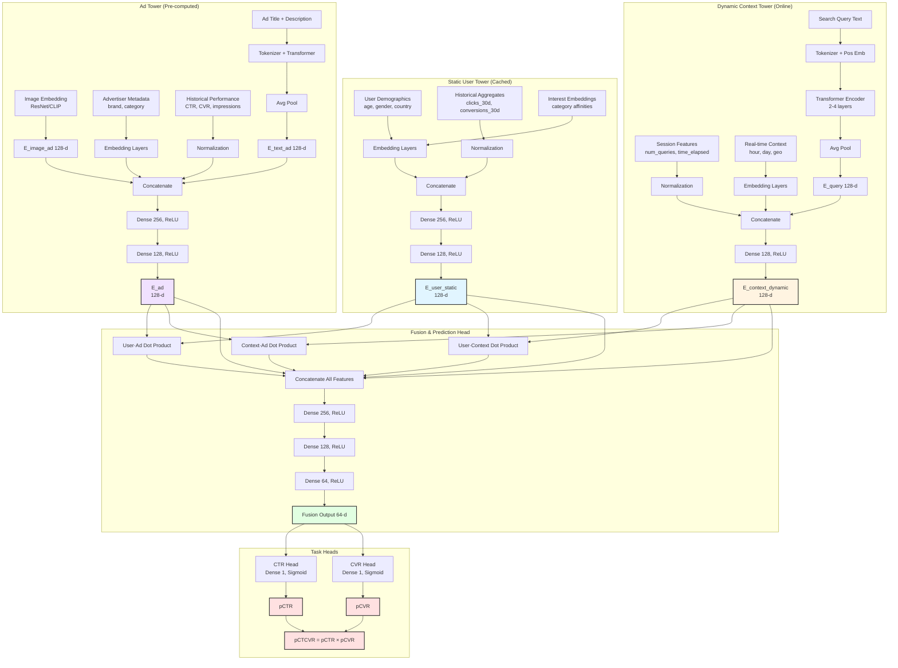

# Chapter 5: Multi-Tower Scoring Model for CTR/CVR Prediction

**Building on Chapter 4's retrieval architecture**, this chapter reveals the complete neural model that powers both retrieval and scoring. While Chapter 4 explained how to use embeddings for fast candidate retrieval via ANN search, this chapter details the full picture: **those embeddings come from a sophisticated multi-tower neural network trained to predict CTR and CVR**.

This unified model serves dual purposes:
- **For retrieval** (Chapter 4): Tower embeddings enable semantic similarity search as part of hybrid retrieval (Boolean-targeting + semantic matching) → 10M ads narrowed to 500-1000 candidates in <15ms
- **For scoring** (this chapter): Same embeddings feed into fusion layers for precise pCTR/pCVR prediction that are important elements in calculating adjusted eCPM (chapter 3) → 200-500 candidates scored in 10-30ms

We expand the basic two-tower framework [5] into a **multi-tower architecture** that separates static user features from dynamic context, integrates ad creative features, and adds fusion layers with prediction heads for CTR/CVR estimation [4, 6]. This design is optimized for both accuracy (scoring precision) and low-latency serving (retrieval speed).

---

- [Chapter 5: Multi-Tower Scoring Model for CTR/CVR Prediction](#chapter-5-multi-tower-scoring-model-for-ctrcvr-prediction)
  - [1. Complete Multi-Tower Architecture Overview](#1-complete-multi-tower-architecture-overview)
    - [1.1 Placement-Specific Models: A Critical Design Requirement](#11-placement-specific-models-a-critical-design-requirement)
    - [1.2 Dual-Purposes: Retrieval + Scoring](#12-dual-purposes-retrieval--scoring)
    - [1.3 Training for Both Retrieval and Scoring](#13-training-for-both-retrieval-and-scoring)
  - [2. Detailed Component Breakdown](#2-detailed-component-breakdown)
    - [2.1 Static User Tower](#21-static-user-tower)
    - [2.2 Dynamic Context Tower](#22-dynamic-context-tower)
    - [2.3 Ad Tower](#23-ad-tower)
    - [2.4 Fusion \& Prediction Head](#24-fusion--prediction-head)
      - [Pattern A: Concatenation + MLP (Simple, Fast)](#pattern-a-concatenation--mlp-simple-fast)
      - [Pattern B: Cross-Feature Interaction + MLP (More Expressive)](#pattern-b-cross-feature-interaction--mlp-more-expressive)
  - [3. Task-Specific Prediction Heads](#3-task-specific-prediction-heads)
    - [3.1 Single-Task: CTR Prediction](#31-single-task-ctr-prediction)
    - [3.2 Multi-Task: CTR + CVR (Shared Backbone, Separate Heads)](#32-multi-task-ctr--cvr-shared-backbone-separate-heads)
    - [3.3 Advanced: Multi-Task with Auxiliary Losses (ESMM Pattern)](#33-advanced-multi-task-with-auxiliary-losses-esmm-pattern)
  - [4. Complete Architecture Diagram](#4-complete-architecture-diagram)
  - [5. Training Details](#5-training-details)
    - [5.1 Data Pipeline](#51-data-pipeline)
    - [5.2 Model Training](#52-model-training)
    - [5.3 Calibration](#53-calibration)
  - [6. Serving Architecture Integration](#6-serving-architecture-integration)
    - [6.1 Retrieval Phase (ANN Search)](#61-retrieval-phase-ann-search)
    - [6.2 Scoring Phase (Full Model Inference)](#62-scoring-phase-full-model-inference)
  - [7. Why Multi-Tower Design Works](#7-why-multi-tower-design-works)
  - [Summary and Next Steps](#summary-and-next-steps)
  - [References and Further Reading](#references-and-further-reading)

---

## 1. Complete Multi-Tower Architecture Overview

**The core task**: Given a user viewing a specific page (e.g., searching for "wireless headphones"), predict the probability that they will (1) click on a candidate ad and (2) convert (purchase) if they click. These predictions—**pCTR** (predicted click-through rate) and **pCVR** (predicted conversion rate)—are essential inputs to the auction mechanism (Chapter 3) that determines which ads to show and what advertisers pay.

**Model inputs**:
- **User features**: Demographics, purchase history, long-term interests (static), plus session behavior (dynamic)
- **Context features**: Search query text, page type, time of day, device type, current browsing context
- **Ad features**: Creative content (title, image, description), advertiser metadata, historical performance metrics

**Model outputs**:
- **pCTR**: $P(\text{click} \mid \text{user, context, ad})$ — probability user clicks the ad (0 to 1)
- **pCVR**: $P(\text{conversion} \mid \text{user, context, ad, click})$ — probability user converts given they clicked (0 to 1)
- **Tower embeddings**: Reusable vector representations (`$\vec{E}_{\text{user}}$`, `$\vec{E}_{\text{context}}$`, `$\vec{E}_{\text{ad}}$`) used for both fast retrieval (Chapter 4's ANN search) and precise scoring

This chapter details the neural architecture that produces these predictions while serving dual purposes: enabling fast candidate retrieval via embeddings (Chapter 4) and providing calibrated probability predictions for auction ranking (Chapter 3).

### 1.1 Placement-Specific Models: A Critical Design Requirement

**Before diving into the architecture**, we must address a fundamental reality: **Different ad placement types require different CTR/CVR models**. A retail media network serves ads across multiple placement contexts, each with distinct contextual features:

| Placement Type | Context Features | Example Context |
|----------------|------------------|-----------------|
| **Search Results Page** | Query text, search filters, result count | User searches "wireless headphones" |
| **Product Detail Page** | Viewed product ID, category, price, reviews | User viewing iPhone 15 Pro page |
| **Category Browse Page** | Category ID, applied filters, sort order | User browsing "Electronics > Audio" |
| **Homepage** | Time of day, recent browse history, personalization signals | User landing on site homepage |
| **Cart/Checkout Page** | Cart contents, cart value, checkout stage | User reviewing cart before purchase |

**Why separate models are necessary**:

1. **Different context representations**: Search placements need query embeddings (Transformer encoder for text), while product page placements need product embeddings (item features + metadata). These require fundamentally different encoding architectures.

2. **Different user intent**: CTR/CVR patterns differ dramatically by placement. Users searching "buy now" have high purchase intent, while homepage browsers are exploring. The same ad shown in both contexts has different conversion probabilities.

3. **Feature availability**: Search query text doesn't exist on product pages; viewed product ID doesn't exist on search pages. Each model must be trained on features actually available at serving time.

4. **Training data distribution**: Click/conversion patterns are placement-specific. A search-trained model will perform poorly on product pages due to distribution shift.

**Industry practice**: Major ad platforms (Google Ads, Amazon Ads, Meta) maintain **separate CTR/CVR models per placement type** or **placement families** (e.g., "search-like" placements vs. "browse-like" placements) [5, 6, 14].

**Architectural sharing opportunities**:
- **Static User Tower**: Can be shared across all placement models (user demographics/history don't change by placement)
- **Ad Tower**: Can share the base architecture and potentially weights (ad creative features are consistent)
- **Dynamic Context Tower**: Must be placement-specific (different context features and encoding logic)
- **Fusion & Prediction Heads**: Often placement-specific (different interaction patterns)

**Scope of this chapter**: To maintain clarity and focus, this chapter details the architecture for a **search placement model** (query-driven context). The architectural patterns—three-tower design, dual-purpose embeddings, fusion patterns, multi-task learning—generalize to all placement types. The key difference lies in the **Dynamic Context Tower implementation**: replace the query Transformer with product embedding lookup, category feature encoding, or homepage personalization features as appropriate for your placement type.

---

The full model consists of **four major components**:

1. **Static User Tower**: Encodes slowly-changing user profile features (demographics, historical behavior, long-term interests) into a cached embedding `$\vec{E}_{\text{user}}^{\text{static}}$` (128-d).
2. **Dynamic Context Tower**: Encodes request-time features (search query text, real-time context, session state) into `$\vec{E}_{\text{context}}^{\text{dynamic}}$` (128-d).
3. **Ad Tower**: Encodes ad creative features (title, description, image embeddings, advertiser info, historical performance) into `$\vec{E}_{\text{ad}}$` (128-d).
4. **Fusion & Prediction Head**: Combines the three tower outputs through cross-feature interactions and dense layers, then applies task-specific heads to predict CTR, CVR, or multi-task objectives.

**Key architectural principle**: The first three towers produce **reusable embeddings** that serve dual purposes:

### 1.2 Dual-Purposes: Retrieval + Scoring

**Embedding Layers are used For Retrieval (Chapter 4)**:
- Semantic retrieval: Combine user + context tower embeddings into query embedding $\vec{Q}$, then use ANN search to find Top-K ads with highest `$\vec{Q} \cdot \vec{E}_{\text{ad}}$` dot product
- Lightweight scoring (Chapter 4, Section 3): Combines dot-product similarity with pre-computed features (bid, historical CTR) to narrow candidates
- Result: 10M ads → 500-1000 candidates (hybrid retrieval) → 200-500 candidates (lightweight scoring) in <15ms total

**For Scoring (This Chapter)**:
- The **same embeddings** from all three towers (pre-computed and cached) feed into Fusion & Prediction Head
- Fusion head computes cross-feature interactions: user·ad, context·ad dot products
- Prediction heads output calibrated pCTR and pCVR probabilities
- These scores feed into the auction mechanism (Chapter 3) which computes eCPM = pCTR × bid × quality_score
- Result: 200-500 candidates → precise scores in 10-30ms; auction ranks ads by eCPM

**Why this unified design works**:
- **Training consistency**: Model optimized for BOTH semantic retrieval recall (via dot-product similarity) AND scoring accuracy (via CTR/CVR prediction)
- **Shared embedding space**: Candidates retrieved by semantic similarity are naturally relevant to scoring predictions
- **Efficient serving**: Pre-compute static components (user, ad offline), compute dynamic (context online), reuse embeddings across retrieval and scoring
- **Single model to maintain**: No drift between semantic retrieval and scoring models (Boolean-targeting uses separate inverted indices)

### 1.3 Training for Both Retrieval and Scoring

The model is trained with a **unified loss** that optimizes tower embeddings for BOTH objectives:

$$\mathcal{L}_{\text{total}} = \alpha \cdot \mathcal{L}_{\text{scoring}} + \beta \cdot \mathcal{L}_{\text{retrieval}} \tag{5.1}$$

Where:
- `$\mathcal{L}_{\text{scoring}}$`: BCE loss on CTR/CVR predictions using full model (towers + fusion + heads)
- `$\mathcal{L}_{\text{retrieval}}$`: Contrastive loss on dot-product similarity (ensures towers learn embedding alignment for semantic retrieval; note: Boolean-targeting criteria are not learned but specified by advertisers)

**Retrieval loss** (optional but recommended):
$$\mathcal{L}_{\text{retrieval}} = -\log \frac{\exp(\vec{Q} \cdot \vec{E}_{\text{ad}}^{\text{clicked}})}{\exp(\vec{Q} \cdot \vec{E}_{\text{ad}}^{\text{clicked}}) + \sum_{j} \exp(\vec{Q} \cdot \vec{E}_{\text{ad}_j}^{\text{negative}})} \tag{5.2}$$

This sampled softmax loss [5] ensures that:
- Query embedding $\vec{Q}$ (combining user + context) is close to clicked ad embeddings
- Query embedding is far from non-clicked (negative) ad embeddings
- Towers explicitly optimize for semantic retrieval recall (the embedding-based component), not just scoring accuracy
- Note: This loss does not optimize Boolean-targeting, which uses advertiser-specified rules indexed separately

**Training details** covered in Section 5: Loss formulations, negative sampling strategies, multi-task learning patterns.


---

## 2. Detailed Component Breakdown

### 2.1 Static User Tower

**Input features** (batch-materialized, updated daily):
- User demographics: `age_bucket`, `gender`, `country`, `device_type`, `language`
- Historical aggregates: `total_clicks_30d`, `total_conversions_30d`, `avg_order_value`, `days_since_last_purchase`
- Interest embeddings: Pre-trained category affinity vectors (e.g., user has 0.8 affinity to "travel", 0.6 to "electronics")

**Architecture**:
```
Input: [age_bucket, gender, country, device_type, language, 
        total_clicks_30d, total_conversions_30d, avg_order_value, days_since_last_purchase,
        interest_vector]
  ↓
Embedding layers (categorical features):
  - age_bucket (10 buckets) → 32-d embedding
  - gender (3 categories) → 4-d embedding
  - country (200 countries) → 64-d embedding
  - device_type (5 types) → 8-d embedding
  - language (50 languages) → 32-d embedding
  - Total categorical embeddings: 32+4+64+8+32 = 140-d

Normalization (numerical features):
  - total_clicks_30d, total_conversions_30d, avg_order_value, days_since_last_purchase
  - Log-transform + standardization → 4-d

Pre-trained interest embeddings:
  - Category affinity vector (pre-computed from user behavior) → 256-d
  ↓
Concatenate all embeddings → [140 + 4 + 256 = 400-d]
  ↓
Dense(256, ReLU) → LayerNorm → Dropout(0.2)
  ↓
Dense(128, ReLU) → LayerNorm → Dropout(0.2)
  ↓
Output: E_user_static [dim=128]
```

**Note**: The exact concatenated dimension (400-d in this example) depends on embedding sizes chosen for each categorical feature and the dimensionality of pre-trained interest vectors. Common practice is to use embedding dimensions proportional to $\min(50, \lceil \text{cardinality}/2 \rceil)$ for categorical features, though you may use powers of 2 (4, 8, 16, 32, 64) for hardware efficiency.

**Code Listing 5.1: Static User Tower Implementation in PyTorch**

```python
import torch
import torch.nn as nn
import numpy as np

class StaticUserTower(nn.Module):
    def __init__(self, 
                 age_buckets=10, 
                 gender_categories=3, 
                 countries=200, 
                 device_types=5, 
                 languages=50,
                 interest_dim=256):
        super(StaticUserTower, self).__init__()
        
        # Embedding layers for categorical features
        self.age_embedding = nn.Embedding(age_buckets, 32)
        # For age_buckets=10, it creates a learnable matrix of 
        # shape [10, 32]. Each of the 10 possible input IDs (0-9) 
        # has its own 32-d vector
        self.gender_embedding = nn.Embedding(gender_categories, 4)
        self.country_embedding = nn.Embedding(countries, 64)
        self.device_embedding = nn.Embedding(device_types, 8)
        self.language_embedding = nn.Embedding(languages, 32)
        
        # Numerical feature normalization (learned parameters)
        self.numerical_mean = nn.Parameter(torch.zeros(4), requires_grad=False)
        self.numerical_std = nn.Parameter(torch.ones(4), requires_grad=False)
        
        # Interest embedding dimension
        self.interest_dim = interest_dim
        
        # Dense layers: input_dim = 140 (categorical) + 4 (numerical) + 256 (interest) = 400
        input_dim = 32 + 4 + 64 + 8 + 32 + 4 + interest_dim
        self.fc1 = nn.Linear(input_dim, 256)
        self.ln1 = nn.LayerNorm(256)
        self.dropout1 = nn.Dropout(0.2)
        
        self.fc2 = nn.Linear(256, 128)
        self.ln2 = nn.LayerNorm(128)
        self.dropout2 = nn.Dropout(0.2)
        
        self.relu = nn.ReLU()
        
    def forward(self, age_bucket, gender, country, device_type, language, 
                numerical_features, interest_vector):
        """
        Args:
            age_bucket: [batch_size] tensor of age bucket IDs (0-9)
            gender: [batch_size] tensor of gender IDs (0-2)
            country: [batch_size] tensor of country IDs (0-199)
            device_type: [batch_size] tensor of device type IDs (0-4)
            language: [batch_size] tensor of language IDs (0-49)
            numerical_features: [batch_size, 4] tensor of 
                [total_clicks_30d, total_conversions_30d, avg_order_value, days_since_last_purchase]
            interest_vector: [batch_size, 256] pre-computed interest embeddings
        
        Returns:
            user_embedding: [batch_size, 128] static user embedding
        """
        # Embed categorical features
        age_emb = self.age_embedding(age_bucket)          # [batch_size, 32]
        gender_emb = self.gender_embedding(gender)        # [batch_size, 4]
        country_emb = self.country_embedding(country)     # [batch_size, 64]
        device_emb = self.device_embedding(device_type)   # [batch_size, 8]
        language_emb = self.language_embedding(language)  # [batch_size, 32]
        
        # Normalize numerical features: log(x + 1) then standardize
        numerical_log = torch.log1p(numerical_features)   # log(1 + x) for stability
        numerical_norm = (numerical_log - self.numerical_mean) / (self.numerical_std + 1e-8)
        
        # Concatenate all features: [batch_size, 400]
        combined = torch.cat([
            age_emb, gender_emb, country_emb, device_emb, language_emb,
            numerical_norm, interest_vector
        ], dim=1)
        
        # Dense layers with layer norm and dropout
        x = self.fc1(combined)
        x = self.ln1(x)
        x = self.relu(x)
        x = self.dropout1(x)
        
        x = self.fc2(x)
        x = self.ln2(x)
        x = self.relu(x)
        x = self.dropout2(x)
        
        return x  # [batch_size, 128]
    
    def set_normalization_params(self, mean, std):
        """
        Set normalization parameters from training data statistics.
        
        IMPORTANT: mean and std should be computed from LOG-TRANSFORMED training data:
        1. Compute log1p on all training samples: log_values = log(1 + raw_features)
        2. Calculate mean and std from log_values (not raw features)
        3. Pass these log-space statistics to this method
        
        Example:
            # During training data preprocessing
            raw_features = [100, 50, 200, ...]  # Raw clicks/conversions/etc
            log_features = np.log1p(raw_features)
            mean = np.mean(log_features, axis=0)  # Mean of LOG values
            std = np.std(log_features, axis=0)    # Std of LOG values
            tower.set_normalization_params(mean, std)
        """
        self.numerical_mean.data = torch.tensor(mean, dtype=torch.float32)
        self.numerical_std.data = torch.tensor(std, dtype=torch.float32)


# Example usage of the forward pass to compute embedding from raw features
if __name__ == "__main__":
    # Initialize tower
    tower = StaticUserTower()
    
    # Example batch of 32 users
    batch_size = 32
    age_bucket = torch.randint(0, 10, (batch_size,))
    gender = torch.randint(0, 3, (batch_size,))
    country = torch.randint(0, 200, (batch_size,))
    device_type = torch.randint(0, 5, (batch_size,))
    language = torch.randint(0, 50, (batch_size,))
    
    # Numerical features: [clicks, conversions, avg_order_value, days_since_purchase]
    numerical_features = torch.rand(batch_size, 4) * 100  # Random values
    
    # Pre-computed interest embeddings (from user behavior analysis)
    interest_vector = torch.randn(batch_size, 256)
    
    # Set normalization parameters (computed from training data)
    # NOTE: These are mean/std of LOG-TRANSFORMED features, not raw features
    # If raw training data had mean clicks=150, then log1p(150)≈5.01
    tower.set_normalization_params(
        mean=[10.5, 2.3, 45.2, 30.0],  # Mean of log1p(raw_features) from training data
        std=[5.2, 1.8, 25.4, 15.0]      # Std of log1p(raw_features) from training data
    )
    
    # Forward pass
    tower.eval()  # Set to eval mode to disable dropout
    with torch.no_grad():
        user_embedding = tower(age_bucket, gender, country, device_type, language,
                              numerical_features, interest_vector)
    
    print(f"Output shape: {user_embedding.shape}")  # [32, 128]
    print(f"Sample embedding (first user): {user_embedding[0][:5]}")
```

**Key Implementation Details**:

1. **Embedding Initialization**: PyTorch's `nn.Embedding` uses random initialization by default. In production, you might initialize with pre-trained embeddings or use Xavier/He initialization.

2. **Numerical Normalization**: The `log1p` (log(1+x)) transformation handles zeros gracefully and reduces skewness in count-based features. Normalization parameters are computed from training data and frozen during inference.

3. **Dense Layer (`nn.Linear`)**: 
   - **`self.fc1 = nn.Linear(input_dim, 256)`** creates a fully-connected (dense) layer that performs the linear transformation: $y = xW^T + b$
   - **Parameters**: 
     - Weight matrix $W$: shape `[256, 400]` → 102,400 learnable parameters
     - Bias vector $b$: shape `[256]` → 256 learnable parameters
     - Total: 102,656 parameters
   - **Forward pass**: Each of the 256 output neurons computes a weighted sum of all 400 input features plus a bias term
   - **Example**: Input `[batch_size, 400]` → Output `[batch_size, 256]`
     - For one sample: `output[i] = sum(input[j] * W[i,j] for j in 0..399) + b[i]`
   - **Purpose**: Learns non-linear combinations of input features; compresses 400-d concatenated features into a 256-d representation

4. **Layer Normalization (`nn.LayerNorm`)**:
   - **`self.ln1 = nn.LayerNorm(256)`** normalizes activations across the feature dimension for each sample independently
   - **Operation**: For each sample in the batch, compute mean $\mu$ and variance $\sigma^2$ across all 256 features, then normalize:
     $$y = \gamma \cdot \frac{x - \mu}{\sqrt{\sigma^2 + \epsilon}} + \beta$$
   - **Learnable parameters**: 
     - Scale $\gamma$: shape `[256]` (initialized to 1)
     - Shift $\beta$: shape `[256]` (initialized to 0)
     - Total: 512 parameters
   - **Why it works**: Stabilizes training by preventing internal covariate shift; keeps activations in a reasonable range regardless of input distribution
   - **vs BatchNorm**: LayerNorm normalizes across features (per sample), BatchNorm normalizes across batch (per feature). LayerNorm is better for variable batch sizes and sequential models.
   - **Example**: 
     - Input: `[0.1, 5.2, -2.3, ...]` (256 values) with mean=1.5, std=2.1
     - After normalization: mean≈0, std≈1
     - After scale/shift with learned $\gamma$, $\beta$: optimized distribution for next layer
   - **Applied after Dense layer**: Dense output → LayerNorm → ReLU → Dropout. This ordering stabilizes gradients during backpropagation.

5. **ReLU Activation (`nn.ReLU`)**: 
   - **Rectified Linear Unit** - the most common activation function in deep learning
   - **Operation**: $\text{ReLU}(x) = \max(0, x)$ - simply sets all negative values to zero, keeps positive values unchanged
   - **Applied in both training AND inference**: Unlike Dropout, ReLU is a fundamental part of the model architecture and must be applied consistently in all forward passes. It's not mode-dependent.
   - **Example**: 
     - Input: `[-2.3, 0.5, -0.1, 3.2, 0, -1.5]`
     - Output: `[0, 0.5, 0, 3.2, 0, 0]` (same in training and inference)
   - **Why it's needed**: Without activation functions, stacking multiple linear layers (Dense) would still be just one big linear transformation. ReLU introduces **non-linearity**, allowing the network to learn complex patterns and decision boundaries.
   - **Properties**:
     - **Sparse activation**: Typically ~50% of neurons are zero (inactive) after ReLU, making the network computationally efficient
     - **No vanishing gradient**: Gradient is 1 for positive values (vs sigmoid/tanh which saturate), enabling deeper networks
     - **Simple & fast**: Just a comparison and max operation, no exponentials
   - **Gradient behavior** (training only): 
     - **For positive activations**: ReLU gradient = 1, so gradient flows through unchanged to the weights
     - **For negative activations**: ReLU gradient = 0, so gradient is blocked - weights that produced negative pre-activations get ZERO gradient
   - **Backpropagation mechanics**:
     - Forward: Dense layer computes `z = xW + b`, then ReLU computes `a = max(0, z)`
     - Backward: Gradient flows back as `dL/dz = dL/da * da/dz` where `da/dz = 1 if z>0, else 0`
     - **Critical distinction**: It's not about negative *weights* - it's about negative *activations* (the output of Dense layer before ReLU)
     - If neuron output `z[i] = -0.5` (negative), then ReLU zeroes it to `a[i] = 0`, and during backprop the gradient `dL/dz[i] = 0`
     - This means weights that contributed to that negative activation receive reduced gradients (proportional to how much they contributed)
     - **"Dead ReLU" problem**: If a neuron always outputs negative values for all training samples, it never receives gradient updates and becomes permanently inactive
   - **Example**:
     ```
     Forward:  Dense output z = [-1.2, 0.8, -0.3, 2.1]
               ReLU output  a = [0,    0.8,  0,   2.1]
     
     Backward: Loss gradient    dL/da = [0.5, 0.3, 0.2, 0.1]
               ReLU gradient    dL/dz = [0,   0.3,  0,  0.1]  (zero for negative z)
               
     Weights that produced z[0]=-1.2 and z[2]=-0.3 receive NO gradient update this step
     ```
   - **IMPORTANT: Negative weights ≠ blocked gradients**:
     - **Weights can be negative** and still get updated normally! Weight values (positive or negative) don't directly affect ReLU gradient flow.
     - What matters is the **activation** (weighted sum output): `z = x₁w₁ + x₂w₂ + ... + b`
     - If `z < 0` (negative activation), then ReLU blocks gradient regardless of whether individual weights w₁, w₂ are positive or negative
     - **Example**: Weight w=-0.5 with input x=2 contributes -1.0 to activation. If total activation z=+0.3 (positive), the weight still receives gradient updates even though it's negative.
     - **Key insight**: A neuron with mix of positive and negative weights can produce positive activations (and get gradients) for some inputs and negative activations (blocked gradients) for others, depending on the input values.
   - **In the forward pass sequence**: 
     - Dense: `x = input @ W + b` → linear combination
     - LayerNorm: normalize `x` → stabilized distribution
     - ReLU: `x = max(0, x)` → introduces non-linearity, zeros out negative values
     - Dropout: randomly zero some positive values → regularization (training only)
   - **Why ReLU after LayerNorm**: LayerNorm can produce negative values even if inputs were all positive. ReLU then decides which features to "activate" for the next layer.

6. **Dropout**: Prevents overfitting by randomly setting a fraction of activations to zero during training. With dropout rate 0.2:
   - **During Training** (`model.train()` mode): 
     - **Forward pass**: Each activation has 20% probability of being zeroed out. For each neuron, generate a random number from [0,1]; if it's < 0.2, set activation to 0. Remaining active neurons (80%) are scaled by 1/(1-0.2)=1.25 to maintain the same expected sum.
       - Example: Layer output = [0.5, 0.8, 0.3, 0.9] → after dropout with mask [1, 0, 1, 1] → [0.625, 0, 0.375, 1.125] (active values scaled by 1.25)
     - **Backward pass**: Gradients flow only through active neurons. Dropped neurons (activation=0) contribute 0 to the loss, so their gradient is 0.
     - **Weight update**: Weights connected to dropped neurons receive zero gradient and are **not updated** in that step—they retain their current values. Different neurons are dropped in each training iteration, so over many steps all weights get updated but not simultaneously. This prevents co-adaptation.
   - **During Inference** (`model.eval()` mode): Dropout is **disabled** - all neurons are active and no scaling is applied. This ensures deterministic predictions.
   - **Why it works**: By randomly dropping neurons during training, the model cannot rely on specific feature co-adaptations. This acts as an ensemble of many sub-networks, improving generalization.
   - **Example**: In a layer with 256 neurons and dropout=0.2, approximately 51 neurons are randomly zeroed each training step. The network learns to make predictions even when some features are missing.

7. **Output**: Returns a 128-dimensional embedding that can be cached in Redis for fast retrieval during serving.

**Caching strategy**: 
- Pre-compute for all active users (50M-200M) in daily batch job → store in Redis with 24-48h TTL.
- Cache hit rate >95%; fallback to on-demand computation for new users.

---

### 2.2 Dynamic Context Tower

**Note**: This section describes the **search placement** implementation of the Dynamic Context Tower. For other placement types (product pages, category browse, homepage), the context tower architecture differs—e.g., replacing the query Transformer with product embedding lookup or category feature encoding—while the overall three-tower pattern remains consistent.

**Input features** (computed online per request):
- Search query: Text string (tokenized → Transformer encoder [1] with positional embeddings, as detailed in the technical appendix [15])
- Session context: `num_queries_in_session`, `time_since_session_start`, `pages_viewed`
- Real-time signals: `hour_of_day`, `day_of_week`, `is_weekend`, `device_orientation` (mobile)
- Geo-context: `city`, `current_location_type` (home/work/travel)

**Architecture**:
```
Query text → Tokenizer → Token Embeddings + Positional Embeddings
  ↓
Transformer Encoder (2-4 layers, 8 attention heads)
  ↓
Average Pooling → E_query [dim=128]
  (Alternative: Use [CLS] token output [12] for sequence representation)

Categorical features (hour_of_day, city, etc.) → Embedding layers
Numerical features (num_queries, time_since_start) → Normalization
  ↓
Concatenate: [E_query, embedded_categoricals, normalized_numericals] → [dim=256]
  ↓
Dense(128, ReLU) → LayerNorm
  ↓
Output: E_context_dynamic [dim=128]
```

**Latency optimization**:
- Lightweight Transformer (2-layer, 128-d hidden) for query encoding: 3-5ms
- Micro-batching: Accumulate 5-10 concurrent requests → batch inference → split results
- Session-level caching: Cache `$\vec{E}_{\text{context}}$` for 30-60s if query unchanged (for pagination)

---

### 2.3 Ad Tower

**Input features** (pre-computed offline for all ads):
- Creative text: `ad_title`, `ad_description`, `landing_page_url`
- Visual features: Image embedding from pre-trained ResNet [8] or CLIP [7] (frozen or fine-tuned)
- Advertiser metadata: `advertiser_id`, `brand_id`, `campaign_type`, `industry_category`
- Historical performance: `historical_ctr`, `historical_cvr`, `total_impressions`, `ad_age_days`

**Architecture**:
```
Ad title + description → Tokenizer → Transformer Encoder (shared with query encoder or separate)
  ↓
Average Pooling → E_text_ad [dim=128]

Image → Pre-trained CNN/CLIP → E_image_ad [dim=128]

Categorical features (advertiser_id, brand_id, etc.) → Embedding layers
Numerical features (historical_ctr, ad_age_days) → Log-transform + Normalization
  ↓
Concatenate: [E_text_ad, E_image_ad, embedded_categoricals, normalized_numericals] → [dim=512]
  ↓
Dense(256, ReLU) → LayerNorm → Dropout(0.2)
  ↓
Dense(128, ReLU) → LayerNorm → Dropout(0.2)
  ↓
Output: E_ad [dim=128]
```

**Pre-computation**:
- Compute for all eligible ads (10M-100M) in daily batch → store in ad index (FAISS [3] / ScaNN, or alternative structures like HNSW [13])
- Incremental updates: New ads or creative changes trigger re-encoding within 5-15 minutes

> **Code Listings 5.2-5.5**: Due to their length (~100-120 lines each), complete implementations for the Ad Tower (5.2), Dynamic Context Tower (5.3), Fusion Layers (5.4), and ESMM Model (5.5) are available in the accompanying Jupyter notebook: `code/ch5_multi_tower_scoring_model.ipynb`. These implementations include full error handling, comprehensive tests, and production-ready features.

---

### 2.4 Fusion & Prediction Head

The three tower outputs are **combined** to model user-context-ad interactions. Two architectural patterns are common:

#### Pattern A: Concatenation + MLP (Simple, Fast)

```
Input: [E_user_static (128), E_context_dynamic (128), E_ad (128)]
  ↓
Concatenate → [dim=384]
  ↓
Dense(256, ReLU) → LayerNorm → Dropout(0.3)
  ↓
Dense(128, ReLU) → LayerNorm → Dropout(0.3)
  ↓
Dense(64, ReLU)
  ↓
Output logits (for CTR/CVR prediction)
```

**Limitation**: This pattern **does NOT explicitly reflect the retrieval objective**. The MLP must implicitly learn the dot product interactions during training. While this can work (the MLP has sufficient capacity to approximate dot products), it's less efficient and provides weaker alignment between retrieval and scoring stages.

#### Pattern B: Cross-Feature Interaction + MLP (More Expressive)

Modern scoring models add explicit **cross-tower interactions** before the MLP to capture feature combinations [4]. **This pattern explicitly reflects the retrieval objective** (see explanation below).

```
Tower outputs: E_user, E_context, E_ad [each 128-d]
  ↓
Pairwise dot products (interaction features):
  - user_ad_similarity = E_user · E_ad
  - user_context_similarity = E_user · E_context
  - context_ad_similarity = E_context · E_ad
  ↓
Concatenate: [E_user, E_context, E_ad, user_ad_sim, user_context_sim, context_ad_sim] → [dim=387]
  ↓
Dense(256, ReLU) → LayerNorm → Dropout(0.3)
  ↓
Dense(128, ReLU) → LayerNorm → Dropout(0.3)
  ↓
Dense(64, ReLU)
  ↓
Task-specific heads (see below)
```

**How this connects to retrieval**:
- **During retrieval**: Compute query embedding $\vec{Q}$ by combining user + context (e.g., `$\vec{Q} = \vec{E}_{\text{user}} + \vec{E}_{\text{context}}$` or concatenation), then use `$\vec{Q} \cdot \vec{E}_{\text{ad}}$` for ANN search
- **During scoring**: The fusion layer computes individual dot products (user·ad, context·ad) which are components of the full query·ad similarity
- **Training insight**: Since `$\vec{Q} \cdot \vec{E}_{\text{ad}} = (\vec{E}_{\text{user}} + \vec{E}_{\text{context}}) \cdot \vec{E}_{\text{ad}} = \vec{E}_{\text{user}} \cdot \vec{E}_{\text{ad}} + \vec{E}_{\text{context}} \cdot \vec{E}_{\text{ad}}$`, the model learns both components
- **Result**: By including user·ad and context·ad dot products as explicit features in the fusion layer, the model learns to make these dot products predictive of clicks. This naturally optimizes the towers for retrieval (where we use the sum/combination of these dot products).

**Why cross-interactions matter**: The dot products `$\vec{E}_{\text{user}} \cdot \vec{E}_{\text{ad}}$` and `$\vec{E}_{\text{context}} \cdot \vec{E}_{\text{ad}}$` explicitly measure alignment in the shared embedding space. This is the same similarity score used during ANN retrieval, so feeding it to the scoring head creates a **unified retrieval-scoring framework** where the MLP learns to refine the raw similarity scores with additional context.

---

## 3. Task-Specific Prediction Heads

The fusion layer outputs a final dense representation (64-d or 128-d). Task-specific heads branch from this point:

### 3.1 Single-Task: CTR Prediction

```
Fusion output [64-d]
  ↓
Dense(1, no activation) → logit
  ↓
Sigmoid → pCTR ∈ [0, 1]
```

**Loss function**: Binary Cross-Entropy (BCE) with optional calibration:
$$\mathcal{L}_{\text{CTR}} = -\frac{1}{N} \sum_{i=1}^{N} \left[ y_i \log(\hat{p}_i) + (1 - y_i) \log(1 - \hat{p}_i) \right] \tag{5.3}$$

where `$y_i \in \{0, 1\}$` is the click label and `$\hat{p}_i$` is the predicted CTR.

**Calibration**: Post-training, apply isotonic regression [10] or Platt scaling [9] to map raw model outputs to calibrated probabilities that match observed click rates. This ensures pCTR predictions are accurate for auction eCPM calculations.

---

### 3.2 Multi-Task: CTR + CVR (Shared Backbone, Separate Heads)

```
Fusion output [64-d]
  ↓           ↓
CTR Head    CVR Head
  ↓           ↓
Dense(1)    Dense(1)
  ↓           ↓
Sigmoid     Sigmoid
  ↓           ↓
pCTR        pCVR
```

**Loss function**: Weighted multi-task loss:
$$\mathcal{L}_{\text{total}} = \alpha \cdot \mathcal{L}_{\text{CTR}} + \beta \cdot \mathcal{L}_{\text{CVR}} \tag{5.4}$$

Typical weights: $\alpha=0.7$, $\beta=0.3$ (CTR has more training samples than CVR due to conversion sparsity).

**Label construction**:
- CTR: Binary label (clicked=1, not clicked=0)
- CVR: Conditional label (converted=1 **given click**, otherwise 0). Only clicks contribute to CVR loss to avoid label noise from non-clickers.

**Advantage**: Shared tower representations learn generalizable user/ad features; task-specific heads specialize for click vs. conversion patterns.

---

### 3.3 Advanced: Multi-Task with Auxiliary Losses (ESMM Pattern)

For sparse conversion events, use the **Entire Space Multi-Task Model (ESMM)** pattern [2]:

```
Fusion output [64-d]
  ↓           ↓
CTR Head    CVR Head
  ↓           ↓
pCTR        pCVR
  ↓           ↓
   \         /
    \       /
     \     /
      \   /
       \ /
    pCTCVR = pCTR × pCVR (multiplication, not a separate head)
```

**Key insight**: Model $p(\text{click})$ and $p(\text{conversion} | \text{click})$ separately using two neural network heads, then **multiply their outputs** to get $p(\text{click and conversion})$. This eliminates **sample selection bias** in CVR modeling (traditionally trained only on clicked samples).

**Why pCTCVR is needed - The Sample Selection Bias Problem:**

Traditional CVR modeling trains only on **clicked samples** to predict $p(\text{conversion} | \text{click})$. This creates bias because:
- Non-clickers are excluded from training (you don't observe whether they would have converted)
- The model only learns from users who clicked, which is a biased subset

ESMM solves this by introducing **pCTCVR** = $p(\text{click AND conversion})$ as a supervisory signal:
- pCTCVR can be trained on **all impressions** (conversion=1 if user converted, 0 otherwise)
- By enforcing the constraint **pCTCVR = pCTR × pCVR**, the CVR head learns indirectly
- The CVR head must output values such that when multiplied by pCTR, the product matches observed conversion rates across **the entire population**, not just clickers

**Loss function**:
$$\mathcal{L}_{\text{ESMM}} = \mathcal{L}_{\text{CTR}} + \mathcal{L}_{\text{CTCVR}} \tag{5.5}$$

where:
- `$\mathcal{L}_{\text{CTR}}$`: BCE (Binary Cross-Entropy) loss on all impressions (clicked=1, not clicked=0)
- `$\mathcal{L}_{\text{CTCVR}}$`: BCE loss on all impressions (converted=1, otherwise=0)
  - Note: pCTCVR is computed as pCTR × pCVR, then BCE loss is applied to this product

**How the constraint works:**
- The CVR head has **no direct supervision** - there's no standalone CVR loss
- Instead, it learns through backpropagation from `$\mathcal{L}_{\text{CTCVR}}$` via the multiplication operation
- Gradients flow: `$\mathcal{L}_{\text{CTCVR}} \rightarrow \text{pCTCVR} \rightarrow \text{pCVR}$` (CVR head)
- This forces pCVR to learn $p(\text{conversion} | \text{click})$ correctly across the **entire impression space**, eliminating sample selection bias

**Practical benefit**: CVR predictions are more accurate and generalize better than traditional CVR models trained only on clicked samples.

---

## 4. Complete Architecture Diagram

**Figure 5.1: Complete Multi-Tower Architecture for CTR/CVR Prediction with Dual-Purpose Embeddings**



---

## 5. Training Details

> **Note on Code Listings**: Sections 5.1-5.3 present abbreviated code listings focused on core concepts. Complete, production-ready implementations with comprehensive error handling, testing, and documentation are available in the accompanying Jupyter notebook: `code/ch5_multi_tower_scoring_model.ipynb`

### 5.1 Data Pipeline

**Input**: Impression logs with labels
- **CTR label**: `clicked=1` within 1-hour attribution window, otherwise `0`
- **CVR label**: `converted=1` within 7-day attribution window **given click**, otherwise `0`

**Sampling strategy**:
- **Downsampling negatives**: Clicks are rare (CTR ~0.1-3%). Downsample non-clicks by 10-100× to balance training data.
- **Importance weighting**: During loss calculation, up-weight negative examples by the downsampling factor to correct for sampling bias:
  $$\mathcal{L} = -\frac{1}{N} \sum_{i=1}^{N} w_i \left[ y_i \log(\hat{p}_i) + (1 - y_i) \log(1 - \hat{p}_i) \right]$$
  where `$w_i = 1$` for clicks, `$w_i = \text{downsample\_ratio}$` for non-clicks.

**Feature freshness**:
- Static user features: Updated daily (batch ETL)
- Ad features: Updated every 1-4 hours (incremental pipeline)
- Dynamic context: Computed online (no pre-computation)

**Code Listing 5.6: Data Pipeline Skeleton**

The following shows the core structure of the impression dataset class. In production, this would load from data warehouses (Hive/BigQuery), streaming systems (Kafka), or feature stores (Feast/Tecton).

```python
from torch.utils.data import Dataset, DataLoader

class ImpressionDataset(Dataset):
    """Dataset for ad impression logs."""
    def __init__(self, data_path: str = None, mode: str = 'synthetic'):
        if mode == 'synthetic':
            self.impressions = self._generate_synthetic_data(n_samples=5000)
        else:
            self.impressions = self._load_from_file(data_path)
        
        # Compute normalization statistics from training data (log-space)
        self._compute_normalization_stats()
    
    def __getitem__(self, idx: int) -> Dict[str, torch.Tensor]:
        """Return a single impression as tensors ready for model input."""
        imp = self.impressions[idx]
        
        return {
            # User tower inputs
            'user_categorical': self._encode_user_categorical(imp['user']),
            'user_numerical': self._encode_user_numerical(imp['user']),
            'user_interest': torch.randn(256),  # From user behavior model
            
            # Context tower inputs
            'query_tokens': self._tokenize_query(imp['context']['query_text']),
            'query_mask': self._create_attention_mask(),
            'context_categorical': self._encode_context_categorical(imp['context']),
            'context_numerical': self._encode_context_numerical(imp['context']),
            
            # Ad tower inputs
            'ad_categorical': self._encode_ad_categorical(imp['ad']),
            'ad_numerical': self._encode_ad_numerical(imp['ad']),
            'ad_text_emb': torch.randn(128),    # From text encoder
            'ad_image_emb': torch.randn(128),   # From image encoder
            
            # Labels
            'labels': torch.tensor([imp['clicked'], imp['converted']]),
        }

# Create dataloader with batching
dataloader = DataLoader(
    ImpressionDataset(mode='synthetic'),
    batch_size=128,
    shuffle=True,
    collate_fn=collate_fn  # Custom function to batch variable-length sequences
)
```

> **Note**: Complete implementation with synthetic data generation, file I/O, comprehensive feature engineering, and normalization statistics is available in the accompanying notebook: `code/ch5_multi_tower_scoring_model.ipynb`

---

### 5.2 Model Training

**Optimizer**: Adam with learning rate warm-up and decay
- Initial LR: 1e-4
- Warm-up: 10K steps (linear increase from 1e-6 to 1e-4)
- Decay: Cosine decay over 1M steps to 1e-5

**Batch size**: 2048-8192 (large batches stabilize gradients for sparse CTR/CVR signals)

**Regularization**:
- Dropout: 0.2-0.3 in tower layers, 0.3 in fusion head
- L2 weight decay: 1e-5
- Early stopping: Monitor validation AUC; stop if no improvement for 50K steps

**Distributed training**: 
- Data parallelism across 16-64 GPUs (each GPU processes a mini-batch shard)
- Gradient accumulation every 4 steps for effective batch size of 8K-32K

**Training time**: 2-5 days for 100M-1B training samples (depending on model size and infrastructure)

**Code Listing 5.8: End-to-End Training with Dual Loss**

The complete training pipeline trains all components (user tower, context tower, ad tower, fusion layer, ESMM heads) end-to-end. The dual loss combines ranking objectives (CTR/CVR prediction) with retrieval objectives (embedding similarity).

```python
def train_end_to_end(user_tower, context_tower, ad_tower, esmm_model, 
                     dataloader, optimizer, alpha=1.0, beta=0.5):
    """
    End-to-end training with dual loss: L_total = α·L_ranking + β·L_retrieval
    
    Key: Trains ALL 7.5M parameters (not just fusion + heads).
    """
    for batch in dataloader:
        optimizer.zero_grad()
        
        # Forward pass through all towers
        user_emb = user_tower(batch['user_features'])
        context_emb = context_tower(batch['context_features'])
        ad_emb = ad_tower(batch['ad_features'])
        
        # ESMM predictions
        pCTR, pCVR, pCTCVR = esmm_model(user_emb, context_emb, ad_emb)
        
        # Ranking loss (ESMM): Fine-grained CTR/CVR supervision
        loss_ctr = binary_cross_entropy(pCTR, batch['clicked'])
        loss_ctcvr = binary_cross_entropy(pCTCVR, batch['converted'])
        loss_ranking = loss_ctr + loss_ctcvr
        
        # Retrieval loss (Contrastive): Align embeddings for ANN search
        query_emb = user_emb + context_emb  # Combined query representation
        similarity_matrix = query_emb @ ad_emb.T  # [batch, batch]
        targets = torch.arange(len(batch))  # Diagonal = positive pairs
        loss_retrieval = cross_entropy(similarity_matrix, targets)
        
        # Combined loss
        total_loss = alpha * loss_ranking + beta * loss_retrieval
        
        # Backprop through entire architecture
        total_loss.backward()  # Updates all 7.5M parameters
        torch.nn.utils.clip_grad_norm_(all_parameters, max_norm=1.0)
        optimizer.step()
    
    return metrics
```

**Key insights**:
- **Ranking loss** provides fine-grained CTR/CVR supervision for scoring accuracy
- **Retrieval loss** aligns tower embeddings for semantic similarity (enables ANN retrieval)
- **Joint training** ensures consistency between retrieval and scoring stages
- **Contrastive learning** uses in-batch negatives: for each query, positive ad = shown ad, negatives = all other ads in batch

> **Note**: Complete DualLossTrainer class with metrics tracking, learning rate scheduling, checkpointing, and production features is available in the notebook.

---

### 5.3 Calibration

Raw model outputs often have **calibration drift**: predicted pCTR=0.05 may correspond to observed CTR=0.03 [11]. This breaks auction dynamics and budget pacing because the eCPM formula (pCTR × bid × quality_score) relies on accurate probability estimates.

**Post-training calibration methods**:

1. **Isotonic Regression** [10] (most common):
   - Bin validation set predictions into 100-1000 buckets
   - Fit a piecewise-constant mapping: `$\text{calibrated\_pCTR} = f(\text{raw\_pCTR})$` that matches observed CTR in each bucket
   - Pro: Non-parametric, flexible
   - Con: Requires large validation set; bins can be unstable

2. **Platt Scaling** [9]:
   - Fit a logistic regression on top of model logits: `$\text{calibrated\_pCTR} = \sigma(a \cdot \text{logit} + b)$`
   - Pro: Simple, two parameters
   - Con: Assumes logistic relationship (may underfit complex calibration errors)

3. **Temperature Scaling** [11]:
   - Scale logits by a learned temperature $T$: `$\text{calibrated\_pCTR} = \sigma(\text{logit} / T)$`
   - Pro: Single parameter, preserves ranking order
   - Con: Global scaling may not fix local calibration issues

**Best practice**: Use isotonic regression for CTR (high sample volume), temperature scaling for CVR (sparser data).

**Code Listing 5.7: Isotonic Regression Calibration**

The following implementation shows how to calibrate model predictions using isotonic regression to ensure predicted probabilities match observed frequencies.

```python
from sklearn.isotonic import IsotonicRegression

class ModelCalibrator:
    """
    Calibrates predicted probabilities using isotonic regression.
    
    Problem: Neural networks often produce overconfident predictions.
    Solution: Post-process to match observed frequencies.
    """
    def __init__(self):
        self.ctr_calibrator = IsotonicRegression(out_of_bounds='clip')
        self.cvr_calibrator = IsotonicRegression(out_of_bounds='clip')
        self.ctcvr_calibrator = IsotonicRegression(out_of_bounds='clip')
        
    def fit(self, predictions: Dict[str, np.ndarray], labels: Dict[str, np.ndarray]):
        """Fit isotonic regression on validation set."""
        # CTR: Train on all impressions
        self.ctr_calibrator.fit(predictions['ctr'], labels['clicked'])
        
        # CTCVR: Train on all impressions
        self.ctcvr_calibrator.fit(predictions['ctcvr'], labels['converted'])
        
        # CVR: Train only on clicked impressions
        clicked_mask = labels['clicked'] == 1
        if clicked_mask.sum() > 0:
            self.cvr_calibrator.fit(
                predictions['cvr'][clicked_mask],
                labels['converted'][clicked_mask]
            )
    
    def transform(self, predictions: Dict[str, np.ndarray]) -> Dict[str, np.ndarray]:
        """Apply calibration to new predictions."""
        return {
            'ctr': self.ctr_calibrator.predict(predictions['ctr']),
            'cvr': self.cvr_calibrator.predict(predictions['cvr']),
            'ctcvr': self.ctcvr_calibrator.predict(predictions['ctcvr']),
        }

# Usage:
# calibrator = ModelCalibrator()
# calibrator.fit(val_predictions, val_labels)
# calibrated_preds = calibrator.transform(test_predictions)
```

**Calibration metrics**:
- **Expected Calibration Error (ECE)** [11]: Measures average difference between predicted probabilities and observed frequencies across probability bins
- **Reliability diagram**: Scatter plot of predicted vs. observed probabilities (perfect calibration = diagonal line)

> **Note**: Complete implementation with ECE computation, reliability diagram visualization, and before/after comparison is available in the notebook.

---

## 6. Serving Architecture Integration

The multi-tower model serves two roles in production:

### 6.1 Retrieval Phase (ANN Search)

- **Pre-compute** `$\vec{E}_{\text{ad}}$` for all ads → store in ANN index (FAISS [3] or ScaNN)
- **At request time**:
  1. Fetch `$\vec{E}_{\text{user}}^{\text{static}}$` from cache (Redis)
  2. Compute `$\vec{E}_{\text{context}}^{\text{dynamic}}$` online (Transformer encoder)
  3. Fuse: `$\vec{Q} = \text{FusionLayer}(\vec{E}_{\text{user}}, \vec{E}_{\text{context}})$` (or simple concatenation for fast retrieval)
  4. ANN search: Find Top-K ads with highest `$\vec{Q} \cdot \vec{E}_{\text{ad}}$` similarity → 500-1000 candidates

**Latency budget**: 5-15ms for full retrieval (cache lookup + dynamic tower + ANN search)

---

### 6.2 Scoring Phase (Full Model Inference)

- **Input**: 500-1000 candidates from retrieval + all three tower embeddings
- **At request time**:
  1. Fetch pre-computed `$\vec{E}_{\text{ad}}$` for each candidate (from ad index metadata or separate cache)
  2. Run fusion head + prediction heads: `$(E_{\text{user}}, E_{\text{context}}, E_{\text{ad}}) \rightarrow (\text{pCTR}, \text{pCVR})$`
  3. Auction mechanism (Chapter 3) computes eCPM: `$\text{eCPM} = \text{bid} \times \text{pCTR} \times \text{quality\_score}$` (or multi-objective: $\text{bid} \times (\alpha \cdot \text{pCTR} + \beta \cdot \text{pCVR})$)
  4. Auction ranks candidates by eCPM → selects Top-10-20 for final display

**Latency budget**: 10-30ms for scoring 200-500 candidates (batched inference on GPU/TPU)

**Batching optimization**: Accumulate 5-10 concurrent requests → batch all candidates → run single forward pass → split results. Increases throughput 5-10×.

---

## 7. Why Multi-Tower Design Works

The multi-tower architecture is **not just a modeling choice**—it's driven by **system constraints** and **computational efficiency**:

1. **Asymmetric Update Frequencies**:
   - User profiles change daily (job changes, new purchases)
   - Ads change hourly (new creatives, budget updates, performance drift)
   - Context changes per request (query, time, location)
   - Separate towers allow **independent update cycles** without full model retraining

2. **Massive Scale**:
   - 100M users × 10M ads = 1 quadrillion (10¹⁵) possible pairs
   - Pre-computing all pairwise scores is infeasible
   - Factorizing into separate embeddings (user, ad) enables **ANN search** to prune 99.99% of pairs in <10ms

3. **Unified Retrieval-Ranking**:
   - Retrieval uses dot product: `$\vec{E}_{\text{user}} \cdot \vec{E}_{\text{ad}}$` (fast, parallelizable)
   - Ranking uses same embeddings + fusion head (accurate, expressive)
   - **Consistency**: Top-K from retrieval are relevant to the ranking model since both share the same embedding space

4. **Incremental Learning**:
   - New user signs up → compute `$\vec{E}_{\text{user}}$` once, cache, immediately served
   - New ad uploaded → encode `$\vec{E}_{\text{ad}}$`, insert into ANN index within minutes
   - No need to retrain the full model for every new entity

This architecture is the **backbone of modern recommendation and ad systems** at Google, Meta, Pinterest, Airbnb [14], and others. The key innovation is recognizing that **embeddings are the universal interface** between retrieval, ranking, and downstream systems.

---

## Summary and Next Steps

This chapter presented the complete multi-tower ranking model for production ad systems:

1. **Placement-Specific Models**: Different ad placement types (search, product pages, category browse) require separate CTR/CVR models with placement-specific Dynamic Context Towers, while sharing User and Ad tower architectures
2. **Three-Tower Architecture**: Static User Tower, Dynamic Context Tower (search placement example), and Ad Tower that produce reusable embeddings for both retrieval (Chapter 4) and scoring (this chapter)
3. **Dual-Purpose Embeddings**: Same tower outputs serve ANN-based retrieval (fast candidate finding) and CTR/CVR prediction (precise scoring)
4. **Fusion & Prediction Heads**: Cross-feature interactions (user·ad, context·ad dot products) combined with task-specific heads for CTR, CVR, and ESMM
5. **Unified Training**: Combined loss function optimizes for both retrieval recall and ranking accuracy simultaneously
6. **Multi-Task Learning**: Shared backbone with separate prediction heads, addressing sample selection bias via ESMM pattern
7. **Production Serving**: Caching strategies (static user embeddings in Redis), batching (5-10 concurrent requests), calibration (isotonic regression, Platt scaling)
8. **System Integration**: Pre-computed ad embeddings stored in ANN index (Chapter 4), cached user embeddings, online context encoding for <50ms end-to-end latency

**Connection to Chapter 4**: The retrieval system (Chapter 4) uses the tower embeddings from this model for ANN search. This chapter explained how those embeddings are created, trained, and refined into calibrated probability predictions for auction ranking.

**Next steps**: With candidates retrieved (Chapter 4) and scored with pCTR/pCVR (this chapter), Chapter 3 showed how these predictions feed into the auction mechanism (adjusted eCPM, quality scores, GSP pricing) to determine which ads win and what advertisers pay.

---

## References and Further Reading

1. Vaswani, A., Shazeer, N., Parmar, N., et al. (2017). "Attention Is All You Need." *Advances in Neural Information Processing Systems (NeurIPS)*. The foundational paper introducing the Transformer architecture with self-attention mechanism and positional encoding, which powers the Dynamic Context Tower's query understanding.

2. Ma, X., Zhao, L., Huang, G., et al. (2018). "Entire Space Multi-Task Model: An Effective Approach for Estimating Post-Click Conversion Rate." *SIGIR 2018*. Alibaba's ESMM paper introducing the method to eliminate sample selection bias in CVR prediction by jointly modeling CTR and CTCVR on the entire impression space.

3. Johnson, J., Douze, M., & Jégou, H. (2019). "Billion-scale similarity search with GPUs." *IEEE Transactions on Big Data*. Describes FAISS library architecture and optimization techniques for approximate nearest neighbor search at scale, used for embedding-based ad retrieval.

4. Guo, H., Tang, R., Ye, Y., Li, Z., & He, X. (2017). "DeepFM: A Factorization-Machine based Neural Network for CTR Prediction." *IJCAI 2017*. Introduces deep learning approaches for click-through rate prediction combining factorization machines with deep neural networks for feature interaction learning.

5. Covington, P., Adams, J., & Sargin, E. (2016). "Deep Neural Networks for YouTube Recommendations." *RecSys 2016*. Google's two-tower retrieval architecture for candidate generation at scale, demonstrating the effectiveness of separate user and item towers for billion-scale recommendation systems.

6. Zhou, G., Zhu, X., Song, C., et al. (2018). "Deep Interest Network for Click-Through Rate Prediction." *KDD 2018*. Alibaba's approach to modeling user interests dynamically using attention mechanisms, relevant to the user tower's interest embedding design.

7. Radford, A., Kim, J. W., Hallacy, C., et al. (2021). "Learning Transferable Visual Models From Natural Language Supervision." *ICML 2021*. OpenAI's CLIP model for joint vision-language understanding, applicable to ad creative image embeddings in the Ad Tower.

8. He, K., Zhang, X., Ren, S., & Sun, J. (2016). "Deep Residual Learning for Image Recognition." *CVPR 2016*. ResNet architecture commonly used for extracting image embeddings from ad creatives.

9. Niculescu-Mizil, A., & Caruana, R. (2005). "Predicting Good Probabilities With Supervised Learning." *ICML 2005*. Introduces calibration techniques including Platt scaling for converting model scores into well-calibrated probabilities.

10. Zadrozny, B., & Elkan, C. (2002). "Transforming Classifier Scores into Accurate Multiclass Probability Estimates." *KDD 2002*. Describes isotonic regression for probability calibration, used to refine raw model predictions into accurate pCTR/pCVR estimates.

11. Guo, C., Pleiss, G., Sun, Y., & Weinberger, K. Q. (2017). "On Calibration of Modern Neural Networks." *ICML 2017*. Analyzes why modern neural networks produce poorly calibrated probabilities and introduces Expected Calibration Error (ECE) metric.

12. Devlin, J., Chang, M. W., Lee, K., & Toutanova, K. (2019). "BERT: Pre-training of Deep Bidirectional Transformers for Language Understanding." *NAACL 2019*. Introduces BERT architecture with learned positional embeddings and [CLS] token for sequence representation, applicable to query and ad text encoding.

13. Malkov, Y. A., & Yashunin, D. A. (2018). "Efficient and robust approximate nearest neighbor search using Hierarchical Navigable Small World graphs." *IEEE Transactions on Pattern Analysis and Machine Intelligence*. Describes HNSW algorithm, an alternative ANN index structure to FAISS for embedding-based retrieval.

14. Grbovic, M., & Cheng, H. (2018). "Real-time Personalization using Embeddings for Search Ranking at Airbnb." *KDD 2018*. Industry case study demonstrating embedding-based ranking in production search systems with latency constraints similar to ad serving requirements.

15. **Technical Appendix**: For detailed explanations of Sequential Encoder architecture (Transformer-based query encoding) and Positional Embedding mechanisms, see `app5_model_tech.md`.

