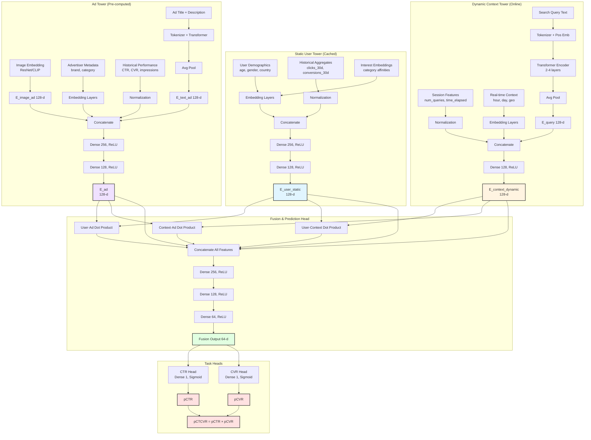

# Chapter 5: Multi-Tower Scoring Model for CTR/CVR Prediction

**Building on Chapter 4's retrieval architecture**, this chapter reveals the complete neural model that powers both retrieval and ranking. While Chapter 4 explained how to use embeddings for fast candidate retrieval via ANN search, this chapter details the full picture: **those embeddings come from a sophisticated multi-tower neural network trained to predict CTR and CVR**.

This unified model serves dual purposes:
- **For retrieval** (Chapter 4): Tower embeddings enable fast dot-product similarity search → 10M ads narrowed to 500 candidates in <15ms
- **For ranking** (this chapter): Same embeddings feed into fusion layers for precise pCTR/pCVR prediction → 500 candidates scored in 10-30ms

We expand the basic two-tower framework into a **multi-tower architecture** that separates static user features from dynamic context, integrates ad creative features, and adds fusion layers with prediction heads for CTR/CVR estimation. This design is optimized for both accuracy (ranking precision) and low-latency serving (retrieval speed).

---

## 1. Complete Multi-Tower Architecture Overview

**Recall from Chapter 4**: The retrieval system uses tower embeddings ($\vec{E}_{\text{user}}$, $\vec{E}_{\text{context}}$, $\vec{E}_{\text{ad}}$) for fast ANN search. But where do these embeddings come from? This chapter answers that question by detailing the complete neural architecture.

The full model consists of **four major components**:

1. **Static User Tower**: Encodes slowly-changing user profile features (demographics, historical behavior, long-term interests) into a cached embedding $\vec{E}_{\text{user}}^{\text{static}}$ (128-d).
2. **Dynamic Context Tower**: Encodes request-time features (search query text, real-time context, session state) into $\vec{E}_{\text{context}}^{\text{dynamic}}$ (128-d).
3. **Ad Tower**: Encodes ad creative features (title, description, image embeddings, advertiser info, historical performance) into $\vec{E}_{\text{ad}}$ (128-d).
4. **Fusion & Prediction Head**: Combines the three tower outputs through cross-feature interactions and dense layers, then applies task-specific heads to predict CTR, CVR, or multi-task objectives.

**Key architectural principle**: The first three towers produce **reusable embeddings** that serve dual purposes:

### Dual-Purpose Embeddings: Retrieval + Ranking

**For Retrieval (Chapter 4)**:
- Combine user + context tower embeddings into query embedding: $\vec{Q} = \text{Concat}(\vec{E}_{\text{user}}, \vec{E}_{\text{context}})$ or $\vec{Q} = \text{FusionLayer}(\vec{E}_{\text{user}}, \vec{E}_{\text{context}})$
- Use ANN search to find Top-K ads with highest $\vec{Q} \cdot \vec{E}_{\text{ad}}$ dot product
- Result: 10M ads → 500-1000 candidates in <15ms

**For Ranking (This Chapter)**:
- The **same embeddings** from all three towers feed into Fusion & Prediction Head
- Fusion head computes cross-feature interactions: user·ad, context·ad dot products
- Prediction heads output calibrated pCTR and pCVR probabilities
- Result: 500 candidates → precise scores in 10-30ms

**Why this unified design works**:
- **Training consistency**: Model optimized for BOTH retrieval recall (via dot-product similarity) AND ranking accuracy (via CTR/CVR prediction)
- **Shared embedding space**: Candidates retrieved by similarity are naturally relevant to ranking predictions
- **Efficient serving**: Pre-compute static components (user, ad offline), compute dynamic (context online)
- **Single model to maintain**: No drift between retrieval and ranking models

### Training for Both Retrieval and Ranking

The model is trained with a **unified loss** that optimizes tower embeddings for BOTH objectives:

$$\mathcal{L}_{\text{total}} = \alpha \cdot \mathcal{L}_{\text{ranking}} + \beta \cdot \mathcal{L}_{\text{retrieval}}$$

Where:
- $\mathcal{L}_{\text{ranking}}$: BCE loss on CTR/CVR predictions using full model (towers + fusion + heads)
- $\mathcal{L}_{\text{retrieval}}$: Contrastive loss on dot-product similarity (ensures towers learn embedding alignment)

**Retrieval loss** (optional but recommended):
$$\mathcal{L}_{\text{retrieval}} = -\log \frac{\exp(\vec{Q} \cdot \vec{E}_{\text{ad}}^{\text{clicked}})}{\exp(\vec{Q} \cdot \vec{E}_{\text{ad}}^{\text{clicked}}) + \sum_{j} \exp(\vec{Q} \cdot \vec{E}_{\text{ad}_j}^{\text{negative}})}$$

This sampled softmax loss ensures that:
- Query embedding $\vec{Q}$ (combining user + context) is close to clicked ad embeddings
- Query embedding is far from non-clicked (negative) ad embeddings
- Towers explicitly optimize for retrieval recall, not just ranking accuracy

**Training details** covered in Section 5: Loss formulations, negative sampling strategies, multi-task learning patterns.


---

## 2. Detailed Component Breakdown

### 2.1 Static User Tower

**Input features** (batch-materialized, updated daily):
- User demographics: `age_bucket`, `gender`, `country`, `device_type`, `language`
- Historical aggregates: `total_clicks_30d`, `total_conversions_30d`, `avg_order_value`, `days_since_last_purchase`
- Interest embeddings: Pre-trained category affinity vectors (e.g., user has 0.8 affinity to "travel", 0.6 to "electronics")

**Architecture**:
```
Input: [age_bucket, gender, country, device_type, language, 
        total_clicks_30d, total_conversions_30d, avg_order_value, days_since_last_purchase,
        interest_vector]
  ↓
Embedding layers (categorical features):
  - age_bucket (10 buckets) → 32-d embedding
  - gender (3 categories) → 4-d embedding
  - country (200 countries) → 64-d embedding
  - device_type (5 types) → 8-d embedding
  - language (50 languages) → 32-d embedding
  - Total categorical embeddings: 32+4+64+8+32 = 140-d

Normalization (numerical features):
  - total_clicks_30d, total_conversions_30d, avg_order_value, days_since_last_purchase
  - Log-transform + standardization → 4-d

Pre-trained interest embeddings:
  - Category affinity vector (pre-computed from user behavior) → 256-d
  ↓
Concatenate all embeddings → [140 + 4 + 256 = 400-d]
  ↓
Dense(256, ReLU) → LayerNorm → Dropout(0.2)
  ↓
Dense(128, ReLU) → LayerNorm → Dropout(0.2)
  ↓
Output: E_user_static [dim=128]
```

**Note**: The exact concatenated dimension (400-d in this example) depends on embedding sizes chosen for each categorical feature and the dimensionality of pre-trained interest vectors. Common practice is to use embedding dimensions proportional to $\min(50, \lceil \text{cardinality}/2 \rceil)$ for categorical features, though you may use powers of 2 (4, 8, 16, 32, 64) for hardware efficiency.

**Implementation Example (PyTorch)**:

```python
import torch
import torch.nn as nn
import numpy as np

class StaticUserTower(nn.Module):
    def __init__(self, 
                 age_buckets=10, 
                 gender_categories=3, 
                 countries=200, 
                 device_types=5, 
                 languages=50,
                 interest_dim=256):
        super(StaticUserTower, self).__init__()
        
        # Embedding layers for categorical features
        self.age_embedding = nn.Embedding(age_buckets, 32)
        # For age_buckets=10, it creates a learnable matrix of 
        # shape [10, 32]. Each of the 10 possible input IDs (0-9) 
        # has its own 32-d vector
        self.gender_embedding = nn.Embedding(gender_categories, 4)
        self.country_embedding = nn.Embedding(countries, 64)
        self.device_embedding = nn.Embedding(device_types, 8)
        self.language_embedding = nn.Embedding(languages, 32)
        
        # Numerical feature normalization (learned parameters)
        self.numerical_mean = nn.Parameter(torch.zeros(4), requires_grad=False)
        self.numerical_std = nn.Parameter(torch.ones(4), requires_grad=False)
        
        # Interest embedding dimension
        self.interest_dim = interest_dim
        
        # Dense layers: input_dim = 140 (categorical) + 4 (numerical) + 256 (interest) = 400
        input_dim = 32 + 4 + 64 + 8 + 32 + 4 + interest_dim
        self.fc1 = nn.Linear(input_dim, 256)
        self.ln1 = nn.LayerNorm(256)
        self.dropout1 = nn.Dropout(0.2)
        
        self.fc2 = nn.Linear(256, 128)
        self.ln2 = nn.LayerNorm(128)
        self.dropout2 = nn.Dropout(0.2)
        
        self.relu = nn.ReLU()
        
    def forward(self, age_bucket, gender, country, device_type, language, 
                numerical_features, interest_vector):
        """
        Args:
            age_bucket: [batch_size] tensor of age bucket IDs (0-9)
            gender: [batch_size] tensor of gender IDs (0-2)
            country: [batch_size] tensor of country IDs (0-199)
            device_type: [batch_size] tensor of device type IDs (0-4)
            language: [batch_size] tensor of language IDs (0-49)
            numerical_features: [batch_size, 4] tensor of 
                [total_clicks_30d, total_conversions_30d, avg_order_value, days_since_last_purchase]
            interest_vector: [batch_size, 256] pre-computed interest embeddings
        
        Returns:
            user_embedding: [batch_size, 128] static user embedding
        """
        # Embed categorical features
        age_emb = self.age_embedding(age_bucket)          # [batch_size, 32]
        gender_emb = self.gender_embedding(gender)        # [batch_size, 4]
        country_emb = self.country_embedding(country)     # [batch_size, 64]
        device_emb = self.device_embedding(device_type)   # [batch_size, 8]
        language_emb = self.language_embedding(language)  # [batch_size, 32]
        
        # Normalize numerical features: log(x + 1) then standardize
        numerical_log = torch.log1p(numerical_features)   # log(1 + x) for stability
        numerical_norm = (numerical_log - self.numerical_mean) / (self.numerical_std + 1e-8)
        
        # Concatenate all features: [batch_size, 400]
        combined = torch.cat([
            age_emb, gender_emb, country_emb, device_emb, language_emb,
            numerical_norm, interest_vector
        ], dim=1)
        
        # Dense layers with layer norm and dropout
        x = self.fc1(combined)
        x = self.ln1(x)
        x = self.relu(x)
        x = self.dropout1(x)
        
        x = self.fc2(x)
        x = self.ln2(x)
        x = self.relu(x)
        x = self.dropout2(x)
        
        return x  # [batch_size, 128]
    
    def set_normalization_params(self, mean, std):
        """
        Set normalization parameters from training data statistics.
        
        IMPORTANT: mean and std should be computed from LOG-TRANSFORMED training data:
        1. Compute log1p on all training samples: log_values = log(1 + raw_features)
        2. Calculate mean and std from log_values (not raw features)
        3. Pass these log-space statistics to this method
        
        Example:
            # During training data preprocessing
            raw_features = [100, 50, 200, ...]  # Raw clicks/conversions/etc
            log_features = np.log1p(raw_features)
            mean = np.mean(log_features, axis=0)  # Mean of LOG values
            std = np.std(log_features, axis=0)    # Std of LOG values
            tower.set_normalization_params(mean, std)
        """
        self.numerical_mean.data = torch.tensor(mean, dtype=torch.float32)
        self.numerical_std.data = torch.tensor(std, dtype=torch.float32)


# Example usage of the forward pass to compute embedding from raw features
if __name__ == "__main__":
    # Initialize tower
    tower = StaticUserTower()
    
    # Example batch of 32 users
    batch_size = 32
    age_bucket = torch.randint(0, 10, (batch_size,))
    gender = torch.randint(0, 3, (batch_size,))
    country = torch.randint(0, 200, (batch_size,))
    device_type = torch.randint(0, 5, (batch_size,))
    language = torch.randint(0, 50, (batch_size,))
    
    # Numerical features: [clicks, conversions, avg_order_value, days_since_purchase]
    numerical_features = torch.rand(batch_size, 4) * 100  # Random values
    
    # Pre-computed interest embeddings (from user behavior analysis)
    interest_vector = torch.randn(batch_size, 256)
    
    # Set normalization parameters (computed from training data)
    # NOTE: These are mean/std of LOG-TRANSFORMED features, not raw features
    # If raw training data had mean clicks=150, then log1p(150)≈5.01
    tower.set_normalization_params(
        mean=[10.5, 2.3, 45.2, 30.0],  # Mean of log1p(raw_features) from training data
        std=[5.2, 1.8, 25.4, 15.0]      # Std of log1p(raw_features) from training data
    )
    
    # Forward pass
    tower.eval()  # Set to eval mode to disable dropout
    with torch.no_grad():
        user_embedding = tower(age_bucket, gender, country, device_type, language,
                              numerical_features, interest_vector)
    
    print(f"Output shape: {user_embedding.shape}")  # [32, 128]
    print(f"Sample embedding (first user): {user_embedding[0][:5]}")
```

**Key Implementation Details**:

1. **Embedding Initialization**: PyTorch's `nn.Embedding` uses random initialization by default. In production, you might initialize with pre-trained embeddings or use Xavier/He initialization.

2. **Numerical Normalization**: The `log1p` (log(1+x)) transformation handles zeros gracefully and reduces skewness in count-based features. Normalization parameters are computed from training data and frozen during inference.

3. **Dense Layer (`nn.Linear`)**: 
   - **`self.fc1 = nn.Linear(input_dim, 256)`** creates a fully-connected (dense) layer that performs the linear transformation: $y = xW^T + b$
   - **Parameters**: 
     - Weight matrix $W$: shape `[256, 400]` → 102,400 learnable parameters
     - Bias vector $b$: shape `[256]` → 256 learnable parameters
     - Total: 102,656 parameters
   - **Forward pass**: Each of the 256 output neurons computes a weighted sum of all 400 input features plus a bias term
   - **Example**: Input `[batch_size, 400]` → Output `[batch_size, 256]`
     - For one sample: `output[i] = sum(input[j] * W[i,j] for j in 0..399) + b[i]`
   - **Purpose**: Learns non-linear combinations of input features; compresses 400-d concatenated features into a 256-d representation

4. **Layer Normalization (`nn.LayerNorm`)**:
   - **`self.ln1 = nn.LayerNorm(256)`** normalizes activations across the feature dimension for each sample independently
   - **Operation**: For each sample in the batch, compute mean $\mu$ and variance $\sigma^2$ across all 256 features, then normalize:
     $$y = \gamma \cdot \frac{x - \mu}{\sqrt{\sigma^2 + \epsilon}} + \beta$$
   - **Learnable parameters**: 
     - Scale $\gamma$: shape `[256]` (initialized to 1)
     - Shift $\beta$: shape `[256]` (initialized to 0)
     - Total: 512 parameters
   - **Why it works**: Stabilizes training by preventing internal covariate shift; keeps activations in a reasonable range regardless of input distribution
   - **vs BatchNorm**: LayerNorm normalizes across features (per sample), BatchNorm normalizes across batch (per feature). LayerNorm is better for variable batch sizes and sequential models.
   - **Example**: 
     - Input: `[0.1, 5.2, -2.3, ...]` (256 values) with mean=1.5, std=2.1
     - After normalization: mean≈0, std≈1
     - After scale/shift with learned $\gamma$, $\beta$: optimized distribution for next layer
   - **Applied after Dense layer**: Dense output → LayerNorm → ReLU → Dropout. This ordering stabilizes gradients during backpropagation.

5. **ReLU Activation (`nn.ReLU`)**: 
   - **Rectified Linear Unit** - the most common activation function in deep learning
   - **Operation**: $\text{ReLU}(x) = \max(0, x)$ - simply sets all negative values to zero, keeps positive values unchanged
   - **Applied in both training AND inference**: Unlike Dropout, ReLU is a fundamental part of the model architecture and must be applied consistently in all forward passes. It's not mode-dependent.
   - **Example**: 
     - Input: `[-2.3, 0.5, -0.1, 3.2, 0, -1.5]`
     - Output: `[0, 0.5, 0, 3.2, 0, 0]` (same in training and inference)
   - **Why it's needed**: Without activation functions, stacking multiple linear layers (Dense) would still be just one big linear transformation. ReLU introduces **non-linearity**, allowing the network to learn complex patterns and decision boundaries.
   - **Properties**:
     - **Sparse activation**: Typically ~50% of neurons are zero (inactive) after ReLU, making the network computationally efficient
     - **No vanishing gradient**: Gradient is 1 for positive values (vs sigmoid/tanh which saturate), enabling deeper networks
     - **Simple & fast**: Just a comparison and max operation, no exponentials
   - **Gradient behavior** (training only): 
     - **For positive activations**: ReLU gradient = 1, so gradient flows through unchanged to the weights
     - **For negative activations**: ReLU gradient = 0, so gradient is blocked - weights that produced negative pre-activations get ZERO gradient
   - **Backpropagation mechanics**:
     - Forward: Dense layer computes `z = xW + b`, then ReLU computes `a = max(0, z)`
     - Backward: Gradient flows back as `dL/dz = dL/da * da/dz` where `da/dz = 1 if z>0, else 0`
     - **Critical distinction**: It's not about negative *weights* - it's about negative *activations* (the output of Dense layer before ReLU)
     - If neuron output `z[i] = -0.5` (negative), then ReLU zeroes it to `a[i] = 0`, and during backprop the gradient `dL/dz[i] = 0`
     - This means weights that contributed to that negative activation receive reduced gradients (proportional to how much they contributed)
     - **"Dead ReLU" problem**: If a neuron always outputs negative values for all training samples, it never receives gradient updates and becomes permanently inactive
   - **Example**:
     ```
     Forward:  Dense output z = [-1.2, 0.8, -0.3, 2.1]
               ReLU output  a = [0,    0.8,  0,   2.1]
     
     Backward: Loss gradient    dL/da = [0.5, 0.3, 0.2, 0.1]
               ReLU gradient    dL/dz = [0,   0.3,  0,  0.1]  (zero for negative z)
               
     Weights that produced z[0]=-1.2 and z[2]=-0.3 receive NO gradient update this step
     ```
   - **IMPORTANT: Negative weights ≠ blocked gradients**:
     - **Weights can be negative** and still get updated normally! Weight values (positive or negative) don't directly affect ReLU gradient flow.
     - What matters is the **activation** (weighted sum output): `z = x₁w₁ + x₂w₂ + ... + b`
     - If `z < 0` (negative activation), then ReLU blocks gradient regardless of whether individual weights w₁, w₂ are positive or negative
     - **Example**: Weight w=-0.5 with input x=2 contributes -1.0 to activation. If total activation z=+0.3 (positive), the weight still receives gradient updates even though it's negative.
     - **Key insight**: A neuron with mix of positive and negative weights can produce positive activations (and get gradients) for some inputs and negative activations (blocked gradients) for others, depending on the input values.
   - **In the forward pass sequence**: 
     - Dense: `x = input @ W + b` → linear combination
     - LayerNorm: normalize `x` → stabilized distribution
     - ReLU: `x = max(0, x)` → introduces non-linearity, zeros out negative values
     - Dropout: randomly zero some positive values → regularization (training only)
   - **Why ReLU after LayerNorm**: LayerNorm can produce negative values even if inputs were all positive. ReLU then decides which features to "activate" for the next layer.

6. **Dropout**: Prevents overfitting by randomly setting a fraction of activations to zero during training. With dropout rate 0.2:
   - **During Training** (`model.train()` mode): 
     - **Forward pass**: Each activation has 20% probability of being zeroed out. For each neuron, generate a random number from [0,1]; if it's < 0.2, set activation to 0. Remaining active neurons (80%) are scaled by 1/(1-0.2)=1.25 to maintain the same expected sum.
       - Example: Layer output = [0.5, 0.8, 0.3, 0.9] → after dropout with mask [1, 0, 1, 1] → [0.625, 0, 0.375, 1.125] (active values scaled by 1.25)
     - **Backward pass**: Gradients flow only through active neurons. Dropped neurons (activation=0) contribute 0 to the loss, so their gradient is 0.
     - **Weight update**: Weights connected to dropped neurons receive zero gradient and are **not updated** in that step—they retain their current values. Different neurons are dropped in each training iteration, so over many steps all weights get updated but not simultaneously. This prevents co-adaptation.
   - **During Inference** (`model.eval()` mode): Dropout is **disabled** - all neurons are active and no scaling is applied. This ensures deterministic predictions.
   - **Why it works**: By randomly dropping neurons during training, the model cannot rely on specific feature co-adaptations. This acts as an ensemble of many sub-networks, improving generalization.
   - **Example**: In a layer with 256 neurons and dropout=0.2, approximately 51 neurons are randomly zeroed each training step. The network learns to make predictions even when some features are missing.

7. **Output**: Returns a 128-dimensional embedding that can be cached in Redis for fast retrieval during serving.

**Caching strategy**: 
- Pre-compute for all active users (50M-200M) in daily batch job → store in Redis with 24-48h TTL.
- Cache hit rate >95%; fallback to on-demand computation for new users.

---

### 2.2 Dynamic Context Tower

**Input features** (computed online per request):
- Search query: Text string (tokenized → Transformer encoder with positional embeddings, as detailed earlier)
- Session context: `num_queries_in_session`, `time_since_session_start`, `pages_viewed`
- Real-time signals: `hour_of_day`, `day_of_week`, `is_weekend`, `device_orientation` (mobile)
- Geo-context: `city`, `current_location_type` (home/work/travel)

**Architecture**:
```
Query text → Tokenizer → Token Embeddings + Positional Embeddings
  ↓
Transformer Encoder (2-4 layers, 8 attention heads)
  ↓
Average Pooling → E_query [dim=128]

Categorical features (hour_of_day, city, etc.) → Embedding layers
Numerical features (num_queries, time_since_start) → Normalization
  ↓
Concatenate: [E_query, embedded_categoricals, normalized_numericals] → [dim=256]
  ↓
Dense(128, ReLU) → LayerNorm
  ↓
Output: E_context_dynamic [dim=128]
```

**Latency optimization**:
- Lightweight Transformer (2-layer, 128-d hidden) for query encoding: 3-5ms
- Micro-batching: Accumulate 5-10 concurrent requests → batch inference → split results
- Session-level caching: Cache $\vec{E}_{\text{context}}$ for 30-60s if query unchanged (for pagination)

---

### 2.3 Ad Tower

**Input features** (pre-computed offline for all ads):
- Creative text: `ad_title`, `ad_description`, `landing_page_url`
- Visual features: Image embedding from pre-trained ResNet or CLIP (frozen or fine-tuned)
- Advertiser metadata: `advertiser_id`, `brand_id`, `campaign_type`, `industry_category`
- Historical performance: `historical_ctr`, `historical_cvr`, `total_impressions`, `ad_age_days`

**Architecture**:
```
Ad title + description → Tokenizer → Transformer Encoder (shared with query encoder or separate)
  ↓
Average Pooling → E_text_ad [dim=128]

Image → Pre-trained CNN/CLIP → E_image_ad [dim=128]

Categorical features (advertiser_id, brand_id, etc.) → Embedding layers
Numerical features (historical_ctr, ad_age_days) → Log-transform + Normalization
  ↓
Concatenate: [E_text_ad, E_image_ad, embedded_categoricals, normalized_numericals] → [dim=512]
  ↓
Dense(256, ReLU) → LayerNorm → Dropout(0.2)
  ↓
Dense(128, ReLU) → LayerNorm → Dropout(0.2)
  ↓
Output: E_ad [dim=128]
```

**Pre-computation**:
- Compute for all eligible ads (10M-100M) in daily batch → store in ad index (FAISS/ScaNN)
- Incremental updates: New ads or creative changes trigger re-encoding within 5-15 minutes

---

### 2.4 Fusion & Prediction Head

The three tower outputs are **combined** to model user-context-ad interactions. Two architectural patterns are common:

#### Pattern A: Concatenation + MLP (Simple, Fast)

```
Input: [E_user_static (128), E_context_dynamic (128), E_ad (128)]
  ↓
Concatenate → [dim=384]
  ↓
Dense(256, ReLU) → LayerNorm → Dropout(0.3)
  ↓
Dense(128, ReLU) → LayerNorm → Dropout(0.3)
  ↓
Dense(64, ReLU)
  ↓
Output logits (for CTR/CVR prediction)
```

**Limitation**: This pattern **does NOT explicitly reflect the retrieval objective**. The MLP must implicitly learn the dot product interactions during training. While this can work (the MLP has sufficient capacity to approximate dot products), it's less efficient and provides weaker alignment between retrieval and ranking stages.

#### Pattern B: Cross-Feature Interaction + MLP (More Expressive)

Modern ranking models add explicit **cross-tower interactions** before the MLP to capture feature combinations. **This pattern explicitly reflects the retrieval objective** (see explanation below).

```
Tower outputs: E_user, E_context, E_ad [each 128-d]
  ↓
Pairwise dot products (interaction features):
  - user_ad_similarity = E_user · E_ad
  - user_context_similarity = E_user · E_context
  - context_ad_similarity = E_context · E_ad
  ↓
Concatenate: [E_user, E_context, E_ad, user_ad_sim, user_context_sim, context_ad_sim] → [dim=387]
  ↓
Dense(256, ReLU) → LayerNorm → Dropout(0.3)
  ↓
Dense(128, ReLU) → LayerNorm → Dropout(0.3)
  ↓
Dense(64, ReLU)
  ↓
Task-specific heads (see below)
```

**How this connects to retrieval**:
- **During retrieval**: Compute query embedding $\vec{Q}$ by combining user + context (e.g., $\vec{Q} = \vec{E}_{\text{user}} + \vec{E}_{\text{context}}$ or concatenation), then use $\vec{Q} \cdot \vec{E}_{\text{ad}}$ for ANN search
- **During ranking**: The fusion layer computes individual dot products (user·ad, context·ad) which are components of the full query·ad similarity
- **Training insight**: Since $\vec{Q} \cdot \vec{E}_{\text{ad}} = (\vec{E}_{\text{user}} + \vec{E}_{\text{context}}) \cdot \vec{E}_{\text{ad}} = \vec{E}_{\text{user}} \cdot \vec{E}_{\text{ad}} + \vec{E}_{\text{context}} \cdot \vec{E}_{\text{ad}}$, the model learns both components
- **Result**: By including user·ad and context·ad dot products as explicit features in the fusion layer, the model learns to make these dot products predictive of clicks. This naturally optimizes the towers for retrieval (where we use the sum/combination of these dot products).

**Why cross-interactions matter**: The dot products $\vec{E}_{\text{user}} \cdot \vec{E}_{\text{ad}}$ and $\vec{E}_{\text{context}} \cdot \vec{E}_{\text{ad}}$ explicitly measure alignment in the shared embedding space. This is the same similarity score used during ANN retrieval, so feeding it to the ranking head creates a **unified retrieval-ranking framework** where the MLP learns to refine the raw similarity scores with additional context.

---

## 3. Task-Specific Prediction Heads

The fusion layer outputs a final dense representation (64-d or 128-d). Task-specific heads branch from this point:

### 3.1 Single-Task: CTR Prediction

```
Fusion output [64-d]
  ↓
Dense(1, no activation) → logit
  ↓
Sigmoid → pCTR ∈ [0, 1]
```

**Loss function**: Binary Cross-Entropy (BCE) with optional calibration:
$$\mathcal{L}_{\text{CTR}} = -\frac{1}{N} \sum_{i=1}^{N} \left[ y_i \log(\hat{p}_i) + (1 - y_i) \log(1 - \hat{p}_i) \right]$$

where $y_i \in \{0, 1\}$ is the click label and $\hat{p}_i$ is the predicted CTR.

**Calibration**: Post-training, apply isotonic regression or Platt scaling to map raw model outputs to calibrated probabilities that match observed click rates.

---

### 3.2 Multi-Task: CTR + CVR (Shared Backbone, Separate Heads)

```
Fusion output [64-d]
  ↓           ↓
CTR Head    CVR Head
  ↓           ↓
Dense(1)    Dense(1)
  ↓           ↓
Sigmoid     Sigmoid
  ↓           ↓
pCTR        pCVR
```

**Loss function**: Weighted multi-task loss:
$$\mathcal{L}_{\text{total}} = \alpha \cdot \mathcal{L}_{\text{CTR}} + \beta \cdot \mathcal{L}_{\text{CVR}}$$

Typical weights: $\alpha=0.7$, $\beta=0.3$ (CTR has more training samples than CVR due to conversion sparsity).

**Label construction**:
- CTR: Binary label (clicked=1, not clicked=0)
- CVR: Conditional label (converted=1 **given click**, otherwise 0). Only clicks contribute to CVR loss to avoid label noise from non-clickers.

**Advantage**: Shared tower representations learn generalizable user/ad features; task-specific heads specialize for click vs. conversion patterns.

---

### 3.3 Advanced: Multi-Task with Auxiliary Losses (ESMM Pattern)

For sparse conversion events, use the **Entire Space Multi-Task Model (ESMM)** pattern:

```
Fusion output [64-d]
  ↓           ↓           ↓
CTR Head    CVR Head    CTCVR Head
  ↓           ↓           ↓
pCTR        pCVR        pCTCVR = pCTR × pCVR (constrained)
```

**Key insight**: Model $p(\text{click})$ and $p(\text{conversion} | \text{click})$ separately, then multiply to get $p(\text{click and conversion})$. This eliminates **sample selection bias** in CVR modeling (traditionally trained only on clicked samples).

**Loss function**:
$$\mathcal{L}_{\text{ESMM}} = \mathcal{L}_{\text{CTR}} + \mathcal{L}_{\text{CTCVR}}$$

where:
- $\mathcal{L}_{\text{CTR}}$: BCE on all impressions (clicked=1, not clicked=0)
- $\mathcal{L}_{\text{CTCVR}}$: BCE on all impressions (converted=1, otherwise=0)

The CVR head learns implicitly through the constraint $\text{pCTCVR} = \text{pCTR} \times \text{pCVR}$.

---

## 4. Complete Architecture Diagram



**Figure: End-to-End Multi-Tower Architecture for CTR/CVR Prediction**

---

## 5. Training Details

### 5.1 Data Pipeline

**Input**: Impression logs with labels
- **CTR label**: `clicked=1` within 1-hour attribution window, otherwise `0`
- **CVR label**: `converted=1` within 7-day attribution window **given click**, otherwise `0`

**Sampling strategy**:
- **Downsampling negatives**: Clicks are rare (CTR ~0.1-3%). Downsample non-clicks by 10-100× to balance training data.
- **Importance weighting**: During loss calculation, up-weight negative examples by the downsampling factor to correct for sampling bias:
  $$\mathcal{L} = -\frac{1}{N} \sum_{i=1}^{N} w_i \left[ y_i \log(\hat{p}_i) + (1 - y_i) \log(1 - \hat{p}_i) \right]$$
  where $w_i = 1$ for clicks, $w_i = \text{downsample\_ratio}$ for non-clicks.

**Feature freshness**:
- Static user features: Updated daily (batch ETL)
- Ad features: Updated every 1-4 hours (incremental pipeline)
- Dynamic context: Computed online (no pre-computation)

---

### 5.2 Model Training

**Optimizer**: Adam with learning rate warm-up and decay
- Initial LR: 1e-4
- Warm-up: 10K steps (linear increase from 1e-6 to 1e-4)
- Decay: Cosine decay over 1M steps to 1e-5

**Batch size**: 2048-8192 (large batches stabilize gradients for sparse CTR/CVR signals)

**Regularization**:
- Dropout: 0.2-0.3 in tower layers, 0.3 in fusion head
- L2 weight decay: 1e-5
- Early stopping: Monitor validation AUC; stop if no improvement for 50K steps

**Distributed training**: 
- Data parallelism across 16-64 GPUs (each GPU processes a mini-batch shard)
- Gradient accumulation every 4 steps for effective batch size of 8K-32K

**Training time**: 2-5 days for 100M-1B training samples (depending on model size and infrastructure)

---

### 5.3 Calibration

Raw model outputs often have **calibration drift**: predicted pCTR=0.05 may correspond to observed CTR=0.03. This breaks auction dynamics and budget pacing.

**Post-training calibration methods**:

1. **Isotonic Regression** (most common):
   - Bin validation set predictions into 100-1000 buckets
   - Fit a piecewise-constant mapping: $\text{calibrated\_pCTR} = f(\text{raw\_pCTR})$ that matches observed CTR in each bucket
   - Pro: Non-parametric, flexible
   - Con: Requires large validation set; bins can be unstable

2. **Platt Scaling**:
   - Fit a logistic regression on top of model logits: $\text{calibrated\_pCTR} = \sigma(a \cdot \text{logit} + b)$
   - Pro: Simple, two parameters
   - Con: Assumes logistic relationship (may underfit complex calibration errors)

3. **Temperature Scaling**:
   - Scale logits by a learned temperature $T$: $\text{calibrated\_pCTR} = \sigma(\text{logit} / T)$
   - Pro: Single parameter, preserves ranking order
   - Con: Global scaling may not fix local calibration issues

**Best practice**: Use isotonic regression for CTR (high sample volume), temperature scaling for CVR (sparser data).

---

## 6. Serving Architecture Integration

The multi-tower model serves two roles in production:

### 6.1 Retrieval Phase (ANN Search)

- **Pre-compute** $\vec{E}_{\text{ad}}$ for all ads → store in ANN index (FAISS/ScaNN)
- **At request time**:
  1. Fetch $\vec{E}_{\text{user}}^{\text{static}}$ from cache (Redis)
  2. Compute $\vec{E}_{\text{context}}^{\text{dynamic}}$ online (Transformer encoder)
  3. Fuse: $\vec{Q} = \text{FusionLayer}(\vec{E}_{\text{user}}, \vec{E}_{\text{context}})$ (or simple concatenation for fast retrieval)
  4. ANN search: Find Top-K ads with highest $\vec{Q} \cdot \vec{E}_{\text{ad}}$ similarity → 500-1000 candidates

**Latency budget**: 5-15ms for full retrieval (cache lookup + dynamic tower + ANN search)

---

### 6.2 Ranking Phase (Full Model Inference)

- **Input**: 500-1000 candidates from retrieval + all three tower embeddings
- **At request time**:
  1. Fetch pre-computed $\vec{E}_{\text{ad}}$ for each candidate (from ad index metadata or separate cache)
  2. Run fusion head + prediction heads: $(E_{\text{user}}, E_{\text{context}}, E_{\text{ad}}) \rightarrow (\text{pCTR}, \text{pCVR})$
  3. Compute auction score: $\text{eCPM} = \text{bid} \times \text{pCTR} \times 1000$ (or multi-objective: $\text{bid} \times (\alpha \cdot \text{pCTR} + \beta \cdot \text{pCVR})$)
  4. Re-rank candidates by eCPM → select Top-10-20 for final auction and rendering

**Latency budget**: 10-30ms for ranking 500-1000 candidates (batched inference on GPU/TPU)

**Batching optimization**: Accumulate 5-10 concurrent requests → batch all candidates → run single forward pass → split results. Increases throughput 5-10×.

---

## 7. Why Multi-Tower Design Works

The multi-tower architecture is **not just a modeling choice**—it's driven by **system constraints** and **computational efficiency**:

1. **Asymmetric Update Frequencies**:
   - User profiles change daily (job changes, new purchases)
   - Ads change hourly (new creatives, budget updates, performance drift)
   - Context changes per request (query, time, location)
   - Separate towers allow **independent update cycles** without full model retraining

2. **Massive Scale**:
   - 100M users × 10M ads = 1 quadrillion (10¹⁵) possible pairs
   - Pre-computing all pairwise scores is infeasible
   - Factorizing into separate embeddings (user, ad) enables **ANN search** to prune 99.99% of pairs in <10ms

3. **Unified Retrieval-Ranking**:
   - Retrieval uses dot product: $\vec{E}_{\text{user}} \cdot \vec{E}_{\text{ad}}$ (fast, parallelizable)
   - Ranking uses same embeddings + fusion head (accurate, expressive)
   - **Consistency**: Top-K from retrieval are relevant to the ranking model since both share the same embedding space

4. **Incremental Learning**:
   - New user signs up → compute $\vec{E}_{\text{user}}$ once, cache, immediately served
   - New ad uploaded → encode $\vec{E}_{\text{ad}}$, insert into ANN index within minutes
   - No need to retrain the full model for every new entity

This architecture is the **backbone of modern recommendation and ad systems** at Google, Meta, Pinterest, Airbnb, and others. The key innovation is recognizing that **embeddings are the universal interface** between retrieval, ranking, and downstream systems.

---

## Summary

This chapter presented the complete multi-tower ranking model for production ad systems:

1. **Three-Tower Architecture**: Static User Tower, Dynamic Context Tower, and Ad Tower that produce reusable embeddings for both retrieval (Chapter 4) and ranking (this chapter)
2. **Dual-Purpose Embeddings**: Same tower outputs serve ANN-based retrieval (fast candidate finding) and CTR/CVR prediction (precise scoring)
3. **Fusion & Prediction Heads**: Cross-feature interactions (user·ad, context·ad dot products) combined with task-specific heads for CTR, CVR, and ESMM
4. **Unified Training**: Combined loss function optimizes for both retrieval recall and ranking accuracy simultaneously
5. **Multi-Task Learning**: Shared backbone with separate prediction heads, addressing sample selection bias via ESMM pattern
6. **Production Serving**: Caching strategies (static user embeddings in Redis), batching (5-10 concurrent requests), calibration (isotonic regression, Platt scaling)
7. **System Integration**: Pre-computed ad embeddings stored in ANN index (Chapter 4), cached user embeddings, online context encoding for <50ms end-to-end latency

**Connection to Chapter 4**: The retrieval system (Chapter 4) uses the tower embeddings from this model for ANN search. This chapter explained how those embeddings are created, trained, and refined into calibrated probability predictions for auction ranking.

**Next steps**: With candidates retrieved (Chapter 4) and scored with pCTR/pCVR (this chapter), Chapter 3 showed how these predictions feed into the auction mechanism (adjusted eCPM, quality scores, GSP pricing) to determine which ads win and what advertisers pay.

The appendices that follow provide deep dives into the **Sequential Encoder** (Transformer-based query encoding) and **Positional Embedding** mechanisms that power the Dynamic Context Tower's text processing capabilities.

---
---

# Appendix A: Sequential Encoder for Contextual Search Queries

The **Sequential Encoder** is a vital component within the **Dynamic Context Tower**. Its primary function is to transform a raw, variable-length text input—like a traveler's search query (e.g., "all-inclusive resorts in cancun for honeymoon")—into a single, fixed-size, dense **Query Vector** that accurately captures the search's meaning and intent.

This is a critical step because the downstream systems (the final concatenation and the dot product comparison) require a consistent, numerical input vector, not a string of text.

---

## A.1 Why Sequential Encoding is Necessary

Textual queries are inherently sequential and semantic, meaning the order of words and their relationship matters significantly:

* **Order Matters:** The query "Paris to London" is fundamentally different from "London to Paris." Simple bag-of-words models fail to capture this directional relationship.
* **Semantic Meaning:** The word "resort" implies a different intent than the word "hostel." The encoder must learn the semantic context of each word.
* **Variable Length:** Queries can be short ("NYC hotels") or long ("best pet-friendly, luxury, beachfront hotels in Miami for Christmas"). The encoder must output a fixed-size vector regardless of input length.

---

## A.2 The Three Stages of Encoding

The process of generating the final query embedding involves three distinct, cascaded stages:

### Stage 1: Tokenization and Input Embeddings

1.  **Tokenization:** The raw string is broken down into a sequence of tokens (words, sub-words, or characters).
    * *Example:* `"best family hotel in Orlando"` becomes `[best, family, hotel, in, Orlando]`.
2.  **Token-to-Vector Mapping:** Each token is mapped to an initial, dense **Token Embedding** vector using a pre-trained **Embedding Table**. This table serves as a lexicon, giving the model a starting point for the semantic value of each word.
3.  **Positional Encoding (for Transformers):** Since the subsequent model (the Transformer) does not inherently know the order of words, a **Positional Embedding** vector is added to the Token Embedding. This vector explicitly injects information about where the word appears in the sequence (e.g., "best" is position 1, "Orlando" is position 5).

### Stage 2: The Sequential Encoder (Transformer Block)

The sequence of embedded tokens is fed into the encoder. While older systems used **Recurrent Neural Networks (RNNs)** or **Long Short-Term Memory (LSTMs)**, modern, high-performance systems favor the **Transformer Architecture**.

* **Self-Attention:** This is the core mechanism. The model calculates an **Attention Score** between every word and every other word in the query. For example, when processing the word "hotel," the self-attention mechanism learns to highly weight (or "attend to") the words "family," "best," and "Orlando," allowing the model to create a more contextually rich representation for "hotel."
* **Contextualization:** By passing through multiple layers of self-attention, the model effectively fuses the entire context of the query into a new, single vector for *each word*. These new vectors are **contextualized**—they now represent the word *in the context of the whole search phrase*.

### Stage 3: Output Condensation

The Sequential Encoder outputs a sequence of $N$ contextualized vectors, where $N$ is the number of tokens. The goal is to collapse this sequence into a single, fixed-size vector ($\vec{E}_{\text{query}}$). Two primary methods are used:

1.  **Pooling (Averaging/Max):** The most common technique is **Average Pooling**, where the model simply takes the average of all the contextualized token vectors. This is fast and robust.
2.  **Special Token (e.g., `[CLS]`):** A designated classification token (like the `[CLS]` token in BERT) is prepended to the input. The output vector corresponding to *only* this token is taken as the representation of the entire sequence. This forces the model to learn to summarize the entire query's meaning into that single position.

The resulting vector, **$\vec{E}_{\text{query}}$**, is the final, dense, fixed-size output of the sequential encoder. This vector then proceeds to the concatenation and fusion steps within the Dynamic Context Tower to be combined with the other features (like device type and numerical filters).

---
---

# Appendix B: Positional Embedding in Transformers

The need for a **positional embedding** exists because the **Self-Attention** mechanism, the heart of the Transformer, fundamentally processes all tokens **in parallel**, which eliminates the concept of order.

Here is the explanation of why the initial token-to-vector mapping is not enough, and why positional encoding is necessary.

---

## B.1 The Token Embedding: Semantic Meaning, No Order

The first layer of the model, the **Token Embedding**, is essentially a sophisticated **lookup table** (or a simple linear mapping).

* **What it provides:** It takes a token (e.g., "hotel") and maps it to a dense vector that captures its **semantic meaning**. This vector tells the model that "hotel" is related to "resort" and "motel," but not to "airplane."
* **What it *does not* provide:** It is calculated independently for every token. Whether the token "hotel" is the first, third, or last word in the search query, the raw output vector for "hotel" is **identical**.

Consider these two queries:
1.  `[**New York**] to [**Seattle**]`
2.  `[**Seattle**] to [**New York**]`

The set of token vectors for both queries is the exact same. The model has no inherent way to know which token came first.

---

## B.2 The Self-Attention Problem: Loss of Sequence

The issue arises when these token vectors are processed by the **Self-Attention** layer in the Transformer block:

* **Parallel Processing:** Unlike an RNN, which processes tokens one by one (left-to-right), the Transformer processes all tokens in the sequence **simultaneously**.
* **The Attention Function:** The attention mechanism calculates the relationship between every token pair ($T_i$ and $T_j$) using matrix multiplication. The calculation is **invariant to the order** of the input vectors. If you swap the vectors for "New York" and "Seattle," the resulting attention scores for those two tokens, relative to all other tokens, will be the same—they will simply be transposed in the output matrix.
* **No Implicit Order:** If you remove the positional embeddings, the Self-Attention mechanism would produce an identical final query vector ($\vec{Q}$) for both "New York to Seattle" and "Seattle to New York," making the model useless for sequential tasks.

**The Transformer gains incredible speed and computational efficiency by giving up the implicit sequential processing of RNNs, but it must explicitly re-introduce that lost order information.**

---

## B.3 The Solution: Positional Embedding

**Positional Embeddings** are small, dense vectors that are **added** to the Token Embeddings at the input layer.

$$\text{Input Vector} = \text{Token Embedding} + \text{Positional Embedding}$$

This fusion injects the sequence information:

* **Unique Position Signal:** For every position in the sequence (1st, 2nd, 3rd, etc.), a unique position vector is generated.
* **Distinguishing the Same Token:** By adding the positional vector, the model now has a unique input for the same token, based on its location:
    * `Token("Seattle")` + `Position(1)` $\rightarrow$ **First Word**
    * `Token("Seattle")` + `Position(4)` $\rightarrow$ **Fourth Word**

When the Self-Attention mechanism runs on these modified vectors, it not only sees the semantic meaning of the word but also its specific location in the query. This allows the model to learn that the **first** location in a search query often represents the **origin** and the **last** location often represents the **destination**.

### How Positional Embeddings are Created:

They are typically generated using one of two methods:
1.  **Sinusoidal (Fixed) Encoding:** Uses fixed sine and cosine functions to generate predictable, non-learnable patterns. This is the original method used in the foundational "Attention Is All You Need" paper.
2.  **Learned Encoding:** The positional vectors are treated as parameters that are updated and optimized during training, allowing the model to determine the most effective way to represent position. This is the common practice in models like BERT.

---

## B.4 Example: Sinusoidal Positional Encoding

The core idea of **Sinusoidal Encoding** is to use sine and cosine functions of different frequencies to create a unique, deterministic vector for every position in the sequence.

### The Mathematical Formula

For an embedding of dimension $d_{\text{model}}$ (e.g., 512) and a position $pos$ (e.g., 1, 2, 3...), the value for each dimension $i$ is calculated as:

$$\begin{aligned}
\text{PE}_{(\text{pos}, 2i)} &= \sin\left(\frac{\text{pos}}{10000^{2i/d_{\text{model}}}}\right) \\
\text{PE}_{(\text{pos}, 2i+1)} &= \cos\left(\frac{\text{pos}}{10000^{2i/d_{\text{model}}}}\right)\end{aligned}$$

* **Sine/Cosine Pair:** Every odd dimension uses $\sin$ and every even dimension uses $\cos$. This allows the model to easily learn relative positions.
* **Variable Frequency:** The $10000^{2i/d_{\text{model}}}$ term ensures that the sine/cosine waves have progressively **longer wavelengths** as the dimension index $i$ increases. The model can then look at low-frequency components for high position numbers and high-frequency components for low position numbers.

### The Encoding Process

Let's use the search query: **"best family hotel"** and assume a small, 4-dimensional embedding ($d_{\text{model}}=4$) for simplicity.

| Position ($pos$) | Token | Position (pos) | Dim 0 (Even, $\sin$) | Dim 1 (Odd, $\cos$) | Dim 2 (Even, $\sin$) | Dim 3 (Odd, $\cos$) | Final Position Embedding ($\text{PE}_{\text{pos}}$) |
| :---: | :---: | :---: | :---: | :---: | :---: | :---: | :---: |
| **1** | **best** | $pos=1$ | 0.841 | 0.540 | 0.010 | 0.999 | $[0.841, 0.540, 0.010, 0.999]$ |
| **2** | **family** | $pos=2$ | 0.909 | -0.416 | 0.020 | 0.999 | $[0.909, -0.416, 0.020, 0.999]$ |
| **3** | **hotel** | $pos=3$ | 0.141 | -0.990 | 0.030 | 0.999 | $[0.141, -0.990, 0.030, 0.999]$ |

### The Final Input Vector

The final input fed into the first Self-Attention block is the **element-wise sum** of the Token Embedding (TE) and the calculated Positional Embedding (PE):

$$\vec{V}_{\text{input}}^{\text{pos}} = \vec{E}_{\text{token}}^{\text{pos}} + \vec{PE}_{\text{pos}}$$

| Position | Token | $\vec{E}_{\text{token}}$ (Semantic) | + | $\vec{PE}_{\text{pos}}$ (Positional) | = | **$\vec{V}_{\text{input}}$ (Contextualized Input)** |
| :---: | :---: | :---: | :---: | :---: | :---: | :---: |
| **1** | "best" | $[0.2, 0.4, 0.6, 0.8]$ | + | $[0.84, 0.54, 0.01, 0.99]$ | = | $[1.04, 0.94, 0.61, 1.79]$ |
| **2** | "family" | $[0.3, 0.5, 0.7, 0.9]$ | + | $[0.90, -0.41, 0.02, 0.99]$ | = | $[1.20, 0.09, 0.72, 1.89]$ |
| **3** | "hotel" | $[0.4, 0.6, 0.8, 1.0]$ | + | $[0.14, -0.99, 0.03, 0.99]$ | = | $[0.54, -0.39, 0.83, 1.99]$ |

Since the positional vector added to "best" is unique from the positional vector added to "family," the Transformer now sees a **distinct input vector** for every token, allowing the Self-Attention mechanism to differentiate the **order** of the words.

---

## B.5 Alternative: Learned Positional Encoding

While Sinusoidal encoding is mathematically elegant, the approach used by modern, large-scale models like BERT is **Learned Positional Encoding**.

* **How it Works:** The model maintains a simple **Embedding Table** for positions, just like it does for tokens. This table is indexed by the position (e.g., Position 1, Position 2, ..., up to the maximum sequence length).
* **Optimization:** The position vectors in this table are **learnable parameters** and are updated alongside the rest of the model's weights during training.
* **Advantage:** This is typically more effective because the model can **optimize** the positional patterns it finds most useful for the specific task (pCTR/pCVR prediction), rather than being constrained by fixed sine and cosine waves.
